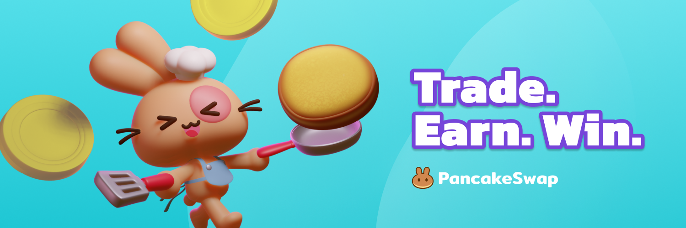

# Introdução à PancakeSwap


**PancakeSwap ajuda você a tirar o máximo proveito das suas criptos de três maneiras:**

**Trade, Renda, e Ganhe.**


## ↔️ Trade

> Negocie instantaneamente tokens cripto: sem necessidade de registro ou conta.

### A Escolha do Povo

PancakeSwap é a principal exchange descentralizada da BNB Smart Chain, com os maiores volumes de negociação do mercado (fontes: [1](https://www.coingecko.com/en/exchanges/decentralized) [2](https://coinmarketcap.com/rankings/exchanges/dex/)).

### Taxas baixas

Por que pagar mais? A PancakeSwap é executada na BNB Smart Chain, uma blockchain com custos de transação muito mais baixos do que a Ethereum ou o Bitcoin. \
As taxas de negociação também são mais baixas do que outras exchanges descentralizadas, então isso é uma vitória dupla para você!

### Descentralizado

Negocie diretamente do seu aplicativo de carteira. Ao contrário das exchanges centralizadas como Binance ou Coinbase, a PancakeSwap não retém seus fundos quando você negocia: **você tem 100% de posse das suas criptomoedas.**

## 💸 Renda

> Ganhe CAKE e outros tokens gratuitamente com taxas de rendimemto super altas.

### Ganhe tokens com Pools de Syrup

Faça Stake de CAKE, ganhe tokens grátis. É realmente muito fácil. \
Os Holders de CAKE agora estão ganhando dezenas de milhões de dólares em tokens gratuitos de grandes projetos a cada semana. Novos projetos se juntam à festa com frequência, para que você possa ganhar mais por ainda mais tempo.

### Ganhe CAKE com Farms de Rendimento

Faça stake de tokens LP, ganhe CAKE. Você assume um pouco mais de exposição às flutuações do mercado do que com as pools de syrup, mas pode ganhar um APR mais alto para compensar o risco.

### Ganhe das Taxas de Trade

Sem farm? Sem problemas. Mesmo que seu par de negociação não seja suportado na página de Farms, você ainda pode ganhar taxas de negociação ao colocar seus tokens em Pools de Liquidez (LPs).

## 🎲 Ganhe

> PancakeSwap faz ganhar dinheiro ser divertido.

### Loteria

**Milhões de doláres** regularmente para ganhar na loteria PancakeSwap\
Junte-se a mais de **11.000 jogadores diários** por sua chance de ganhar um grande prêmio!

### NFT Colecionáveis&#x20;

Ganhe NFTs colecionáveis ​​por participar de competições de Trade e mais diversão e jogos.

### Previsão

Ganhe BNB se puder prever se o preço do BNB subirá ou cairá.\
Novas rodadas a cada 5 minutos!

## PancakeSwap é segura?

Veja por você mesmo:

* Cheque essaas auditorias de segurança da PancakeSwap:
  * [Auditoria de segurança da PancakeSwapela Certik](https://www.certik.com/projects/pancakeswap) e [Shield insurance da Certik](https://shield.certik.foundation)
  * [Auditoria de segurança da PancakeSwapela pela Slowmist](https://github.com/slowmist/Knowledge-Base/blob/master/open-report/Smart%20Contract%20Security%20Audit%20Report%20%20-%20PancakeSwap.pdf)
  * [Auditoria de segurança do pool Auto-CAKE pela Slowmist](https://github.com/slowmist/Knowledge-Base/blob/master/open-report/Smart%20Contract%20Security%20Audit%20Report%20-%20CakeVault.pdf)
  * [Auditoria de segurança do Prediction V2 pela Peckshield](https://github.com/peckshield/publications/blob/master/audit\_reports/PeckShield-Audit-Report-PancakeSwap-PredictionV2-v1.0.pdf)
  * [Auditoria de segurança da nova Pool de CAKE pela Pecksheild](https://github.com/peckshield/publications/blob/master/audit\_reports/PeckShield-Audit-Report-PancakeSwap-CakePool-v1.0.pdf)
  * [Auditoria de segurança da nova Pool de CAKE pela SlowMist](https://github.com/slowmist/Knowledge-Base/blob/master/open-report-V2/smart-contract/SlowMist%20Audit%20Report%20-%20Pancakeswap-CakePool\_en-us.pdf)
  * [Auditoria de segurança do novo MasterChef pela Pecksheild](https://github.com/peckshield/publications/blob/master/audit\_reports/PeckShield-Audit-Report-PancakeSwap-MasterChefV2-v1.0.pdf)
  * [Auditoria de segurança do novo MasterChef pela Slowmist](https://github.com/slowmist/Knowledge-Base/blob/master/open-report-V2/smart-contract/SlowMist%20Audit%20Report%20-%20MasterChef%20v2\_en-us.pdf)
* Transparência:
  * Somos construídos em software de código aberto: nosso site e todos os nossos contratos inteligentes são visíveis publicamente para máxima transparência.
  * Nossos contratos são verificados na BscScan então o que você vê é o que é: [1](https://bscscan.com/address/0x10ED43C718714eb63d5aA57B78B54704E256024E) [2](https://bscscan.com/address/0x73feaa1ee314f8c655e354234017be2193c9e24e#code) [3](https://bscscan.com/address/0xbcfccbde45ce874adcb698cc183debcf17952812) [4](https://bscscan.com/address/0x1b96b92314c44b159149f7e0303511fb2fc4774f#code) [5](https://bscscan.com/address/0x92E8CeB7eAeD69fB6E4d9dA43F605D2610214E68)
* Melhores práticas de segurança:
  * Os chefs usam multisig para todos os contratos.
  * O timelock dos nossos contratos dão tranquilidade para você.

**Parece divertido?**\
**Então vamos empilhar!** 🐰 🥞

***
