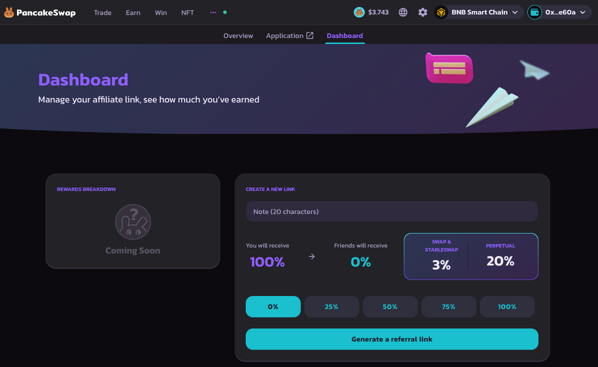
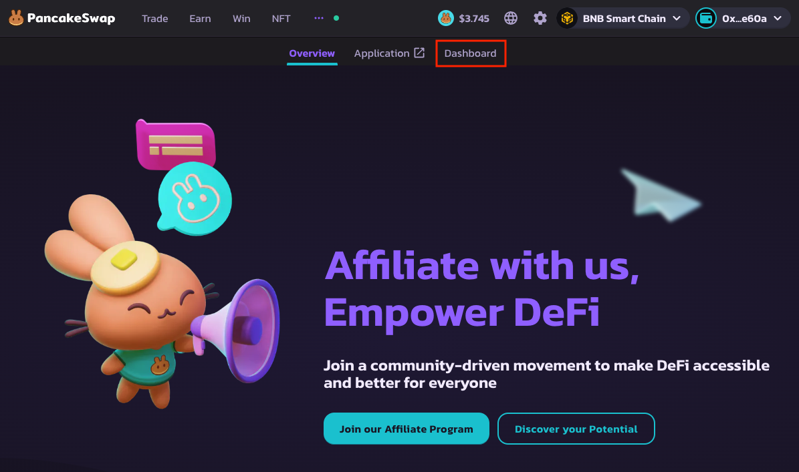
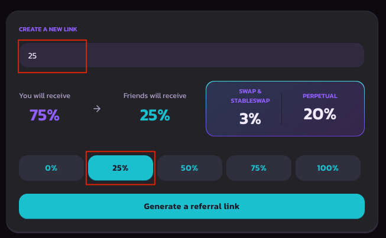
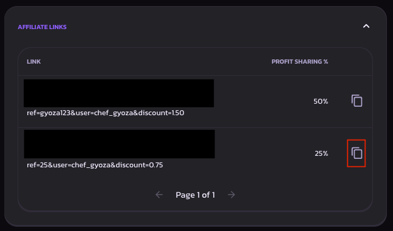

# Dashboard & Link

<figure><figcaption></figcaption></figure>

The affiliate dashboard is the headquarters of the affiliate program. Here, you will be able to create and share links while also tracking and redeeming rewards.

Here are the following steps to access the dashboard and generate an affiliate link:

1.  **Access Affiliate Dashboard**&#x20;

    1. Head to [Affiliate Landing Page ](https://pancakeswap.finance/affiliates-program)
    2. Sign in with the wallet used in the application submission
    3. Click on the ‘Dashboard tab’
    4. You might be prompted to login. Login with your crypto wallet of choice.

    <figure><figcaption></figcaption></figure>
2.  **Generate Link**

    1.  On the Dashboard page, head to the generate link section.&#x20;

        <figure><figcaption></figcaption></figure>
    2.  Set the unique code and profit-sharing rate for the specific link. More information on this can be found here&#x20;

        <figure><figcaption></figcaption></figure>
    3. Hit “Generate Link” and approve the signature. There should be a popup notifying you that a link has been generated.
    4.  Move to the links section at the bottom and copy the link created.&#x20;

        <figure><figcaption></figcaption></figure>

    Once completed, you can share the affiliate link with your community and earn a commission fee when your friends trade on PancakeSwap. For more information on how we qualify a new user, please visit the [Terms & Conditions](terms-and-conditions.md) page.

