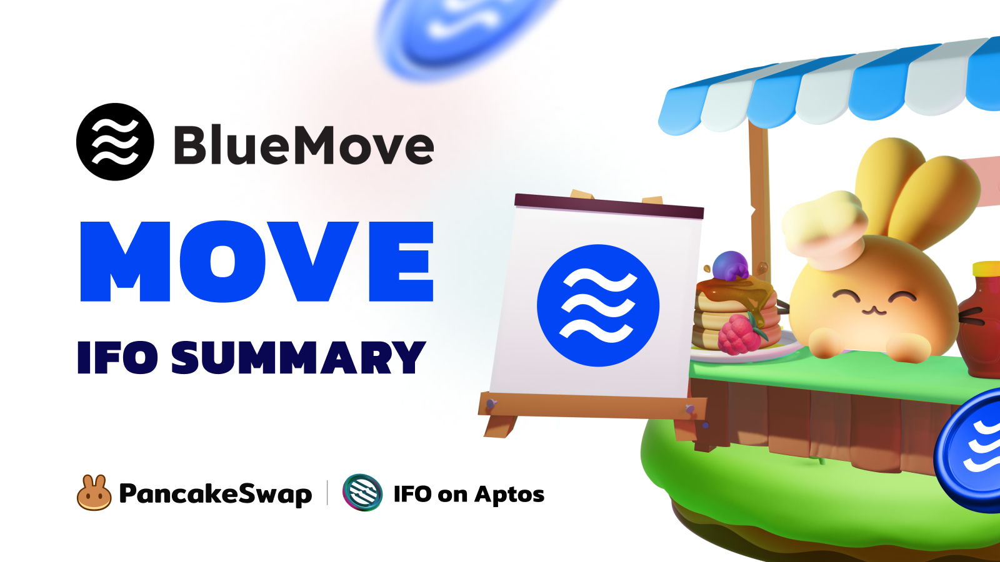

# Aptos Deployment

<figure><figcaption></figcaption></figure>

PancakeSwap (PCS) is the premier decentralized exchange (DEX) on Aptos, and we would love to speak with Aptos Project Teams, potentially introducing you to one of crypto’s largest, most engaged, and active DApps (with over 130K Daily Active Users)!

Since our start, PancakeSwap has thrived in the Retail DeFi landscape, establishing ourselves as the leading DEX, with multiple industry-leading products – liquidity pools; launchpads; prediction and perpetual products; NFT marketplace – and, of course, the best community 😉.

This page serves as a quick FAQ for Project Teams to learn more about us – but if you have any questions, please contact us on **Telegram (https://t.me/PancakeSwapBD).**

### The people's choice for all-things DeFi 

Simple is sexy, and so is safety!&#x20;

With about $2.5B in TVL, we like to move **quickly** and **responsibly**. With more than two years of experience in the crypto markets, from bull to bear, we have been delivering DeFi to our community.&#x20;

Our partnerships with projects go beyond just liquidity mining programs (“Syrup Pools and Farms”) and genuinely recognize the impact of community on crypto – our dedicated team of crypto-native CMs and Admins help us to keep a pulse on the many diverse communities we serve. We also regularly host events with high engagement and user flow to projects: AMAs, meme contests, and many more!

### Interested? Let’s build together.

We support liquidity mining programs (“Syrup Pools and Farms”) and token launchpad offerings (“Initial Farm Offering, or IFO”) on Aptos PCS.

1. Projects interested in Syrup Pools and Farms - please apply [here](https://docs.google.com/forms/d/e/1FAIpQLSceljMty-AKliByIMX6d1Kqtn88hMnzXnp\_DRBEQ7XptwiOGw/viewform)
2. Projects interested in IFOs - please apply [here](https://docs.google.com/forms/d/e/1FAIpQLSf9gWv9L8U0PGYgl-ymeX1qgXncBSlJ1HV5gB6ZeW7e4ekV\_w/viewform)

For more information about our liquidity mining programs (“Syrup Pools and Farms”), please view this PDF:\



For more information about our token launchpad offerings (“Initial Farm Offering, or IFO”), please view this PDF:



### An example of the Syrup Pool/Farm process

1. Initial Outreach
   * We have a lovely chat (where we can share data, user stats, and memes) and your team decides to start the application process – let’s go!
   * Apply via this form [**here**](https://docs.google.com/forms/d/e/1FAIpQLSceljMty-AKliByIMX6d1Kqtn88hMnzXnp\_DRBEQ7XptwiOGw/viewform)**.**
2. Due Diligence
   * Using the information in the form, we would clarify some points _(don’t worry, they’re not meaningless questions, but we take user safety seriously at PancakeSwap, and would also want to only introduce interesting projects to our community)_
   * Team passes due diligence – congrats!
3. Marketing Prep
   * We ask for some design assets, some project info, and create a lovely banner (STEPN Example Below)
   * **Please note that before launch, PancakeSwap and Project Teams should keep the collaboration news private.**
4. Launch
   * We launch the Syrup Pool/Farm, and through our team of community admins, we will monitor, collate, and communicate any feedback the community raises.
   * We will also publish some socials on our [Twitter](https://twitter.com/pancakeswap/status/1501537445401481217) and Telegram
5. Post-Launch
   * We will continue to stay in touch and work together wherever possible!

<figure><figcaption></figcaption></figure>

### An example of the IFO Process 

1. Initial Outreach
   * We have a lovely chat (where we can share data, user stats, and macro, like the rest of CT) and your team decides to start the process – let’s go!
   * Apply via this form [**here**](https://docs.google.com/forms/d/e/1FAIpQLSf9gWv9L8U0PGYgl-ymeX1qgXncBSlJ1HV5gB6ZeW7e4ekV\_w/viewform).
2. Due Diligence
   * Using the information in the form, we would clarify some points
   * For our IFOs, compared to our Syrup Pools/Farms, there is a bit more back-and-forth: we are happy to share our knowledge of best practices concerning tokenomics, product, Go-To-Market (GTM) Strategy, etc.
   * Team passes due diligence – congrats!
3. Marketing Prep
   * We will ask for some design assets, some project info, and create both a lovely banner (BlueMove example below) and a [blog post](https://blog.pancakeswap.finance/articles/blue-move-move-ifo-to-be-hosted-on-aptos-pancake-swap).
   * We will also start collating questions for the **AMA**
   * We will typically run a week-long [marketing campaign](https://twitter.com/PancakeSwap/status/1621841046983286784), including activities like social engagement, meme competitions, airdrops, project-specific tasks, etc.
   * **Please note that before launch, PancakeSwap and Project Teams should keep the collaboration news private.**
4. [AMA](https://twitter.com/PancakeSwap/status/1562648945721212929) (usually 1 day before IFO)
   * An interactive session with our community to clarify any questions and establish ✨vibes✨
5. IFO Launch
   * We will launch the IFO, and through our team of community admins, we will monitor, collate, and communicate any feedback the community raises.
   * We will also publish some socials on our [Twitter](https://twitter.com/pancakeswap/status/1564616363871678484) and Telegram
6. Post-Launch
   * We will continue to stay in touch and work together wherever possible!&#x20;

At every step of the process, the team is here to help – we understand that for founders and their teams, the IFO or TGE Launch is extremely critical, and we leave nothing to chance.

<figure><figcaption></figcaption></figure>
