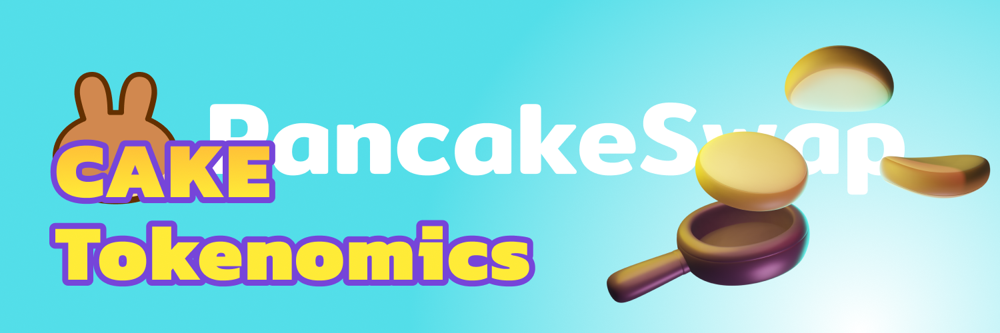

# Old Tokenomics

* **Ticker:** CAKE
* **Contract Address:** [https://bscscan.com/token/0x0e09fabb73bd3ade0a17ecc321fd13a19e81ce82](https://bscscan.com/token/0x0e09fabb73bd3ade0a17ecc321fd13a19e81ce82)
* **Chain:** BNB Smart Chain (BEP20)

## The basics

CAKE is the delicious token that powers the PancakeSwap ecosystem.

Earn CAKE from Farms and Syrup Pools, win it in the lottery, or [buy it on the exchange](../../trade/pancakeswap-exchange/), then explore its use cases:

* Stake it in [Syrup Pools](../../earn/cake-staking/syrup-pool/) to earn free tokens
* Use it in [Yield Farms](https://docs.pancakeswap.finance/products/yield-farming) to earn more CAKE
* Buy Lottery tickets in the [PancakeSwap Lottery](../../play/lottery/)
* Participate in [IFO Token Sales](../../earn/cakepad/)
* Create your Pancake Profile and mint NFTs
* [Vote on proposals](../../protocol/voting/) relating to the PancakeSwap ecosystem

But that's not all -- there's much more on the horizon for CAKE!

## In detail

Check below to discover the nuts and bolts of how CAKE works.


[cake-tokenomics.md](../../protocol/cake-tokenomics.md)



[cake-tokenomics-v1.md](cake-tokenomics-v1.md)


### \*\*\*\*
