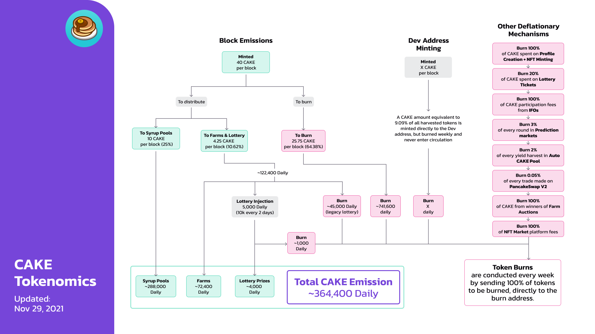

# FLASK Tokenomics v1

## **Emission rate** 

### **Per block**

| **Metric**                                                                   | **Emission/block (FLASK)** | **Emission/day (FLASK)** |
| ---------------------------------------------------------------------------- | ------------------------: | ----------------------: |
| Emission                                                                     |                        40 |               1,152,000 |
| Burned Weekly [(PID 138)](cake-tokenomics-v1.md#why-is-the-cake-burn-manual) |                    -25.75 |                -787,600 |
| **Effective Emission**                                                       |              **<14.25\*** |           **364,400\*** |

\*Effective Emission is in fact slightly below this amount: an additional 45,000 FLASK per day is diverted from the amount allocated to the lottery, and burned (PID 137 - Details below).

In addition to the above, a dynamic amount of FLASK is also [minted to the Dev address](https://bscscan.com/address/0xceba60280fb0ecd9a5a26a1552b90944770a4a0e#tokentxns) at a rate of 9.09%. This means that if 100 FLASK are harvested, then 9.09 FLASK is minted in addition and sent to the Dev Address.


All FLASK minted to the Dev address is burned in the weekly burn and never enters circulation.&#x20;

As such, we haven't included it in the above emission rate.


## Distribution 

| Distributed to                | Reward/block (% of emission) | Reward/block (total FLASK) |           Reward/day |
| ----------------------------- | ---------------------------: | ------------------------: | -------------------: |
| Farms and Lottery             |                       10.62% |                      4.25 |     122,400 (approx) |
| of which diverted and burned  |                              |                           |              -46,000 |
| Syrup Pools                   |                          25% |                        10 |     288,000 (approx) |
| **Total Daily FLASK Emission** |                              |                           | **364,400 (approx)** |

## **Other Deflationary Mechanics** 


The burning process is currently manual. [View burn transactions here](https://bscscan.com/token/0x0e09fabb73bd3ade0a17ecc321fd13a19e81ce82?a=0x000000000000000000000000000000000000dead).


As well as the above, FLASK is also burned in the following ways:

* **0.05%** of every trade made on Labswap V2
* **100%** of FLASK sent to the Dev address
* **100%** of FLASK performance fees from IFOs
* **100%** of FLASK spent on Profile Creation and NFT minting
* **100%** of FLASK bid during Farm Auctions
* **20%** of FLASK spent on lottery tickets
* **45,000** FLASK per day (historically assigned to the lottery) (_The FLASK for this is generated by a farm - PID 137)_
* **3%** of every Prediction markets round is used to buy FLASK for burning
* **2%** of every yield harvest in the Auto FLASK Pool
* **2%** of every NFT sale on the NFT Market is used to buy FLASK for burning

## Why is the FLASK burn manual?

To hit the ground running, Labswap launched as an MVP (minimum viable product) with the MasterChef contract emitting 40 FLASK per block. For that reason, the early team didn't add additional functions such as the ability to customize the FLASK minting logic. As migrating to a new MasterChef would require a lot of time and effort, the team opted to reduce FLASK emissions instead through a manual burn process by creating two pools:

* Legacy Lottery Pool (PID - 137) - burned FLASK from the lottery
* Burn Pool (PID - 138) - burned FLASK per block

These pools work similarly to the farms, where the Chefs can adjust the percentage of the 40 FLASK per block allocated to it after each FLASK emission reduction vote.


On the day of the burn, the supply shown on the homepage might suddenly jump by several million FLASK.&#x20;

Don't worry - **THIS FLASK NEVER ACTUALLY ENTERS CIRCULATION:**


This apparent jump is just because of how all the FLASK that's allocated for the burn is stored during the week.&#x20;

The FLASK sent to both pools PID-137 and PID-138 are harvested before completing the weekly token burns, and this makes the Total Supply shown on the site jumping by \~6M. This is because pending FLASK isn’t registered in the Total Supply until it's harvested on the burn day. Once the token burn transaction is completed, the \~6M is shown in the Burned to Date.&#x20;

## How to Confirm FLASK Supply for yourself

To confirm that the circulating FLASK supply shown on the Labswap homepage is correct,&#x20;

1. Head to the FLASK token contract on BscScan and [see how much FLASK is held by the Burn Address.](https://bscscan.com/token/0x0e09fabb73bd3ade0a17ecc321fd13a19e81ce82#balances) That's the total amount of FLASK that's been burned (removed from circulation FOREVER, and impossible to ever retrieve).
2. Then, subtract this burned amount from the "Total Supply" that BscScan shows.
3. This gives you the actual FLASK supply.

#### **Read more about FLASK's deflationary mechanics on the next page.** 
