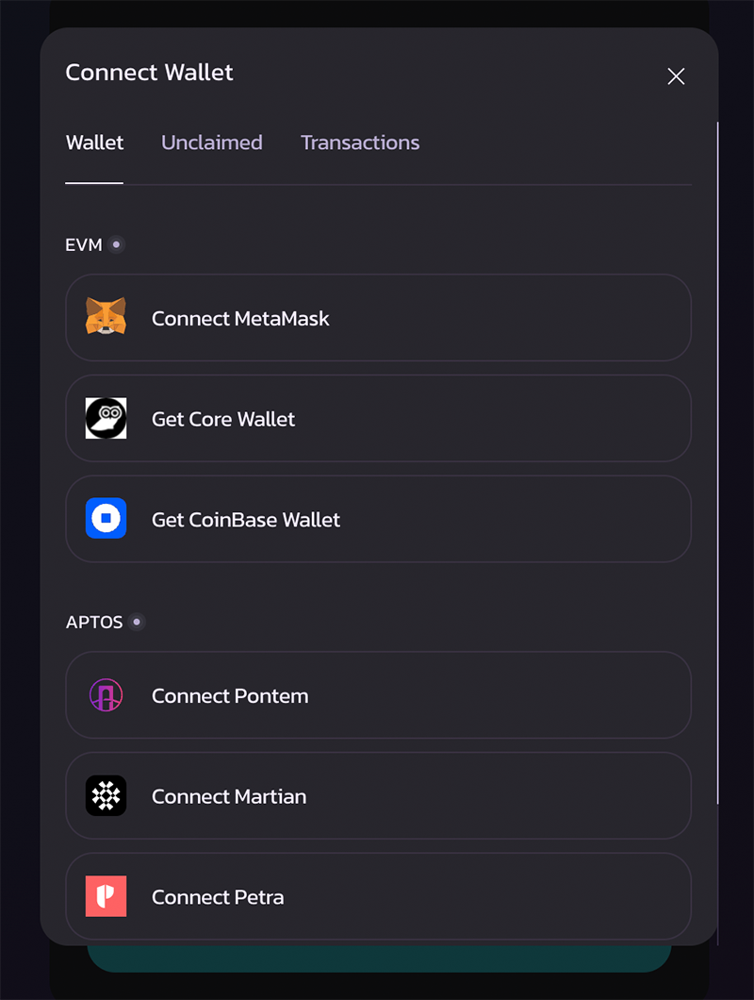
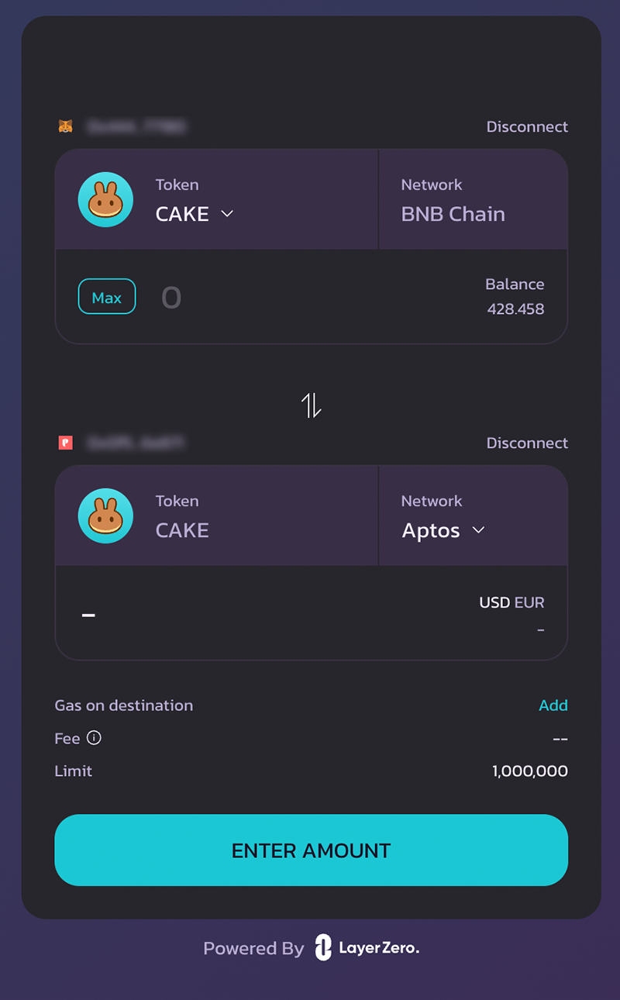
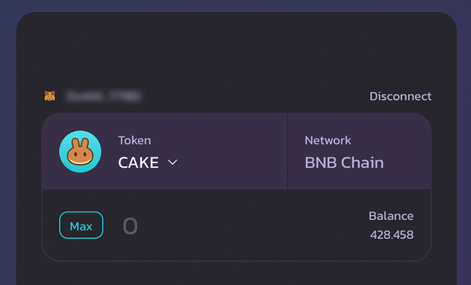
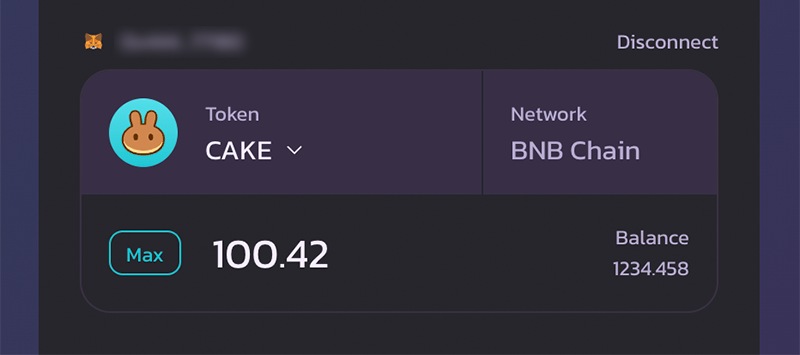
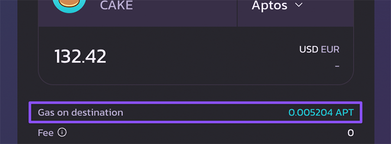
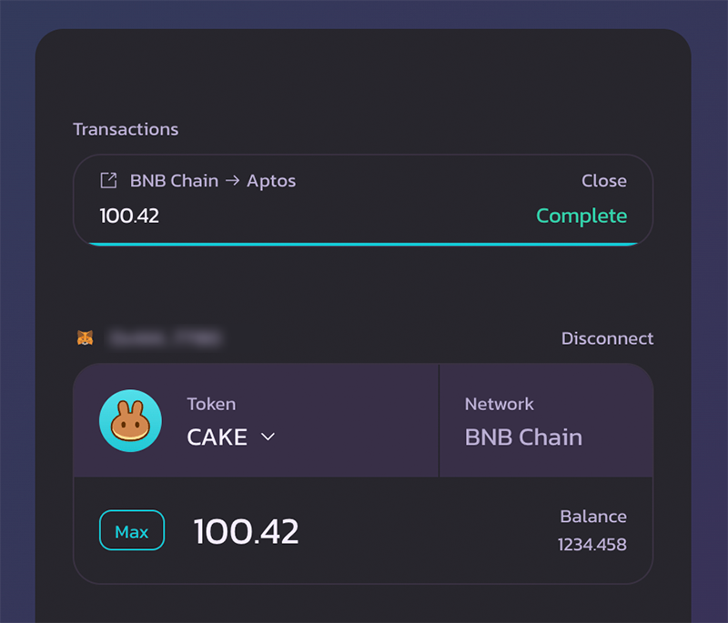
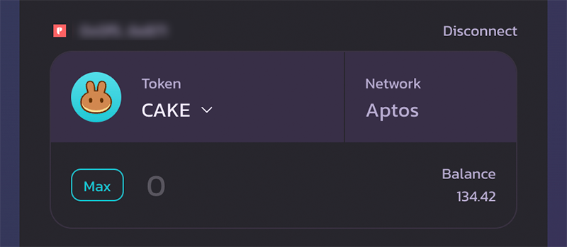
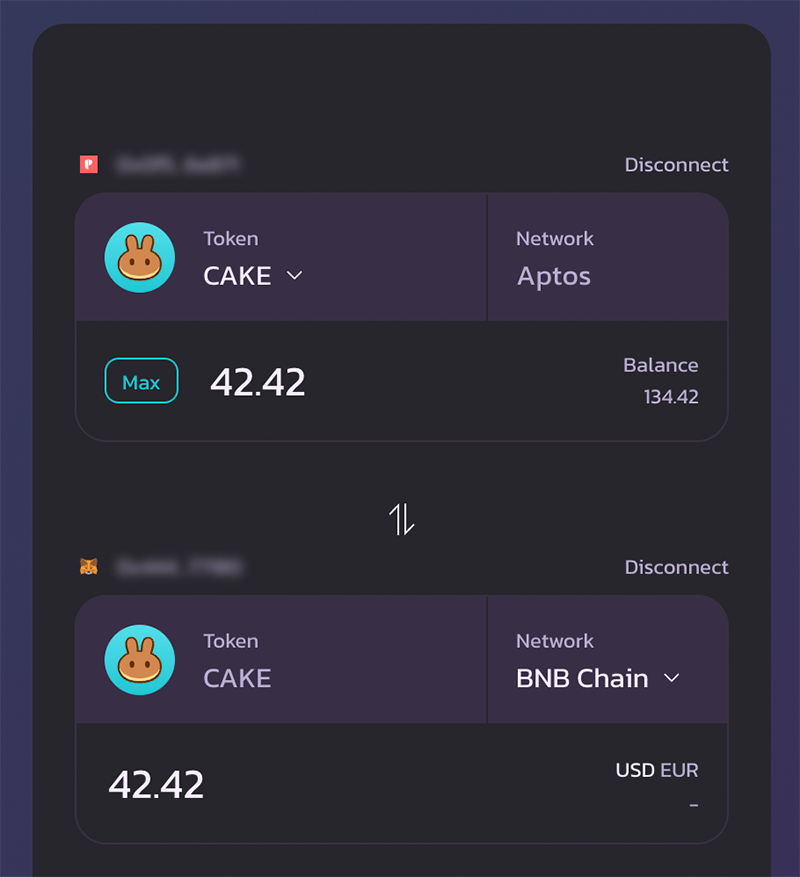

# 如何跨链 - EVM <> Aptos

<figure><figcaption></figcaption></figure>


以下指南以 BNB 链作为 EVM 链的示例。同样的流程也适用于 Ethereum。


## 将 CAKE 从 BNB 智能链跨链至 Aptos

1 - 确保你的钱包同时支持 BNB 智能链和 Aptos 主网。或者你已在浏览器中安装了这两种钱包。

然后打开 [PancakeSwap CAKE 跨链桥](https://bridge.pancakeswap.finance/)

2 - 首先，我们需要连接 BNB 智能链钱包。

点击"Connect"，并在"EVM"部分选择你偏好的钱包。然后在钱包弹窗中确认并批准。

3 - 然后，我们需要连接 Aptos 钱包。

在钱包连接弹窗中，在"Aptos"部分选择你偏好的钱包。然后在钱包弹窗中确认并批准。

4 - 点击上方代币选择框中的"v"，然后选择"CAKE"。

5 - 输入你想跨链至 Aptos 的 CAKE 数量。

6 - 如果你的 Aptos 钱包是新创建的，且没有任何 APT（Aptos Coin）余额。我们建议将"gas on destination"（目标链 gas）选项保持默认设置。跨链桥会向你的钱包存入少量 APT，这不仅能帮助你开启在 Aptos 上的旅程，而且你也需要 APT 作为 gas 来注册并领取你跨链转移的 CAKE。

更改此选项可能导致跨链失败。

7 - 点击"Transfer"以发起跨链交易，并通过钱包确认弹窗进行确认。

请注意，根据你的 BNB 智能链钱包和 Aptos 钱包的情况。你可能需要批准**多个**钱包确认。例如，如果你是第一次将 CAKE 跨链至 Aptos，你将需要：

* 批准跨链合约对 CAKE 的支出（来自你的 BNB 智能链钱包）
* 注册 CAKE（来自你的 Aptos 钱包）

更多详情请查看[此分步说明](aptos.md#bridging-cake-to-aptos-for-the-first-time)。

8 - 坐下来放松一下。这通常只需要几分钟。跨链完成后，CAKE 将存入你的 Aptos 钱包。你可以通过进度条追踪进度。

## 第一次将 CAKE 跨链至 Aptos

将 CAKE 跨链至 Aptos 钱包需要注册和领取交易。这是为了增强用户安全性，是 Aptos 所特有的。

### **如果你的钱包中已有 APT（Aptos Coin）：**

如果 CAKE 尚未在你的 Aptos 钱包中注册，系统会提示你进行注册。这种情况下无需额外的领取交易。

### **如果你的钱包中没有 APT（Aptos Coin）：**

在跨链交易完成后，你需要手动领取你的 CAKE。为支付领取所需的 gas 费，APT 代币会从你的源钱包发送至你的 Aptos 钱包。

这些注册和领取步骤仅在你第一次与 Aptos 上的某个代币交互时适用。同一代币的后续转账无需这些操作。

在第一次将 CAKE 跨链至 Aptos 之前，请确保你的 Aptos 地址有足够的 APT 用于支付 gas 费。更多详情请查看 Aptos 的说明：[https://theaptosbridge.com/faq#registering-claiming-assets](https://theaptosbridge.com/faq#registering-claiming-assets)

## 将 CAKE 从 Aptos 跨链至 BNB 智能链

1 - 确保你的钱包同时支持 BNB 智能链和 Aptos 主网。或者你已在浏览器中安装了这两种钱包。

然后打开 [PancakeSwap CAKE 跨链桥](https://bridge.pancakeswap.finance/)

2 - 首先，我们需要连接 BNB 智能链钱包。

点击"Connect"，并在"EVM"部分选择你偏好的钱包。然后在钱包弹窗中确认并批准。

3 - 然后，我们需要连接 Aptos 钱包。

在钱包连接弹窗中，在"Aptos"部分选择你偏好的钱包。然后在钱包弹窗中确认并批准。

4 - 点击上方代币选择框中的"v"，然后选择"CAKE"。接着点击页面中间的双箭头按钮，以翻转跨链的方向。

请确保"Aptos"网络位于上方字段中。

5 - 输入你想跨链至 BNB 智能链的 CAKE 数量。

6 - 如果你的 BNB 智能链钱包是新创建的，且没有任何 BNB（gas 代币）余额。我们建议将"gas on destination"（目标链 gas）选项保持默认设置。跨链桥会向你的钱包存入少量 BNB。这将帮助你开启在 BNB 智能链上的旅程，并探索充满活力的 PancakeSwap 生态系统。

7 - 点击"Transfer"，并在钱包弹窗中批准交易。

8 - 坐下来放松一下。这通常只需要几分钟。跨链完成后，CAKE 将存入你的 BNB 智能链钱包。你可以通过进度条追踪进度。
