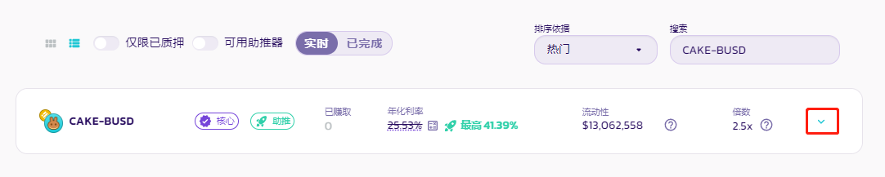
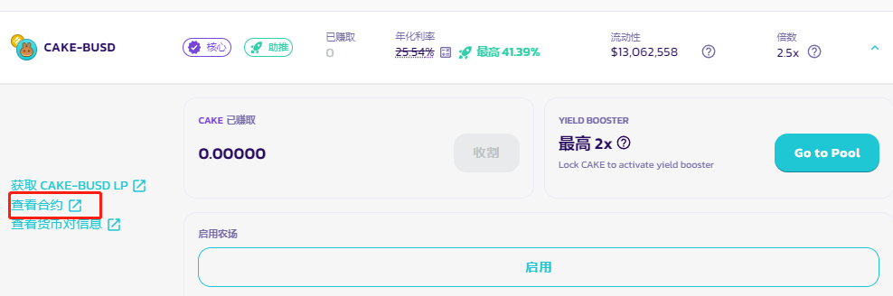
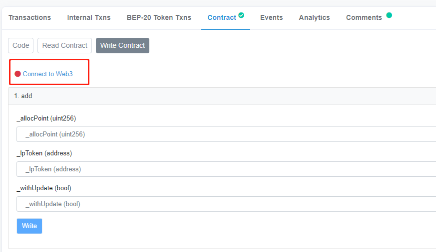

# 如何通过BscScan使用农场

<figure><figcaption></figcaption></figure>

由于它需要几个步骤，因此通过 Bscscan 调用农场合约乍一看似乎令人生畏。本指南将引导您直接通过 BscScan 调用农场合约。


请理解，我们不建议初学者使用 BscScan 与合约交互。如果您没有信心，我们建议您改用学习[如何使用农场指南](../products/yield-farming/ru-he-shi-yong-nong-chang.md)。


## 查找农场进程标识符

要与农场智能合约正确交互，您需要为您的 LP 对匹配进程标识符 (PID)。 目前，找到它的最简单方法是查看 GitHub。

1. 在 GitHub 上打开 PancakeSwap 网站的 Farms 代码。&#x20;
2. Control/command + F 并通过代码（不是项目名称）搜索您的代币对。 例如，'CAKE-BUSD'。

<figure><figcaption></figcaption></figure>

3\. 记下或复制 PID 编号（在本例中为 389），您可以轻松访问它。稍后的步骤中会需要这个。

## 通过 BscScan 存入 LP 代币

使用 BscScan 存入 LP 代币涉及一些事项。 我们已将其分解为多个步骤，使得操作更加简便。&#x20;

### 获取主质押合约地址&#x20;

主质押合约地址为：**0x73feaa1eE314F8c655E354234017bE2193C9E24E**&#x20;

如果您想确认是否正确，请访问 PancakeSwap：[主质押合约 BscScan 页面](https://bscscan.com/address/0x73feaa1ee314f8c655e354234017be2193c9e24e#writeContract)。 您会在左上角看到地址。 单击页面图标将其复制到剪贴板。

<figure><figcaption></figcaption></figure>

### 为您的 LP 代币打开合约&#x20;

您需要先批准您希望提交给农场的 LP 代币的智能合约，然后才能使用它。&#x20;

### **从源代码入手**

1. 首先，在 GitHub 上打开 farms.ts。&#x20;
2. &#x20;Control/command + F 并通过代码（不是项目名称）搜索您的代币对。 例如，“CAKE-BNB”

<figure><figcaption></figcaption></figure>

当你有了你正在寻找的LP代币对的代码时，找到“56：”之后的地址。 这将是您的合约地址。

<figure><figcaption></figcaption></figure>

### 从用户界面入手

1.首先，访问 [PancakeSwap Farms](https://pancakeswap.finance/farms) 页面并使用右上角的“搜索”字段搜索您选择的配对。 我们在这个例子中使用了 CAKE-BUSD。

<figure><figcaption></figcaption></figure>

2\. 单击右边向下小箭头查看以显示更多信息。

<figure><figcaption></figcaption></figure>

3.单击“查看合约”查看合约以在 BscScan 上打开智能合约。

<figure><figcaption></figcaption></figure>

### 授权LP代币合约

现在您在 BscScan 上打开了您的 LP 代币合约，您将批准将您的 LP 代币用于农场。

1. 在LP Token的合约页面，进入Contract，然后 Write Contract。

<figure><figcaption></figcaption></figure>

&#x20; 2.单击 connect to Web3 以连接 MetaMask 钱包。

<figure><figcaption></figcaption></figure>

确认连接。

3.在 function 1“Approve”下，您会看到“spender:address”。 粘贴您之前复制到剪贴板的主质押合约的合约地址。

<figure><figcaption></figcaption></figure>

4\. 您还需要批准合约可以使用的 LP 代币数量。 在 Value 字段中，您需要输入以 Wei 为单位的数值。 您可以使用 BscScan 单位转换器轻松将您的数值更改为 Wei。 在这里，我们将使用 5 个 CAKE-BUSD LP 代币。

<figure><figcaption></figcaption></figure>


您还可以使用 -1 作为无限制使用批准的值。 这并不意味着默认情况下你会花掉所有东西，只是你的钱包允许使用此合约进行任何规模的交易。


5.单击"Write"写入并授权 MetaMask 钱包中的操作。 您现在可以将 LP 代币质押到农场，最多可达到您批准的数量。

### 使用主质押智能合约存入 LP 代币

主质押合约现已获准使用您的 LP 代币，是时候进行存款了。

1.返回 [PancakeSwap: Main Staking Contract BscScan ](https://bscscan.com/address/0x73feaa1ee314f8c655e354234017be2193c9e24e#writeContract)页面，进入 Contract，然后 Write Contract。

<figure><figcaption></figcaption></figure>

2.单击 **connect to Web3** 以连接 MetaMask。

3.滚动到function 2，“deposit”，然后在“\_pid”字段中输入您的 PID。

<figure><figcaption></figcaption></figure>

4.在 \_pid 下方，您会看到“\_amount”。输入您之前批准的 LP 合约支出数值。

<figure><figcaption></figcaption></figure>

5.检查信息，然后单击"**Write**"写入。在 MetaMask 中确认您的操作。

<figure><figcaption></figcaption></figure>

6.您可以通过点击**查看您的交易**来确认您的操作是否成功。

<figure><figcaption></figcaption></figure>

## 如何从质押池中取款

从池中提取您的 LP 代币与存款非常相似。 差异之处在于您将与之交互的功能不一样。

1.返回 [PancakeSwap: Main Staking Contract BscScan ](https://bscscan.com/address/0x73feaa1ee314f8c655e354234017be2193c9e24e#writeContract)页面，进入 Contract，然后 Write Contract。

<figure><figcaption></figcaption></figure>

2.单击 **connect to Web3** 以连接 MetaMask。

3.一直向下滚动到 function 15，“withdraw”，然后在“\_pid”字段中输入您的 PID。

<figure><figcaption></figcaption></figure>

如果您之前没有复制您的 PID，您可以在此页面上方的"**Finding Farm process identifier"** **查找农场进程标识符**部分中了解如何获取它。

4\. 在\_pid 下方，您会看到“\_amount”。 输入您想从池中提取的 LP 数量。

<figure><figcaption></figcaption></figure>

​​5.检查信息，然后单击"**Write**"写入。 在 MetaMask 中确认您的操作。

<figure><figcaption></figcaption></figure>

​6.您可以通过点击**查看您的交易**来确认您的操作是否成功。​

<figure><figcaption></figcaption></figure>

## 如何进行紧急提款 

‌使用紧急提款功能，您可以在没有其他方法可行的情况下从农场中提取您的所有资金。


**使用紧急提款功能将失去您的 CAKE 奖励！**&#x20;

PancakeSwap 团队强烈建议避免使用此功能，除非 PancakeSwap 团队正式建议这样做，或者如果您非常愿意与进行智能合约交互并能够理解底层代码。


1.返回 [PancakeSwap: Main Staking Contract BscScan ](https://bscscan.com/address/0x73feaa1ee314f8c655e354234017be2193c9e24e#writeContract)页面，进入 Contract，然后 Write Contract。

<figure><figcaption></figcaption></figure>

2.单击 **connect to Web3** 以连接 MetaMask。

3.一直向下滚动到 fuction 4，“emergencywithdraw”，然后在“\_pid”字段中输入您的 PID。

<figure><figcaption></figcaption></figure>

如果您之前没有复制您的 PID，您可以在此页面上方的"**Finding Farm process identifier"** **查找农场进程标识符**部分中了解如何获取它。

4.检查信息，然后单击"**Write**"写入。 在 MetaMask 中确认您的操作

<figure><figcaption>
 
</figcaption></figure>

5.您可以通过点击**查看您的交易**来确认您的操作是否成功。​

<figure><figcaption></figcaption></figure>
