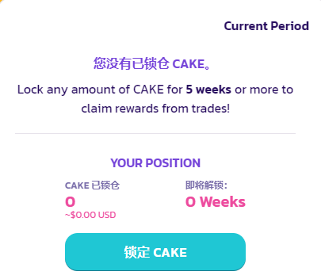

# CAKE 锁仓用户交易返利活动

## 查看一个正在进行的交易返利活动&#x20;

与 "交易大赛" 一样，交易返利计划也以独立活动的形式举行的。当有一个正在进行的交易返利活动时，符合条件的用户可以通过在特定的 PancakeSwap V3 交易对进行交易，以获得返利奖励。&#x20;

要查看是否有一个正在进行的交易返利活动，您可以：&#x20;

* 直接在[交易返利页面](https://pancakeswap.finance/trading-reward)上查看&#x20;
* 查看 [PancakeSwap 首页](https://pancakeswap.finance/)上的活动横幅

<figure><figcaption></figcaption></figure>

* 从[兑换页面](https://pancakeswap.finance/swap?showTradingReward=true)的 "热门代币" 列表中寻找💝图标。或者使用筛选功能来查看有交易返利的代币对。

<figure><figcaption></figcaption></figure>

* 查看我们的[社媒渠道](<../../contact-us/telegram (1).md>)来了解。

## 检查您的地址是否符合条件&#x20;

要参加交交易返利活动。您的地址必须满足以下要求：&#x20;

* 必须有一个有效的 Pancake 个人资料&#x20;
* 必须有一个有效的 CAKE 锁仓仓位&#x20;
* CAKE 锁仓仓位的解锁时间必须不早于阈值 (每个活动都不同)&#x20;

检查您的地址是否符合条件的最简单方法是，访问[交易返利](https://pancakeswap.finance/trading-reward)页面并连接您的钱包来查看，并且该页面有指导教程如何让您的地址有资格从交易中获得 CAKE 返利。&#x20;

<figure><figcaption></figcaption></figure>

例如，如果您没有一个有效的 CAKE 锁仓仓位，您会看到页面显示上述信息。您只需按照指南开始锁定 CAKE。&#x20;

您可以锁定任何数量的 CAKE。但请注意，锁定的 CAKE 数量大小将决定您能从活动中获得的最大返利金额。&#x20;

当活动已经在进行中，您仍可以随时锁定新的 CAKE 以参与活动。交易返利将从活动开始时算起；这听起来不美妙吗？

## 开始交易&#x20;

现在您可以通过在 BNB 链和以太链上交易某些 PancakeSwap V3 代币对来赚取 CAKE！每个活动可能有不同的指定代币对。要查看哪些代币对符合条件，您可以：&#x20;

* 查看[交易返利页面的 "奖励明细" 部分 ](https://pancakeswap.finance/trading-reward#rewards-breakdown)
* 从[兑换页面](https://pancakeswap.finance/swap?showTradingReward=true)的 "热门代币"列表中寻找💝图标。或者使用筛选功能来检查有交易返利的货币对。&#x20;

## 您的奖励数量

<figure><figcaption></figcaption></figure>

您可以在[交易返利页面](https://pancakeswap.finance/trading-reward)查看以下数字：&#x20;

* 赚取的 CAKE 奖励的数量&#x20;
* 您能从活动中获得的最大 CAKE 金额--由您锁仓的 CAKE 金额决定（只有在您超过限额时才可见）&#x20;
* 您在所有符合条件的代币对中的交易量

<figure><figcaption></figcaption></figure>

此外，您可以查看 "返利明细（Rewards Breakdown）" 部分，以详细了解您交易的每一个代币对。

## 领取您的返利

<figure><figcaption></figcaption></figure>

当一个活动结束时，可能需要等待长达 72 小时，因为数据正在被统计，返利正在被注入。

<figure><figcaption></figcaption></figure>

当返利可被领取时，"全部领取" 按钮将亮起。只需点击并领取您的返利。&#x20;

#### 请在返利过期前及时领取返利。
