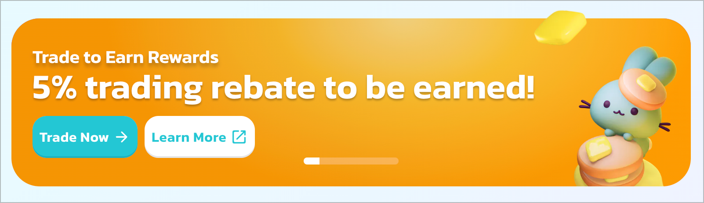
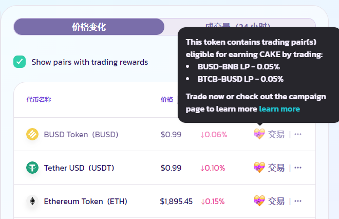

# 顶级交易者交易返利活动

## 查看一个正在进行的交易返利活动&#x20;

与 "交易大赛" 一样，交易返利计划也以独立活动的形式举行的。当有一个正在进行的顶级交易者交易返利活动时，您可以通过交易符合条件的币对来积累交易费用返利。而当活动结束后，如果您在所有的交易者中排名足够高，您将赢得这些返利。

要查看是否有一个正在进行的交易返利活动，您可以：&#x20;

* 直接在[交易返利页面](https://pancakeswap.finance/trading-reward/top-traders)上查看&#x20;
* 查看 [PancakeSwap 首页](https://pancakeswap.finance/)上的活动横幅

<figure><figcaption></figcaption></figure>

* 从[兑换页面](https://pancakeswap.finance/swap?showTradingReward=true)的 "热门代币" 列表中寻找💝图标。或者使用筛选功能来查看有交易返利的代币对。

<figure><figcaption></figcaption></figure>

## 开始交易&#x20;

现在，您可以在 BNB 链和以太链上，通过在特定的 PancakeSwap V3 代币对交易代币来赚取 CAKE！

每场活动可能会指定不同的币对。查看哪些币对符合条件，您可以：&#x20;

* 查看交易返利页面的 "[返利明细（Reward Breakdown）](https://pancakeswap.finance/trading-reward/top-traders)" 部分&#x20;
* 从[兑换页面](https://pancakeswap.finance/swap?showTradingReward=true)的 "热门代币"列表中寻找💝图标。或者使用筛选功能来查看有交易返利的代币对。&#x20;

## 查看您有可能获得的返利金额&#x20;

您可以在[交易返利](https://pancakeswap.finance/trading-reward/top-traders)页面查看您所积累的返利金额。

.png>)

此外，您可以查看 "返利明细（Rewards Breakdown）" 部分，详细查看您交易过的每一个代币对。

<figure><figcaption></figcaption></figure>

关于活动细节，如返利百分比、结束时间或可以赢得返利的排名名次，请查看 "当前返利池" 部分。

<figure><figcaption></figcaption></figure>

### 查看您的排名&#x20;

为了赢得活动并能够领取您所有的累积返利，您需要将自己的排名提高到一定的名次，并保持到活动结束。

要查看您的排名，看看您目前是否有资格领取返利，请查看[交易返利页面](https://pancakeswap.finance/trading-reward)。

.png>)

如果您的排名不够高，会有一个弹窗通知您赢得这个活动的最低排名和当前活动的结束时间。&#x20;

继续交易以提高排名。不要忘记经常检查，以保持您的排名，直到活动结束。

### 领取您的返利

.png>)

当一个活动结束后，您可能需要等待 72小时，因为数据正在被统计，奖励正在被注入。&#x20;

当奖励可供领取时，"全部领取" 按钮将亮起。只需点击并领取您的返利。


请在您的返利过期前及时领取。



所有的返利都是在 BNB 链上领取的，如果您一直在以太链或其他链上交易，请将您的网络切换到 BNB 链上再进行领取。

