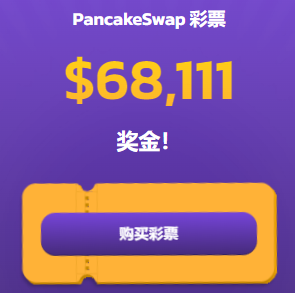
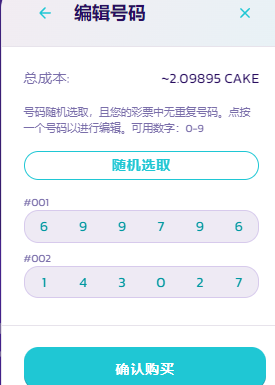
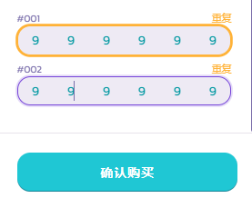
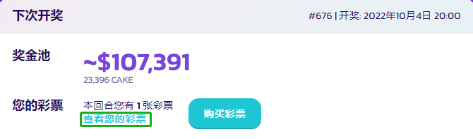
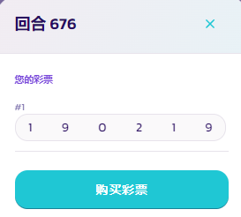
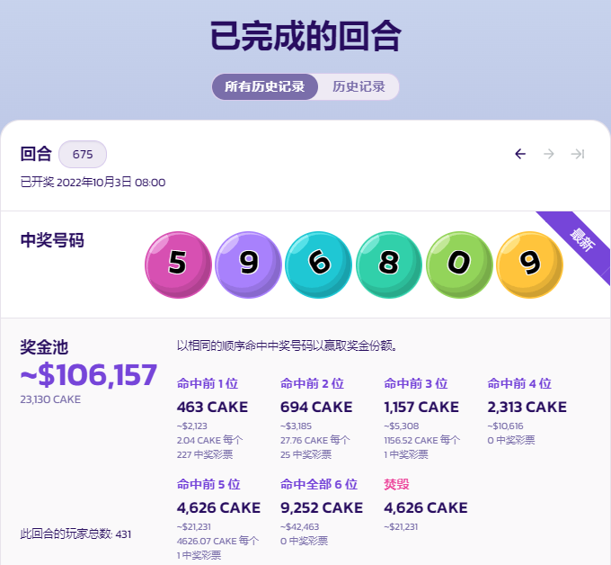

# 如何玩转彩票v2

<figure><figcaption></figcaption></figure>

PancakeSwap 的彩票系统不仅是赚取成堆的 CAKE 的好方法，而且还非常有趣！ 本指南将引导您如何参与彩票。


彩票功能自第一次迭代以来发生了一些变化。彩票 v2 让您能够更频繁地中奖，让您对您的彩票有一定的控制权，并且更有可能获得巨额 CAKE 头奖，足以让您垂涎三尺。在此处了解有关 [PancakeSwap 彩票 v2](./) 的更多信息。


## 决定您是否想要参与本轮彩票

并非所有彩票轮次的奖池都是相等的。 当上一轮彩票未中头奖时，下一轮的奖池将增加；没人中头奖的时间越长，彩票奖池就越大。

一轮彩票开放的时间越长，可以买彩票的人就越多。售出的每张彩票都会进一步增加奖池。以下是查看当前回合的奖池和剩余开放时间的方法。

1. 访问 [PancakeSwap 彩票页面](https://pancakeswap.finance/lottery)并查看页面顶部。 您将看到以（估计的）美元价值显示的当前轮次的奖池。

<figure><figcaption></figcaption></figure>

这是所有中奖者之间分享的奖金。&#x20;

2\. 往下拉一点，您会看见当前回合开奖剩余时间。

请记住，在剩下的时间里会发生很多变化。可能会售出更多彩票。每张售出的彩票都会增加奖池，并降低单张彩票中奖的几率。如果您还在犹豫，您可以一直等到回合后期，根据更多信息来做决定。但是不要等待太久而错过本轮彩票！&#x20;

## 购买彩票

购‌买彩票非常容易。&#x20;

不过，您需要一点 CAKE：每张彩票的价格约为 5 美元（CAKE 价格于回合开始时确定）。&#x20;

彩票号码：您可以选择机选，或手动输入。下方的指南中阅读 “随机选择彩票号码” 和 “手动选择彩票号码” 操作流程。



**随机选择彩票号码**

1. 在 [PancakeSwap 彩票页面](https://pancakeswap.finance/lottery) 上，单击页面顶部的**购买彩票**按钮（页面下方还有一个购彩按钮）。

<figure><figcaption></figcaption></figure>

轮次之间有一段时间无法购买彩票。 如果遇到这种情况，请在倒计时后回来查看。

<figure><figcaption></figcaption></figure>

2\. 在弹出的窗口中，您可以选择购买多少张彩票。在该栏位中输入您要购买的彩票数量。您还可以使用下方预设按钮来快速选择购买张数。

<figure><figcaption></figcaption></figure>

3\. 在进行下一步之前，您或许可以考虑使用批量购买折扣。您购买的彩票越多，折扣力度越大。从购买 2 张彩票开始，一直增加到 100 张彩票，您最多可以节省近 5% 的购买费用 (4.95%)。&#x20;

4\. 当您决定好对要购买的彩票张数，单击 “立即购买“ 并在您的钱包中确认您的操作。

<figure><figcaption></figcaption></figure>



**手动选择彩票号码**

1**.**在 [PancakeSwap 彩票页面](https://pancakeswap.finance/lottery) 上，单击页面顶部的**购买彩票**按钮（页面上下方还有一个购彩按钮）。

<figure><figcaption></figcaption></figure>

轮次之间有一段时间无法购买彩票。如果是这种情况，请在倒计时来查看。

<figure><figcaption></figcaption></figure>

2.在弹出的窗口中，您可以选择购买多少张彩票。在该栏位中输入您要购买的彩票数量。您还可以使用下方预设按钮来快速选择购买张数。

<figure><figcaption></figcaption></figure>

3.在进行下一步之前，您或许可以考虑使用批量购买折扣。您购买的彩票越多，折扣越大。折扣从 购买 2 张彩票开始，一直增加到 100 张彩票，您最多可以节省近 5% 的购买费用 (4.95%)。&#x20;

4\. 要自定义彩票上的号码，请单击**查看/编辑号码**按钮。

<figure><figcaption></figcaption></figure>

5\. 在弹出的窗口中会显示您购买的彩票。单击任何一张票的号码以更改该位置的号码。您可以通过单击 “随机选取” 再次随机您的数字，或者如果您改变主意，可以单击 “**返回**” 按钮返回。

<figure><figcaption></figcaption></figure>

如果您无法编辑数字，可以尝试使用复制贴上。

如果您创建了重复的彩票号码，您会收到提示。您重复号码的彩票可能都会中奖。在这种情况下，您的这些重复彩票将共享对应的奖池。

<figure><figcaption></figcaption></figure>

6.当您决定好了号码，单击“**确认购买**”按钮。

<figure><figcaption></figcaption></figure>

在您的钱包中确认操作。



## 购买后查看您的彩票&#x20;

您可以在购买彩票后彩票开奖前查看您的彩票。

1. 点击彩票页面 “**下次开奖**” 区域中的**查看您的彩票**。

<figure><figcaption></figcaption></figure>

2\. 将打开一个窗口，显示您的所有彩票及其号码。如果您改变主意，可以在此页面购买更多彩票。

<figure><figcaption></figcaption></figure>

## 当本轮结束并抽出中奖号码时 ‌

当本轮结束并且抽出中奖号码时，您可以查看您的彩票以检查您是否中奖。

## 查看您的中奖彩票&#x20;

您可以按照购买后查看您的彩票的方式查看您的中奖彩票。

1. 在彩票页面的 “已完成的回合” 区域中单击**查看您的彩票**。

<figure><figcaption></figcaption></figure>

2\. 弹出的窗口会显示中奖号码以及您的所有彩票及其号码。
