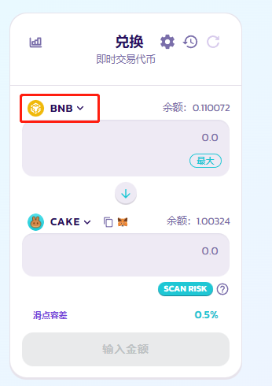
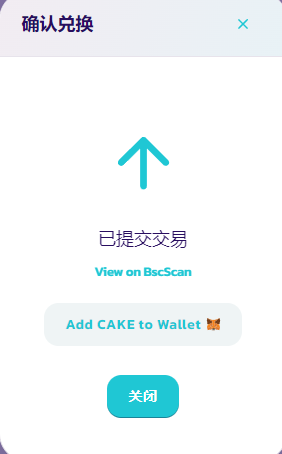

# 如何进行交易

与其他大多数交易平台相比，在PancakeSwap 上交易十分。您不需要看一堆的图标以及行话才能进行交易，交易路径和复杂的计算都由 PancakeSwap 智能路由为你处理。

在进行交易前，您需要准备一个兼容 BNB 智能链或者以太链的钱包。您可以[点击这里](../../master/get-started/wallet-guide.md)学习如何准备。您还需要准备一些 BEP20 或者 ERC20 代币来进行交易。您可以[点击这里](../../master/get-started/bep20-guide.md)学习如何获取。

另外，你可以在[这里](../../master/ru-men-zhi-nan-aptos/chuang-jian-qian-bao.md)了解如何获得一个与 Aptos 链兼容的钱包，以及点击[这里](../../master/ru-men-zhi-nan-aptos/huo-qu-aptos-dai-bi.md)学习如何一些 Aptos 的代币并进行兑换。

## 如何在PancakeSwap交易所交易

1. 跳转到[交易页面](https://pancakeswap.finance/swap#/swap)
2. 通过点击右上角的**连接钱包**来连接您的钱包。如果您还不会将您的钱包连接到 PancakeSwap, 您可以查看[这里的指南](../../master/get-started/connection-guide.md)。

<figure><figcaption></figcaption></figure>

&#x20; 3\. 点击代币右边的小箭头下拉菜单中选择您需要交易的代币。默认设置为 BNB。无论您选择哪种代币，都需要确保您手中有一些代币可用于交易。您钱包中该代币的余额数量显示在代币下拉菜单的右边。

<figure><figcaption></figcaption></figure>

4. &#x20;在下图的代币下拉菜单中选择您想购入的代币。

<figure><figcaption></figcaption></figure>

5. 接下来，在上面的输入框入一个金额，输入你想兑换的代币数量（支出金额），或者在下面的输入框输入一个金额，输入你想获得的代币数量（接收金额）。 无论你在哪一部分输入金额，另一部分的金额都会被自动估算。
6. 检查无误后，点击 "**兑换**" 按钮。如果你是第一次交易该代币，你可能需要先点击 "授权 XXX (你的代币)" 来授权。

<figure><figcaption></figcaption></figure>

6\. 点击 "兑换" 后，会显示以下带详细信息的界面，请检查信息内容是否正确。

确认无误后，点击 “确认兑换” 按钮。您的钱包会弹出支付gas 的界面，您确认支付后，兑换操作将被传送上链。

<figure><figcaption></figcaption></figure>

7\. 完成了！你可以点击 “View on BscScan” 在浏览器上查看这笔交易的细节。

<figure><figcaption></figcaption></figure>

## 什么是智能路由 V3，我该如何使用它？

PancakeSwap 智能路由是一种连接 V3、V2、稳定币兑换（BNB 链）、自动化做市商和做市商（BNB 链和以太链）的路由算法，通过链接以上流动性来持续不断地提供流动性和报价。在默认情况下，执行交易时它会纳入多个流动性池的流动性，来为交易者计算出最佳价格。&#x20;

智能路由现在是 PancakeSwap V3 的默认交易路由。但是用户依然可以根据自己的需求自定义路由。&#x20;

要了解更多关于如何自定义路由的信息，请点击[这里](jiao-yi-shou-xu-fei-he-lu-you-she-zhi.md)。

关于稳定币兑换的更多信息，请点击[这里](wen-ding-bi-dui-huan/)，关于做市商整合，请点击[这里](zuo-shi-shang-zheng-he.md)。

## FAQ


这部分内容迁移到了[这里](jiao-yi-faq.md)。

