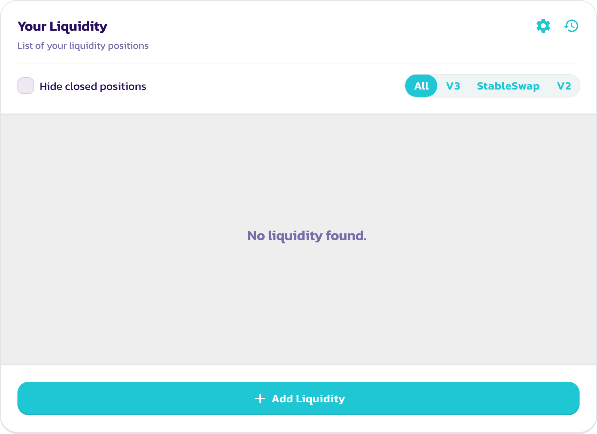
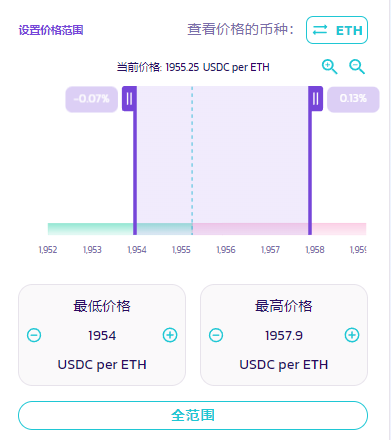
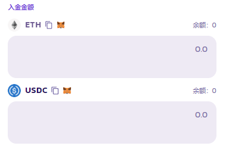
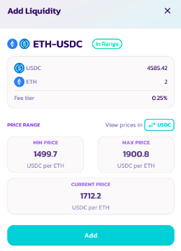
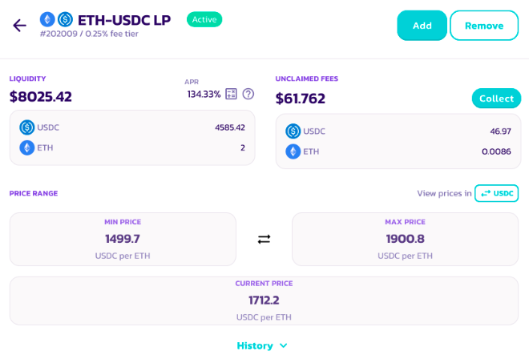
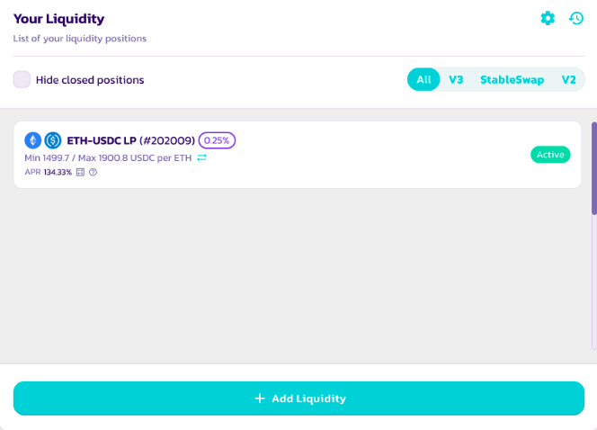

# 如何添加&移除流动性

<figure><figcaption></figcaption></figure>

"流动性" 是 PancakeSwap 去中心化交易所的运作核心。您可以在流动性页面为任意代币对添加流动性。

作为添加流动性的回报，您将获得该交易对的交易手续费奖励，并且获得 LP NFT 凭证或者 LP 代币，您可以在[农场](https://pancakeswap.finance/farms)中质押 LP NFT 凭证或者 LP 代币以获得 CAKE 奖励。

## V3 中添加/移除流动性教程

### 添加流动性

添加流动性时，您需要在流动性页面存入一定的数量的代币对。您可以提供的流动性资金的多少，取决于您想要添加的两个代币中价值（以美元计）最低的一个。&#x20;

在 PancakeSwap 兑换页面您可以轻易兑换您需要的任何代币。如果有需要请查看并学习我们的[如何进行交易的指南](../../products/pancakeswap-exchange/ru-he-jin-hang-jiao-yi.md)。&#x20;

下述示例中，我们将使用 ETH 和 USDC ，在以太链的 PancakeSwap 上添加 V3 流动性。

1. 访问[流动性页面](https://pancakeswap.finance/liquidity)。

<figure><figcaption></figcaption></figure>

2 - 点击 " 增加流动性 "按钮。

3 - 在左上角，找到代币对输入框，选择您想添加的两个代币。此例中，我们将使用 ETH和 USDC 做为范例。

<figure><figcaption></figcaption></figure>

4 - 选择完成后，界面将自动帮您选择目前最受欢迎的交易费用级别 (tier)，并为您预设一个价格区间。

5 - 您可以通过查看 "V3 LP - x% 费用级别" 下的显示窗，来确认您所提供的流动性池的版本以及费用级别。

<figure><figcaption></figcaption></figure>

* 如果您想自定义费用级别，请点击 "More"，并选择所需的费用级别。&#x20;
* 请注意，建议在最受欢迎的费用级别提供流动性。

6 - 您可以在右侧显示的价格区间进行调整和确认。

<figure><figcaption></figcaption></figure>

* 该图表显示了所有价格区间的流动性深度。您可以使用放大镜按钮进行放大和缩小。还可以通过拖动底部的 X 轴来平移并浏览图表。&#x20;
* 如果您想自定义价格区间，可以通过拖动光标，或是点击最低和最高价格下面的+和-按钮，或者点击两个价格数字并手动输入。&#x20;
* 您可以通过点击 "全范围" 按钮在所有价格区间提供您的流动性，虽然并不建议您这样做。

7 - 找到 "入金金额"，在其中一个代币输入框输入金额后，另一个将自动计算和填入数量。如果其中一个代币没有足够的余额，按钮将变成灰色。您可以输入一个较低的金额，或者使用 "MAX" 按钮来填入最大金额。

<figure><figcaption></figcaption></figure>

8 - 点击 "批准 USDC" 按钮。如果您添加的是非 ETH 的流动性，您可能需要点击两次 "批准” 来对两个代币都进行授权。您将需要在钱包确认此次授权操作。

<figure><figcaption></figcaption></figure>

9 - 完成后，"添加" 按钮将亮起。单击以继续。

<figure><figcaption></figcaption></figure>

10 - 将会弹出一个新的窗口，供您预览您的流动性仓位详情。确认一切无误后，再次点击 "添加" 以继续。

<figure><figcaption></figcaption></figure>

11 - 您需要在钱包中确认操作，点击确认。

12 - 之后您会在 "我的流动性(My liquidity)" 页面看到添加后的流动性仓位，你可以通过点击仓位来查看细节。

<figure><figcaption></figcaption></figure>

### 移除流动性&#x20;

要移除流动性请参照以下步骤：

1 - 访问[流动性页面](https://pancakeswap.finance/liquidity)。

<figure><figcaption></figcaption></figure>

2 - 在 "您的流动性资金 (Your Liquidity)" 中，点击想移除的流动性。您可以使用筛选功能来快速筛出您所有的 V3 流动性仓位。

<figure><figcaption></figcaption></figure>

3 - 点击 "移除 (Remove)" 后，将出现一个新的窗口。

<figure><figcaption></figcaption></figure>

4 - 使用按钮或滑块来选择您想移除的流动性的数量。您可以点击 "MAX" 来快速移除您在这个交易对中的所有流动性。

5 - 点击 "移除 (Remove)" 以继续。&#x20;

6 - 弹出窗口将显示您将收到多少代币，确认完毕后再次点击 "移除 (Remove)"。您需要在钱包中确认此操作。&#x20;

7 - 链上操作确认后，您将收到您添加的代币对中的两种代币。如果您没有移除所有的流动资金，流动性页面将更新您剩余的流动性的价值。

## V2 中添加/移除流动性教程

### 添加流动性

我们举例使用 BNB 和 CAKE 在 BNB 链的 PancakeSwap 上添加 V2 流动性。


请注意，以下举例仅仅是为了说明教程，CAKE/BNB 交易对已经迁移到了 V3。我们建议优先提供 V3 流动性，除非交易对中其中一个代币不支持 V3，或者该代币对的大部分流动性没有被迁移。


1. 访问[流动性页面](https://pancakeswap.finance/liquidity)
2. 点击 “增加流动性” 按钮，可以看到选择代币对提示框。
3. 左上方选择代币对输入框中选择您想要添加流动性的交易对中的两个代币。在这里，以 BNB 和 CAKE 代币对为例，左边选择 BNB，右边选择 CAKE。
4. 该界面将默认添加 V3 流动性，但有几个例外：
   1. 如果交易对有一个现行的 PancakeSwap V2 农场，它将默认为添加 V2 流动性。&#x20;
   2. 如果交易对有一个现成的 V2 流动性池，将出现一个 "添加 V2 流动性 "的按钮。只需点击即可切换到添加 V2 流动性。
5. 通过查看费用级别显示为 "V2 LP - 0.25 费用级别 "，确认您现在正在添加 V2 流动性。
6. 在 "入金金额" 下的一个代币输入框内输入一个金额，另一个将会被被自动计算和填充。如果其中一个代币没有足够的余额，您将会看到按钮变成灰色。请输入一个较低的金额并继续操作，或者使用 "MAX" 按钮自动填入最大的可用金额。
7. &#x20;击 “批准 CAKE” 按钮。如果您是正添加的流动性的其中一个代币不是 BNB，您可能需要点击两次 "批准” 来对代币对中的两个代币都进行授权。您将需要在钱包内确认授权操作。
8. 此时，"添加 (Add)" 按钮将会亮起，点击以继续。
9. 您的钱包会要求您确认，您需要在从您的钱包确认这次链上操作。
10. 之后您可以在流动性页面上看到您的 LP 代币余额，以及来自 V3 和稳定币兑换的其他流动性仓位。

### 移除流动性

要移除流动性请参照以下步骤：

1. 访问[流动性页面](https://pancakeswap.finance/liquidity)
2. 在 "您的流动性 (Your Liquidity)" 下方点击您想移除的代币对。您可以使用筛选功能来快速筛出所有 V2 流动性仓位。
3. 点击 "移除"，将出现一个新的页面。
4. 使用按钮或滑块来选择您想移除多少流动性。您可以点击 "MAX" 来移除您在这个代币对中的所有流动性。
5. 点击 "批准"。您的钱包将要求您确认该操作。
6. 之后 "移除" 按钮将亮起，点击以继续。
7. 弹出的窗口将显示您将收到多少个代币。点击 "确认"，之后您的钱包将要求确认该操作。
8. 链上交易确认后，您将收到代币对中的两个代币。如果您尚未移除所有流动性，剩余的流动性价值将在 “流动性” 页面上更新。

