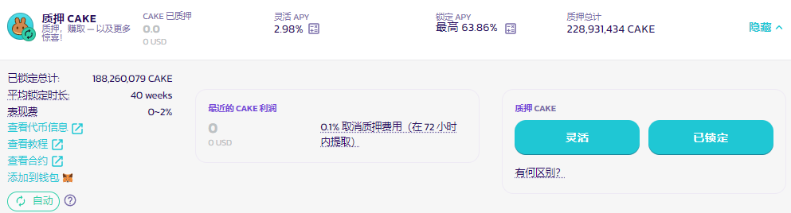
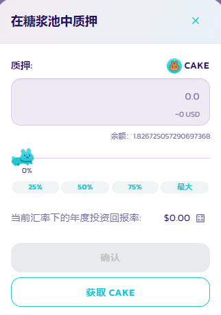
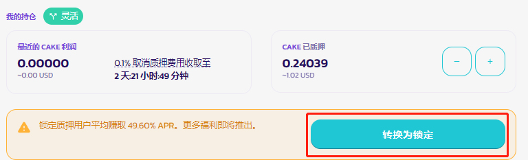
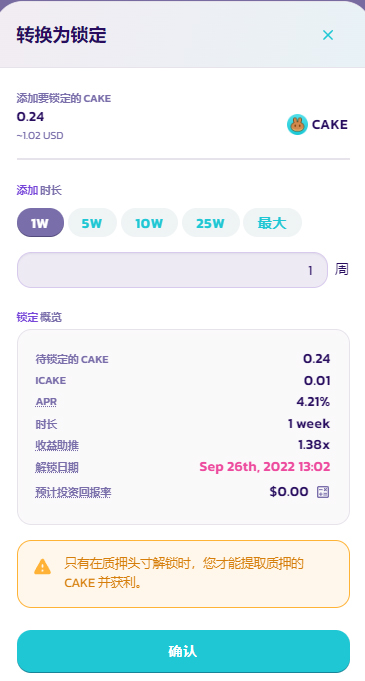

# 如何使用灵活质押糖浆池

1. 跳转到糖浆池页面，点击[此处](https://pancakeswap.finance/pools)。
2.  通过单击**连接钱包**按钮（右上角）连接到您的 BNB 智能链兼容钱包。

    <figure><figcaption></figcaption></figure>
3.  选择您相应的钱包并连接。

    <figure><figcaption></figcaption></figure>
4.  选择 CAKE 糖浆池并单击**启用**按钮。 您的钱包会要求您确认操作。

    <figure><figcaption></figcaption></figure>
5.  启用按钮现在应该已替换为**灵活**和**锁定**。单击按钮以调出质押菜单。

    <figure><figcaption></figcaption></figure>
6.  对于灵活质押，只需按**灵活**，会显示一个新窗口，输入您要质押的 CAKE 数量，单击**确认**并确认您钱包中的交易。

    <figure><figcaption></figcaption></figure>

想要将您的灵活质押转换为锁仓质押以赚取更多 CAKE？ 只需单击转换为锁仓并选择要锁仓 CAKE 的时长即可。

<figure><figcaption></figcaption></figure>

<figure><figcaption></figcaption></figure>
