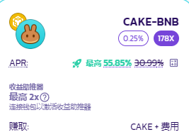

# 如何使用 bCAKE V3?

<figure><figcaption></figcaption></figure>

与 iCAKE 和 vCAKE 类似，bCAKE 也是锁仓质押 CAKE 糖浆池用户的专属福利。通过将 CAKE 锁定在固定期限的 CAKE 糖浆池中，用户可以将特定的农场的收益提高到最高 2 倍。

提升倍数根据你持有的锁仓 CAKE 数量、锁仓时长、打开助推的农场中你质押的流动性量来计算。

## 准备工作

#### 锁仓 CAKE

<figure><figcaption></figcaption></figure>

如果您尚未在 CAKE 锁仓质押池中锁定任何 CAKE，请单击 “**前往糖浆池（Go to Pool）**” 并按照说明进行 CAKE 锁仓质押。

了解有关如何进行 CAKE 锁仓质押的更多信息，请阅读[此处](../../../products/syrup-pools/cake-tang-jiang-chi/ru-he-shi-yong-suo-cang-zhi-ya-tang-jiang-chi.md)。

#### 找到你想要助推的农场以及仓位

你只能从启用了 bCAKE 的农场来提高收益。要找到具备 bCAKE 功能的农场，请查看每个农场的标签部分，寻找标有 "助推（Boosted）" 的绿色火箭标签的农场。

<figure><figcaption></figcaption></figure>

或者你也可以使用 "农场类型" 筛选工具中的 "可用助推器" 筛选依据，来快速筛选所有已启用了 bCAKE 的农场。

<figure><figcaption></figcaption></figure>

#### 质押你的流动性仓位&#x20;

要激活 bCAKE，你的流动性仓位必须先质押进农场里。&#x20;

要了解更多关于收益农场的知识，请查看本[教程](../../../products/yield-farming/ru-he-shi-yong-nong-chang.md)。


V3 农场和 bCAKE V3 简化了流程，因此不再需要启用 bCAKE 或迁移你的质押仓位。


#### 激活 bCAKE

.png>)

准备就绪后，你就可以看到当前质押的农场的可助推倍数和提升后的 APR。 要进一步了解 bCAKE 倍数的计算方法，请阅读[此处](../../../products/yield-farming/bcake/chang-jian-wen-ti-jie-da.md)。&#x20;

要激活农场的助推功能，请单击 “助推（Boost）” 按钮，然后在您的钱包确认此链上操作。


请注意，用户进行农场、 CAKE 锁仓调整操作后，您的倍数将自动更新，因前两者的统计及数据更新了。

点击[这里](../../../products/yield-farming/bcake/chang-jian-wen-ti-jie-da.md)了解更多。


<figure><figcaption></figcaption></figure>

同时运转的农场助推器有数量限制，在置顶显示区中可以看见您剩余可用的助推器额度。

当启用数量已到上限，您需要取消一个目前正在运转的助推器，将额度让给其他助推器，才可以启用新的。

## 取消设置助推器

要取消设置农场助推器，只需单击 “取消设置（Unset）” 按钮，然后在您的钱包中确认上链。&#x20;
