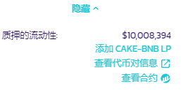
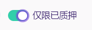
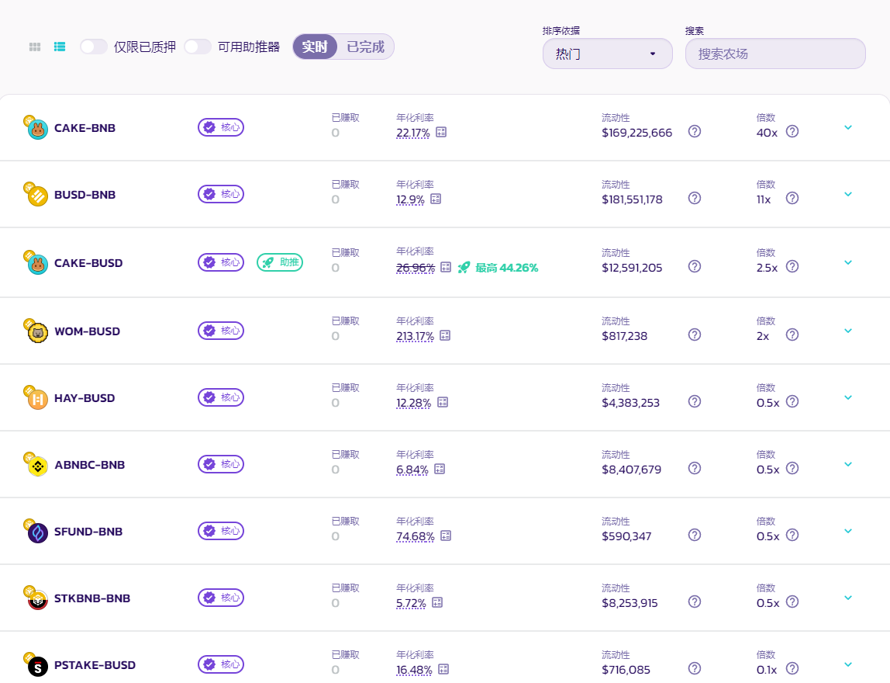
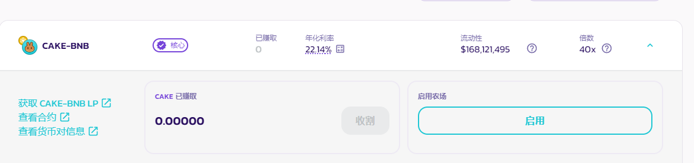
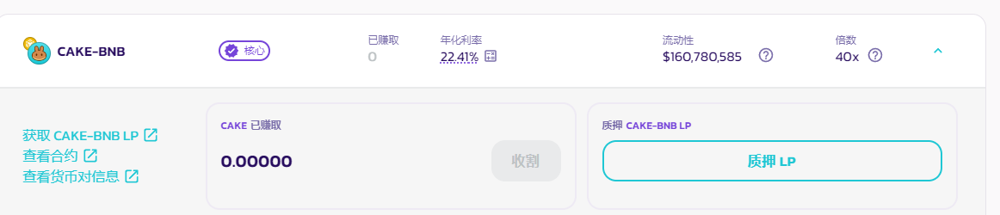
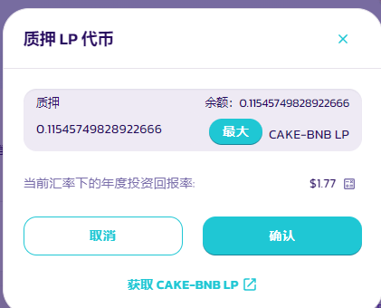
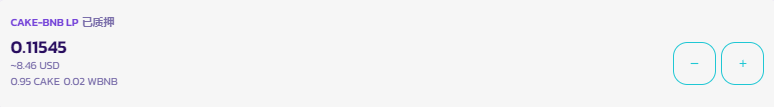
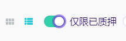
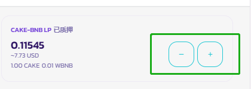
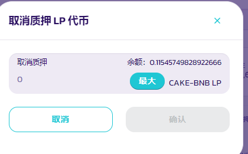

# 如何使用农场

农场的流动性质押功能，是用户在 PancakeSwap 上获得 CAKE 奖励的一大途径。&#x20;

与质押在糖浆池不同，使用农场需要你先提供一个代币对（**由两个代币组成**）的流动性以获得流动性仓位NFT 或者是 LP 代币（LP token），然后你将其质押在农场以获得奖励。 这使你可以在赚取 CAKE 的同时仍持有原有的两种代币，并且赚取 LP 奖励。


农场与糖浆池相比，奖励更高，但同时它们拥有**无常损失**带来的风险。它并没有听起来那么可怕，但在开始种植前，适当的去了解它是值得的。

查看这一篇来自币安的， [关于无常损失的文章](https://academy.binance.com/en/articles/impermanent-loss-explained) 来了解更多。


## V3 农场

### 做好准备工作

<figure><figcaption></figcaption></figure>

你将需要一个流动性仓位用以质押进农场。农场只能质押来自对应的代币对的流动性仓位，并要选择确切的手续费级别；例如，CAKE-BNB 0.25%农场只接受 0.25% 手续费级别的 CAKE-BNB 流动性仓位质押。它不接受：&#x20;

* 其他代币对的流动性仓位，如 CAKE-BUSD&#x20;
* 相同的代币对的流动性仓位，但是属于其他手续费级别：如手续费级别为 0.05% 的 CAKE-BNB 流动性仓位 。&#x20;

要创建准确的 LP 仓位，你需要为该交易对提供流动性，并选择对应农场的手续费级别。因此，要获得 CAKE-BNB 0.25%的 LP 仓位，你首先要为 CAKE-BNB 交易对提供流动性，并选择 0.25% 的手续费级别。这看起来似乎有点麻烦，实际上非常简单。以下是分步教程。

### 找到想要质押的农场

<figure><figcaption></figcaption></figure>

首先，你要选择一个想要参与的农场。访问[农场页面](https://pancakeswap.finance/farms)，查看可参与的农场列表。&#x20;

你可以选择另一种排序选项，如按 APR 排序，查看目前利率最高的农场。请注意，全局 APR 的计算方式为， CAKE 奖励分发量除以有效以及质押中的流动性量。各个持仓的 APR 并不相同，根据不同的价格区间设置会有所不同。

当你找到一个你想参与的农场时，记下交易对和它的手续费率，例如 BNB-CAKE 和 0.25%，用于之后添加对应的流动性。

### 提供流动性以建立仓位&#x20;

现在你已经找到了准备参与的农场，现在你需要添加流动性：&#x20;

1 - 如果你没有任何可用的流动性仓位，你会看到一个 "添加流动性" 的按钮，只需点击它就可以打开 "添加加流动性" 窗口，不需要离开农场页面。

<figure><figcaption></figcaption></figure>

2 - 或者你也可以点击农场下方的详情或者展开按钮，展开更多细节，点击详情部分中的 "添加XXX-YYY LP" 链接来添加流动性。

<figure><figcaption></figcaption></figure>

### 将你的流动性仓位质押到农场

.png>)

完成流动性添加后。你可以看到你的仓位将在你想使用的农场下列出。&#x20;

如果你有多个仓位，你可以点击 "查看全部"，并在新的弹出窗口中查看它们。

.png>).png>)

在列出的仓位上点击 "质押"，你的钱包弹出提示供你确认。

.png>)

短暂的等待后，窗口将关闭，你将在详情中看到你的质押仓位细节。

你可以重复上述步骤，将不同价格区间设置的多个仓位质押进农场。每个仓位都将赚取 CAKE 并需要单独收割。

### 收割农场奖励&#x20;

在 V3 农场中，你可以在同一个农场中质押多个流动性仓位。每个仓位都会获得CAKE，需要单独收割。

<figure><figcaption></figcaption></figure>

要想从已质押的仓位收获 CAKE 奖励，只需返回农场页面，找到你想收割的农场和对应仓位进行收割。你还可以使用 "仅限已质押" 的功能键来快速筛选你当前质押的农场。&#x20;

如果你有多个已经质押仓位，你可以点击 "查看全部"，并在新的弹出窗口中查看它们。

.png>)

点击对应流动性仓位旁边的 "收割"，之后你的钱包弹出提示供你确认。等待区块确认后，CAKE 奖励将被发送到你的钱包。

### 农场已质押情况下增加或移除流动性&#x20;

当已经在一个农场中质押了流动性的情况下，你仍然可以增加或移除流动性，并且不需要先从农场中取消质押。

<figure><figcaption></figcaption></figure>

你只需回到农场页面，找到你想调整的农场和对应仓位。你可以使用 "仅限已质押" 的功能键来快速筛选你当前质押的农场。&#x20;

.png>)

点击带有代币对、费率、仓位 ID 等信息和 ">" 箭头的仓位标题。你将可以看到对应仓位的详细信息页面。 只需通过 "添加" 或 "移除" 按钮来调整所质押仓位的流动性设置。&#x20;

请注意，在调整仓位的同时，所有尚未收割的 CAKE 奖励将被收割并发送到你的钱包。

### 从农场中解除质押流动性仓位

你可以在任何时候解除仓位的质押。&#x20;

想要解除质押，你只需转到农场页面，找到你想解除质押的农场和对应仓位然后解除质押。你可以使用 "仅限已质押" 的功能键来快速筛选你当前质押的农场。&#x20;

如果你有多个已经质押的仓位，你可以点击 "查看全部"，然后在弹出窗口的中查看它们。&#x20;

在仓位中点击 "解除质押"，你的钱包会要求确认。短暂的区块确认成功后，你的仓位凭证 NFT 将回到你的钱包，同时还有未被收割的 CAKE 奖励。

## V2 农场

### 做好准备工作

在开始耕种前，你需要一些准备工作。

你将需要一些 “LP 代币” 才能使用农场。对应农场只接受自己对应的 LP 代币（LP token）； 例如，CAKE-BNB 农场将只能质押 CAKE-BNB LP 代币。

要获得特定的 LP 代币，你需要为该交易对提供流动性。因此，要获得 CAKE-BNB LP 代币，你首先必须为 CAKE-BNB 交易对提供流动性。

这可能听起来很复杂，但其实还好，让我们一步一步来。

### 找到想要质押的农场

在继续下一步之前，选择一个适合你的农场。打开[农场页面](https://pancakeswap.finance/farms)，可以看到目前可参与的农场列表。

<figure><figcaption></figcaption></figure>

你可以选择其他种排序选项，如按 **APR** 排序，查看目前利率最高的农场。

当你找到一个你想参与的农场时，记下交易对，例如 BNB-CAKE，用于之后添加对应的流动性。

### 提供流动性、获得LP代币

现在你已经找到了一个可质押的农场，你将需要组合流动性来获得一些 LP 代币。

1. 转到[农场页面](https://pancakeswap.finance/farms)找到你想要质押的农场。单击你从列表中选择的农场，点击农场右侧箭头 "⌵" 以显示更多详细信息。
2. 在左侧，你会看到一些超链接。单击**获取（**你**需要的交易对）LP** 链接。

<figure><figcaption></figcaption></figure>

### 将你的 LP 代币质押到对应的农场

现在你已经拥有了 LP 代币，可以开始将它们质押在农场并获得奖励了！

1.  返回农场页面并找到你选择的农场。单击此农场任意空白处，它将展开更多细节。

    <figure><figcaption></figcaption></figure>

    准备就绪后，单击**启用**按钮并在钱包中确认你的操作。
2.  稍等片刻后，启用按钮将变为**质押 LP**。 单击它，将出现一个新窗口。

    <figure><figcaption></figcaption></figure>
3.  输入数量后（或点击「最大」投入所有 LP 代币），**确认**按钮将亮起。\

    <figure><figcaption></figcaption></figure>
4. 点击它。你的钱包会要求你授权你的操作。
5.  稍等片刻后，窗口将关闭，你将在详细信息中看到你新质押的 LP 代币 余额。

    <figure><figcaption></figcaption></figure>


当你在 BNB 链以外的 EVM 区块链上质押挖矿时。你需要等待约 30 分钟待跨链讯息传递完毕。

.png>)

若要查看你的进程，可以点击余额右侧的转圈图标（circular icon），或点击右上角的「最近的交易（Recent Transaction）」。



当你在 BNB 链以外的区块链上进行流动性挖矿，进行首次质押设置时，将需要少许公链币（例如，以太坊上是 ETH）来完成。因此，第一笔质押操作所需的 gas 将稍微高一些。

查看 [设置费用说明](https://docs.pancakeswap.finance/v/chinese/products/yield-farming/kua-lian-nong-chang/faq#kua-lian-nong-chang-zhi-ya-xu-yao-shou-fei-ma) 以了解更多信息。


### 从农场添加或者移除 LP 代币

你可能会决定稍后将更多 LP 代币质押进农场，或者从农场中取出一部分代币。这非常容易，随存随取。

1. 返回 [农场页面](https://pancakeswap.finance/farms)，在页面顶部，你将看到仅限已质押，单击以切换。

<figure><figcaption></figcaption></figure>

你现在应该只会在列表中看到你拥有的 LP 代币对应的农场，这将更容易找到你的农场。

&#x20;2\. 找到你拥有的 LP 代币对应的农场，然后单击该行以查看详细信息。 你将在右侧看到一个 - 和 + 按钮。 单击 - 移除/减少 LP 代币，或单击 + 添加更多 LP 代币。

<figure><figcaption></figcaption></figure>

3\. 将弹出一个窗口，该窗口类似于之前用于首次质押 LP 代币的窗口。像上次一样，输入想要取消质押/质押的数量，或单击 **最大** 以移除/添加所有可用的 LP 代币。

<figure><figcaption></figcaption></figure>

4\. 检查并确保显示的信息是正确的。 准备好后，单击 **确认** 按钮并于钱包中确认你的操作。&#x20;

5\. 稍等片刻后，你的新余额将显示在 LP 代币对的详细信息部分。如果你从农场移除了你的 LP 代币，你拥有的任何未收割的奖励都将自动被收割。

### 收割你的农场质押奖励

随着时间的推移，农场将为你带来 CAKE 奖励。 你可以收割这些奖励并使用它们来获得更多 LP 代币、将它们投入糖浆池或者使用它们来玩彩票或其他任何你感兴趣的项目。

### 如何回到你的农场并收割奖励

你可以从主页一键收割农场和糖浆池奖励。如果你只想收割你的农场奖励，请按照以下步骤。&#x20;

要领取你的农场奖励，你需要访问你质押的农场以收割你的 CAKE。

1. 回到 [农场页面](https://pancakeswap.finance/farms)。
2. 找到你质押 LP 代币的农场，然后单击该行以查看详细信息。 你应该在 “**CAKE 已赚取**” 下看到你的奖励估算值。

<figure><figcaption></figcaption></figure>

&#x20; 3.单击收割按钮并确认你钱包中的操作。 稍等片刻后，CAKE 将被提取到你的钱包中，供你随意使用。


当你在 BNB 链以外的 EVM 区块链上使用跨链农场时，你将需切换到 BNB 智能链来收割您的农场奖励。\
如果你的钱包不支持多链之间的切换，操作质押或取消质押 LP 代币将自动收割你的 CAKE。请注意，收割的 CAKE 将在 BNB 智能链上分发。

.png>)


## 我应该多久收割一次我的奖励？

你多久收割一次奖励取决于你，但请记住，收割时需要支付少量 gas 费用。&#x20;

点击 **收割** 后，确认时，你可以在钱包中看到此费用。

<figure><figcaption></figcaption></figure>

以上显示了 MetaMask 钱包中出现的收割费用。不同的钱包会以不同的方式显示信息。可以考虑让你的奖励累积一段时间，这样你支付 gas 费用的频率就会降低。&#x20;

这就是全部流程了！你可能还想了解[如何使用 PancakeSwap 糖浆池](../syrup-pools/ru-he-zai-tang-jiang-chi-nei-zhi-ya/)来获得奖励。

快乐耕种吧！
