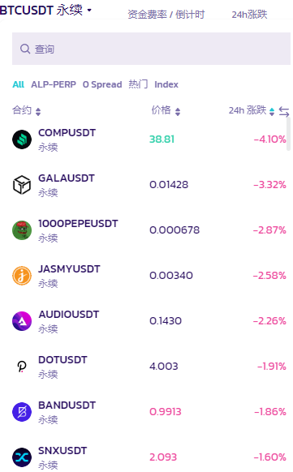
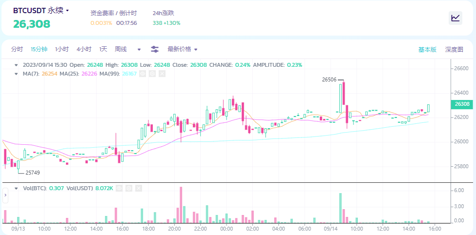

# 我应该如何使用它？

<figure><figcaption></figcaption></figure>

使用这一功能其实很简单（难的是如何做好交易）。我们只需按照步骤操作，就能获得完整的交易体验。想要获取更多信息，请访问[永续合约 V2 术语表](yong-xu-he-yue-v2-shu-yu-biao.md)。&#x20;

### 进入永续合约交易页面&#x20;

您可以从[官方网站](https://pancakeswap.finance/)的交易 → 永续合约 前往永续合约页面，或点击[此链接](https://perp.pancakeswap.finance/en/futures/BTCUSDT)。\

### 选择想要交易的代币对&#x20;

您可以点击页面顶部，可交易交易对旁边的箭头，选择该交易对。

<figure><figcaption></figcaption></figure>

更多的交易对将会推出！

<figure><figcaption></figcaption></figure>

### 分析图表，并决定交易策略&#x20;

现在让我们认真开始交易。您可以使用所有可用工具，按自己的方式分析图表。

<figure><figcaption></figcaption></figure>

**您知道怎么进行分析，或者想改进您的分析结果吗？**

以下是图表分析领域的入门指南：&#x20;

* [如何在币安网站上使用 TradingView](https://www.binance.com/zh-CN/support/faq/8419126024404348a1c6e4039fbed3fe)
* [K 线图](https://academy.binance.com/zh/articles/a-beginners-guide-to-candlestick-charts)
* [趋势线详解](https://academy.binance.com/zh/articles/trend-lines-explained)

### 设置你的仓位

接下来在右上方的版块中设置你的仓位。

<figure><figcaption></figcaption></figure>

您必须在此设置几个参数，例如：

_以下设置不分先后_

1. 做多或者做空

<figure><figcaption></figcaption></figure>

选择你的交易方向。

2. 设置合约杠杆倍数

<figure><figcaption></figcaption></figure>

<figure><figcaption></figcaption></figure>

移动小兔子滑块，选择合适的杠杆倍数。您也可以在右侧倍数框中手动输入倍数。&#x20;

免责声明：请记住，高杠杆有非常高的风险，请谨慎使用。

3. 设置订单类型

<figure><figcaption></figcaption></figure>

4. 设置订单规模并为你的订单设置好一个价格（适用于限价单）。

<figure><figcaption></figcaption></figure>

您还可以选择不同参照货币来查看您的仓位。

5. 设置止盈/止损和滑点

<figure><figcaption></figcaption></figure>

用户可以在开仓时设置止盈或止损价格。&#x20;

* 止盈： 一旦达到设定的获利盈亏百分比时，用户的仓位将会被平仓。&#x20;
* 止损： 一旦达到设定的损失盈亏百分比时，用户的仓位将会被平仓。&#x20;
* 滑点： 作用是，如果价格在开仓前向开仓方向移动过快，则自动取消市价订单。例如，如果您想以当前价格做多，但在开仓前价格上涨了 1%，则会自动取消市价订单。

提示：您可以将鼠标悬停在每个选项上以了解更多信息。请参阅[永续合约 V2 术语表](yong-xu-he-yue-v2-shu-yu-biao.md)以获取更详细的指南。

### 发送你的订单

设置好所有参数后，点击 "开仓" 即可发送订单。

<figure><figcaption></figcaption></figure>

### 查看你的仓位

订单发送后，将显示在 "未结订单" 中，直至订单完全成交。

<figure><figcaption></figcaption></figure>

### 仓位生效！

订单完全成交后，您的仓位就会生效。您可以在仓位面板中看到它，并且您可以查看、调整或平仓它。

<figure><figcaption></figcaption></figure>

祝您交易顺利！
