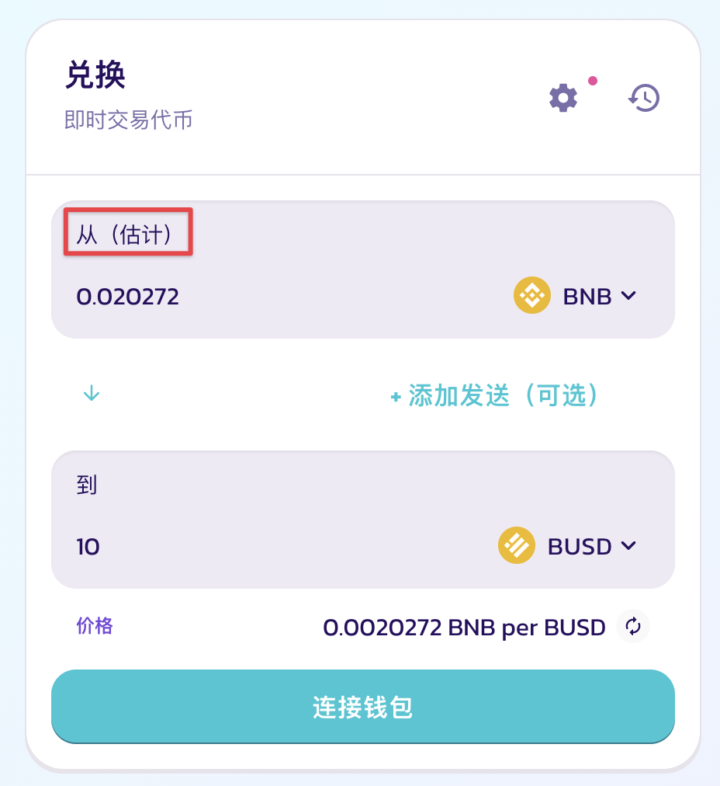

# 故障排除指南

有时您可能会发现自己面临一个没有明确解决方案的问题。 这些故障排除技巧可以帮助您解决遇到的问题。

## **交易相关问题**

### **INSUFFICIENT\_OUTPUT\_AMOUNT**

> The transaction cannot succeed due to error: PancakeRouter: INSUFFICIENT\_OUTPUT\_AMOUNT. This is probably an issue with one of the tokens you are swapping.
>
> (交易由于此错误而无法成功：PancakeRouter：INSUFFICIENT\_OUTPUT\_AMOUNT。问题可能出自您正在兑换的其中一个代币)

您正在尝试兑换代币，但您设置的滑点容限太低或您兑换的代币流动性太低。



1. 刷新页面，然后重试。
2. 尝试交易较小的金额。
3. 调高滑点容限：
   1. 点击兑换页面上的设置图标。
   2. 逐步调高滑点容限，然后重试。\
       (4) (2).png>)
4. 若还是不行，您可以尝试减少兑换金额的小数点位数。



**问题常见于尝试兑换流动性较低的代币时：**

换言之，您尝试兑换的代币，它的流动性池内有一个代币的数量不足以完成交易：有可能是因为该币的市值较低，或交易人数太少。

但是，您也有可能遇到无法出售的假币或诈骗币。 在这种情况下，PancakeSwap 无法封锁该代币或返还资金。



### **INSUFFICIENT\_A\_AMOUNT or INSUFFICIENT\_B\_AMOUNT**

> Fail with error 'PancakeRouter: INSUFFICIENT\_A\_AMOUNT'
>
> (交易出现此错误导致失败: "PancakeRouter: A代币不足")
>
> 或
>
> Fail with error 'PancakeRouter: INSUFFICIENT\_B\_AMOUNT'
>
> (交易出现此错误导致失败: "PancakeRouter: B代币不足")

您正在尝试从流动性池(LP)添加或解除流动性，但是该交易对中的其中一个代币不足。



**刷新页面，然后重试，或稍后重试。**

还是不行？

1. 点击流动性页面上的设置图标。
2.  逐步调高滑点容限，然后重试。

     (4) (2).png>)



该错误是由于尝试添加或解除流动性但其交易对中的A代币或B代币数量不足而引起的。

其中一个可能的情况是，当您的滑点容限设置太低时，价格更新太快导致。




好的，您或许坚决要解决此问题。但除非您知道自己在做什么，否则我们真的不建议您这样做。

PancakeSwap的网站目前没有解决此问题的简单方法：您需要直接调用智能合约。 您可以直接通过Router合约添加或解除流动性，同时将amountAMin或amountBMin设置为很小的数目。

### **批准并授权合约提取您的钱包里的LP代币**

浏览您要授权的LP代币合约地址。 \
以下示范例子是ETH/WBNB对：[https://bscscan.com/address/0x70d8929d04b60af4fb9b58713ebcf18765ade422](https://bscscan.com/address/0x70d8929d04b60af4fb9b58713ebcf18765ade422)

1. 选择 “**Write Contract”** (写入合约)**，**然后点击 “**Connect to Web3”** (连接至Web3)以连接您的钱包。\
   
2. 在第一项**"1. approve"**，通过输入以下内容批准Router合约提取您的LP代币。输入完毕后点击 **Write** 按钮。
   1. spender (address): 输入Router合约地址
   2. value (uint256): -1

### 查询LP余额"balanceOf"

1. 选择 **“Read Contract”** (读取合约)
2. 在第五项 **"5. balanceOf"**，输入您的钱包地址然后点击 **Query** 按钮。
3. 记下显示的余额。这余额显示的格式是uint256。您的下一个步骤需要输入这余额。

.png>)

### 添加或解除流动性

浏览以下Router合约网址: [https://bscscan.com/address/0x05ff2b0db69458a0750badebc4f9e13add608c7f#writeContract](https://bscscan.com/address/0x05ff2b0db69458a0750badebc4f9e13add608c7f#writeContract)

1. 跟之前一样，选择 **“Write Contract”** 然后点击 **“Connect to Web3”**。
2. 寻找 **addLiquidity** 或 **removeLiquidity** (根据当下你想做的操作)
3. 输入LP的两个代币地址，即代币A与代币B的合约地址。
4. 在 **“liquidity (uint256)”** 这一栏位，输入您从之前的步骤获得的uint256格式LP余额(即"balanceOf")。
5. 设置低额的 **amountAMin** 或 **amountBMin**: 两个都尝试 “1” 这个值。
6. 在 **“to (address)”** 这一栏位输入您的钱包地址。
7. **Deadline** (截止时间)必须是大于执行此交易的纪元(epoch)时间。

.png>)


这可能会导致很高的滑点，并且如果被机器人抢跑，可能会导致您损失一些资金。




### PancakeRouter: EXPIRED

> The transaction cannot succeed due to error: PancakeRouter: EXPIRED. This is probably an issue with one of the tokens you are swapping.
>
> (交易由于此错误而无法成功: PancakeRouter: 逾期。 这可能是因为您正在兑换的一个代币存在某些问题)

再试一次，但是在交易产生后立即确认(即签名并往链上广播)该交易。&#x20;

发生这种情况是因为您在交易产生后，没有足够快地点击“确认”按钮，而是等到期限过后才进行签名与链上广播。&#x20;

### Pancake: K

> The transaction cannot succeed due to error: Pancake: K. This is probably an issue with one of the tokens you are swapping.

尝试更改「到」一栏的数量，让「（估计）」标志出现在「从」一栏中，然后立刻开始交易，保持该标志一直在「从」一栏。

这通常发生在含有自身交易手续费的代币上。

### Pancake: TRANSFER\_FAILED

> The transaction cannot succeed due to error: execution reverted: Pancake: TRANSFER\_FAILED.

在交易前，请确保您有额外 30% 数量的代币在您的钱包内。或者，尝试交易一个较少的数额。如果您想卖出最大可能的数目，请尝试设置数量为总数的 70% 或者 69%，不要设置为 100%。这个问题导致的原因是类似 tDoge 和 tBTC 代币所实行的「实时恢复性调整」。\
[点击此处了解弹性调整代币](https://btcst.medium.com/stp-8-restorative-rebase-b4fbbdfd96c)。

另一个可能的原因是：该恶意代币的项目方暂停了所有的交易，或者设置为仅允许买入不允许卖出，或者仅允许部分地址卖出。任何人都可以发行 BEP-20 代币并在 PancakeSwap 上交易。所以，在交易任何代币前，请充分做好调查，谨防受骗上当。如果您尝试卖出但失败的代币来自于空投，这很可能是诈骗。请不要进行任何授权操作，更不要跟随任何提示跳转到第三方网站操作，您钱包内的资产将由被盗风险。

### Transaction cannot succeed

尝试减少交易的数量，点击设置按钮并增加滑点容差，然后重试。导致该错误的原因是流动性太少。

### **Price Impact too High**

尝试减少交易的数量，点击设置按钮并增加滑点容差，然后重试。导致该错误的原因是流动性太少。

### estimateGas failed

> This transaction would fail. Please contact support



**如果您是在解除与 BNB 组合的流动性对时遇到该错误：**

请选择「接收 WBNB」然后重试。

**如果您是在交易时遇到该错误：**

请联系您交易的代币发行方，这个问题只能由他们解决。



此问题（在交换时）是由将 V1 PancakeSwap 路由器硬编码到其合约中的代币引起的。&#x20;

虽然这种做法充其量是不明智的，但这些项目这样做的原因似乎是由于它们的代币经济学，其中每次购买都会将 % 的代币发送给 LP。&#x20;

受影响的项目可能无法使用 V2 交易路由：他们很可能需要创建指向我们新路由器地址的新版本的代币，并将任何现有的代币持有者迁移到他们的新代币。

我们建议任何创建此类代币的项目也应努力阻止其用户将其添加到 V2 LP。 最新的交易路由地址是 https://bscscan.com/address/0x10ED43C718714eb63d5aA57B78B54704E256024E



### Cannot read property 'toHexString' of undefined

> "Unknown error: "Cannot read property 'toHexString' of undefined"

在交易时，上链操作出错并显示该错误代码。这类错误常见于使用 Trust 钱包的移动设备。



1. 点击设置按钮，增加滑点容差并重试。
2. 若上述方法没用，请尝试使用别的钱包软件，导入相同助记词并重试。例如 SafePal。



**这通常发生在使用 Trust 交易代币，但滑点容差不够的情况下。**

发生该问题的详细原因仍在调查中。



### **Execution reverted: TransferHelper: TRANSFER\_FROM\_FAILED.**

> The transaction cannot succeed due to error: execution reverted: TransferHelper: TRANSFER\_FROM\_FAILED.



1. 请检查您有足够的代币余额用于交易。
2. 请确保该代币授权于交易路由地址的数量，大于您正在尝试交易的数量。若您不确定，请尝试取消、并重新授权。



该错误的常见原因为代币授权额度不足，或者没有足够的余额用于交易。

若您正在交易的代币有「弹性调整机制」，例如 tDoge 或 tBTC。请先 [点击此处](https://btcst.medium.com/stp-8-restorative-rebase-b4fbbdfd96c) 了解他们的机制。



## **糖浆池相关问题**

### BEP20: burn amount exceeds balance

> Fail with error 'BEP20: burn amount exceeds balance'
>
> (交易出现此错误导致失败: “BEP20: 销毁数量超出余额”)

您的钱包中没有足够的 SYRUP 代币，无法从 CAKE-CAKE 池中解除质押以提出 CAKE。



**购买跟您想解除质押 CAKE 同等数量的 SYRUP 代币。**

1. 在交易所上购买 SYRUP 代币。如果您想解除质押 100 个 CAKE，您需要购买对应数量（100 个）SYRUP 代币。
2. 再次尝试解除质押。



如果还是失败，您可以直接调用合约的「紧急提取」(emergencyWithdraw) 以紧急解除质押您正在质押的代币。

1. 浏览以下网址：\
   [https://bscscan.com/address/0x73feaa1eE314F8c655E354234017bE2193C9E24E#writeContract ](https://bscscan.com/address/0x73feaa1eE314F8c655E354234017bE2193C9E24E#writeContract)
2. 点击 **“Connect to Web3”** （连接至 Web3）以连接您的钱包。\
   
3. 在第 4 项：**“4. emergencyWithdraw”**，输入“0”，然后点击 **Write** 按钮。

虽然紧急提取成功让您解除质押，但这也会导致您失去任何尚未收割的奖励代币（即 CAKE）收益。


**紧急提出会导致您失去尚未收割的奖励代币。**




若想防止这种情况再次发生，**请不要出售您的 SYRUP 代币**。 您仍然需要 SYRUP 代币来帮助您从「质押 CAKE 获取 CAKE」糖浆池中解除质押。

发生此错误的原因是您已经出售或转账了您的 SYRUP 代币。 当您在 CAKE-CAKE 糖浆池中质押您的 CAKE 时，SYRUP 会根据 CAKE 的数量，以 “1:1” 的比例被铸造出来。在调用 leavesStaking （即解除 CAKE 质押）函数时，合约会销毁与 CAKE 数量同等的 SYRUP 代币数量。因此，如果您没有足够的 SYRUP 代币，您将不能成功解除质押。




### Out of Gas error

> Warning! Error encountered during contract execution \[out of gas]
>
> (警告！合约执行过程中遇到错误\[矿工费已用尽])

您设置的**Gas Limit**(矿工费限制/网络费用限制)过低。



在点击交易确认前，手动调高 **Gas 限制（**注意！不是 Gas 价格！）

一般而言，限制设为 200000 就足够了。

.png>)

以上的例子取自 Metamask 截图。 如果不确定如何设置 Gas 限制，请查看您钱包的文档。



基本上，您的钱包（Metamask, Trust Wallet等）无法使用预估的 Gas 限制，完成其尝试执行的操作。

您的钱包所建议的 Gas 限制太低，因此在合约函数调用完成之前，矿工费已用尽。\




### BEP20: transfer amount exceeds allowance

> Fail with error 'BEP20: transfer amount exceeds allowance'
>
> (交易出现此错误导致失败: “BEP20: 转出数额超出上限”)



1. 使用 unrekt.net 解除您正在操作糖浆池的合约授权（您可在各糖浆池详情中找到它们的地址）
2. 重新授权（点击「启用」）合约，不要更改默认的授权数量。
3. 重试您正在尝试的操作。



该错误的原因是您在最初授权时，设置了一个过低的数量。后期操作时，操作的代币数量超过了剩余授权允许数目。



### BEP20: transfer amount exceeds balance

> Fail with error 'BEP20: transfer amount exceeds balance'
>
> (交易出现此错误导致失败: “BEP20: 转出数额超出余额”)

您正试图从奖励代币不足的糖浆池中解除质押。如果没有，您可能正在尝试发送您没有的令牌。



首先，让团队知道您要从哪个池中取消质押，以便他们可以充值奖励。 如果您急于取消抵押并且您不介意失去待处理的收益，请尝试紧急提款：

您可以直接调用合约的「紧急提取」 (emergencyWithdraw) 以对您质押着的代币解除质押。

1. 查找您要解除质押的糖浆池的合约地址。您可以在各糖浆池详情中找到他们的 BscScan 页面。
2. 点击进入，或浏览 [https://bscscan.com/](https://bscscan.com/address/0x73feaa1eE314F8c655E354234017bE2193C9E24E#writeContract) 然后在搜索栏中输入糖浆池的合约地址。
3. 选择 **“Write Contract”（**写入合约）。
4. 点击 **"Connect to Web3"（**连接 Web3）以便连接您的钱包。
5. 在第4项：**“4. emergencyWithdraw”**，点击 **Write** 按钮。

虽然紧急提取允许您成功解除质押，但这也会导致您失去任何尚未收割的奖励代币。


**紧急提出会导致您失去尚未收割的奖励代币。**




当您尝试从已结束很久的糖浆池中解除质押时，一般会出现此错误。其原因是因为该池中没有足够的奖励代币供您收割。 这会导致解除质押操作失败。



## 预测功能的问题

请检查以下文档


[yu-ce-gong-neng-gu-zhang-pai-chu.md](../products/yu-ce/yu-ce-gong-neng-gu-zhang-pai-chu.md)


## 其他错误

### Provider Error

> Provider Eror\
> No provider was found
>
> 提供商错误\
> 未找到提供商

该错误常见于：点击「浏览器钱包插件连接」，例如 MetaMask 或 Binance Chain Wallet，但您未安装插件时。



安装浏览器插件，并正确连接。请查阅我们关于 [如何正确连接钱包的教程](https://docs.pancakeswap.finance/get-started/connection-guide)。



### Unsupported Chain ID

不支持的链 ID

请更换您的钱包网络（区块链）到 Binance Smart Chain （币安智能链），如果您不知道如何切换，请查阅您的钱包指南或教程。

### 购买 SAFEMOON 或类似分红代币时遇到错误

要交易 SAFEMOON，您必须点击设置按钮，**并设置您的滑点容差至 12% 或更高。**\
这是因为 **SafeMoon 每一个交易都会收取 10% 的税：**

* 5% 手续费 = 分红给当前所有持有者
* 5% 手续费 = 用于添加流动性

这也是为什么您在交易时可能不会收到预计数量的代币的原因。\
阅读更多关于 [如何交易 SafeMoon](https://community.trustwallet.com/t/how-to-buy-safemoon/155742) 。

### Internal JSON-RPC errors

> "MetaMask - RPC Error: Internal JSON-RPC error. estimateGas failed removeLiquidityETHWithPermitSupportingFeeOnTransferTokens estimateGas failed removeLiquidityETHWithPermit "

常见于使用 MetaMask 解除部分代币的流动性时，具体原因未知，请尝试用别的钱包 App 进行该操作。

> Internal JSON-RPC error. { "code": -32000, "message": "insufficient funds for transfer" } - Please try again.

您没有足够的 BNB 来支付交易矿工费，您的钱包需要更多 BEP-20 网络的 BNB。

### Error: \[ethjs-query]

> Error: \[ethjs-query] while formatting outputs from RPC '{"value":{"code":-32603,"data":{"code":-32000,"message":"transaction underpriced"\}}}"

在确认交易前，增加 Gas 限制。请查看您钱包的指南，了解如何增加 Gas 限制（注意！不是 Gas 价格）

> Swap failed: Error: \[ethjs-query] while formatting outputs from RPC '{"value":{"code":-32603,"data":{"code":-32603,"message":"handle request error"\}}}'

原因未知。请尝试以下步骤并重试：

1. 增加 Gas 限制
2. 增加滑点容差
3. 清除缓存及交易记录

## 个人资料问题

### 哎呀！ 我們無法在您的錢包中找到任何 Pancake 收藏品。

&#x20;我们正在调查这个问题背后的逻辑，同时请尝试以下解决办法：



1. 转到“收藏”页面，然后返回个人资料页面。如果找不到链接，请直接访问 https://pancakeswap.finance/collectibles。&#x20;
2. 重试个人资料创建



改变环境。&#x20;

* 清除缓存并重试。
* &#x20;在不同的浏览器上重试。&#x20;
* 在不同的钱包应用程序上重试。&#x20;
* 在不同的网络上重试



### 检查用户名时不断旋转

有以下两种可能性导致：

1. 您在此浏览器上装了多个插件钱包
2. 网络问题



根本原因：您在浏览器上安装了多个钱包。

它可能会在钱包之间产生冲突。 这超出了 PancakeSwap 的控制，我们无能为力。

1. 在浏览器上只安装一个钱包，删除其他钱包。&#x20;
2. 重新连接钱包并再次尝试设置用户名。



根本原因：网络不稳定。

&#x20;你必须重试以下步骤：

1. 完全删除在文本字段中输入的任何内容。&#x20;
2. 重新输入用户名，然后请等待几秒钟。&#x20;
3. 如果它不起作用，请重新加载页面并重试。


