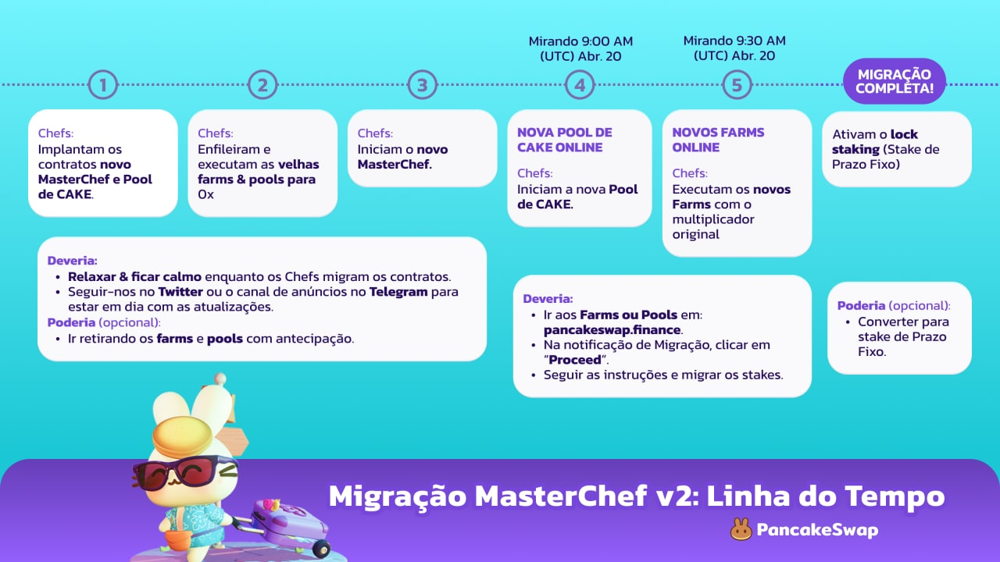

# Migre seus Stakes

Para continuar ganhando suas recompensas do stake, você vai precisar migrar seus farms e pools para o novo MasterChef. Relaxa, vai ser fácil.


**Mas espere! Preciso migrar?**

Você precisa migrar se você faz:

* **Farm** na PancakeSwap.
* Stake nas **Pools de Syrup de CAKE** na PancakeSwap (Manual, Auto, IFO).

\*outras Pools de Syrup não são afetadas


## Como migrar?

### 1. Procure o assistente de migração

Vá para [https://pancakeswap.finance](https://pancakeswap.finance), conecte sua carteira, e visite os **Farms** e **Pool**. Você deve ver uma notificação de migração no topo da página.

.png>)

Clique em "**Proceed**" para ir para o assistente da migração.

### 2. Retire seus farms antigos do Stake

Há duas etapas no assistente de migração. Na primeira etapa, você deve ver uma lista de três pools de Syrup de CAKE e farms que você está fazendo stake no momento.

.png>)

Clique em "**Unstake All**" em cada pool e farm para retirar todos seus ativos do stake.

.png>)

Depois de sacar, clique em "**Go to Stake**" para ir para o passo 2.

### 3.  Faça Stake dos seus LP tokens e CAKE nos novos Farms e Pools.

Aqui você deve ver a nova Pool de Syrup de CAKE e os novos Farms. Antes de fazer stake, você precisa dar permissão para eles.

.png>)

Clique em "**Enable**" para permitir o stake em cada Pool de Syrup de CAKE e Farms. Se você está usando um dispositivo móvel, por favor clique “**v**” (setinha pra baixo) para expandir o card podendo ver o botão "**Enable**".

Depois da permissão, você vai estar habilitado para começar o stake na Pool e nos Farms.



.png>)

Para Pool de Syrup de CAKE. Por favor:

1. Clique "**Flexible**" embaixo na seção "Stake CAKE".
2. Entre com a quantidade de CAKE que você quer colocar em stake.
3. Clique "**Confirm**".


A opção de stake bloqueado (prazo fixo) ficará disponível alguns dias após a migração. Você poderá converter sua posição de stake flexível para bloqueada. Para saber mais sobre a nova Pool de Syrup de CAKE com stake de prazo fixo, confira [esse doc](broken-reference).




.png>)

Para os farms, por favor:

1. Clique em "**Stake**".
2. Entre com a quantidade de LP tokens que você quer colocar em stake.
3. Clique em "**Confirm**"



### 4. Feito!

Você agora está fazendo stake no novo MasterChef e continua ganhando recompensas em CAKE! Clique "**Finish**" para voltar e explorar alguns outros incríveis produtos oferecidos pela PancakeSwap.

## Linha do Tempop da Migração

Certifique-se de seguir nosso [Twitter](https://twitter.com/pancakeswap/) ou canal de anúncios do [Telegram](https://t.me/PancakeSwapAnn) para o cronograma detalhado e ultimas atualizações! Precisa de alguma ajuda? Aprenda mais como entrar em contato conosco para ser ajudado [aqui](../../contact-us/#help).

## FAQ

#### **Quando isso vai terminar?**

A Migração vai levar várias horas, mas deve estar totalmente terminado após o lançamento da página do assistente de migração. Siga nosso [Twitter](https://twitter.com/pancakeswap/) ou o canal de anúncios do [Telegram](https://t.me/PancakeSwapAnn) para as últimas atualizações!

#### **Quando devo migrar?**

1. Você poderá migrar em qualquer momento. Não há tempo limite.
2. É melhor migrar o mais breve possível para você continuar ganhando recompensas dos seus farms e pools.

#### Eu não vejo o assistente de migração!

Ele só será implantado quando as implantações e configurações dos contratos inteligentes forem concluídas. Isso pode levar horas. Siga nosso [Twitter](https://twitter.com/pancakeswap/) ou o canal de anúncios do [Telegram](https://t.me/PancakeSwapAnn) para as últimas atualizações!

#### Por que o stake bloqueado não está disponível?

EM BREVE! Para conseguir uma migração suave. O stake bloqueado (de prazo fixo) será ativado alguns dias após as migrações.

#### Eu não consigo encontrar meus farms no assistente de migração!

Pode ser porque o farm foi descontinuado antes da migração. Por favor:

1. Vá para os **Farms**.
2. Escolha “**Finished**” no topo da lista dos farms.
3. Clique “**Check out v1 farms**” para procurar pelo seu farm.
