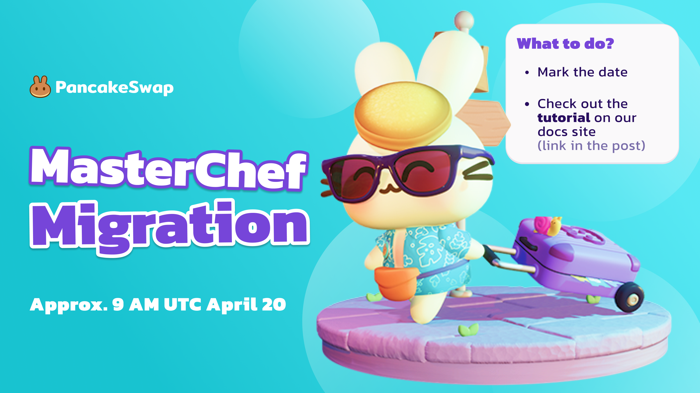
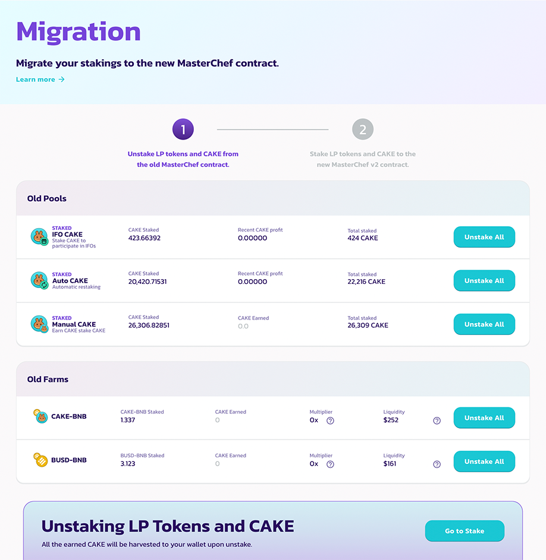
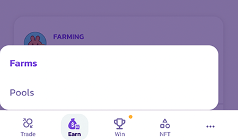
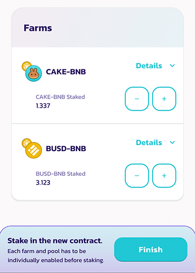

# Migrate Your Stakings

In order to keep earning staking rewards, you will need to migrate your farms and pools staking to the new MasterChef. Relax, it's gonna be easy.


**But wait! Do I need to migrate?**

You need to migrate if you are:

* Farming on PancakeSwap **Farms**.
* Staking in PancakeSwap **CAKE Syrup Pools** (Manual, Auto, IFO).

\*other Syrup Pools aren’t affected


## How to migrate?

### 1. Look for the migration helper

Go to [https://pancakeswap.finance](https://pancakeswap.finance), connect your wallet, and visit the **Farms** or **Pools**. You should see a migration notification at the top of the page.

.png>)

Click "**Proceed**" to visit the migration helper.

### 2. Unstake from the old farms

There are two steps in the migration helper. In the first step, you should see a list of three CAKE syrup pools and farms you are currently staking.

.png>)

Click "**Unstake All**" on each of the farms and pools to unstake all your assets.

.png>)

After unstaking, click "**Go to Stake**" to proceed to step 2.

### 3. Stake your LP tokens and CAKE into the new farms and pools.

Here you should see the brand new CAKE syrup pool and the new farms. Before staking, you will need to enable them.

.png>)

Click "**Enable**" to enable staking on each of the farms and the CAKE syrup pool. If you are using a mobile device, please click the “**v**” (downward arrow) to expand the card while looking for the "**Enable**" button.

After enabling, you will be able to start staking in the pool and farms.



.png>)

For CAKE syrup pool. Please:

1. Click "**Flexible**" under the "Stake CAKE" section.
2. Enter the amount of CAKE you want to stake.
3. Click "**Confirm**".


The locked (fixed-term) staking option will become available a few days after the migration. You will be able to convert your flexible staking position to a locked one. To learn more about the new CAKE syrup pool with fixed-term staking, please check out [this doc](../../products/coming-soon/new-cake-pool/).




.png>)

For farms, please:

1. Click "**Stake**".
2. Enter the amount of LP tokens you want to stake.
3. Click "**Confirm**"



### 4. Done!

You are now staking in the new MasterChef and continue earning CAKE rewards! Click "**Finish**" to go back and explore some other great products PancakeSwap offers.

## Migration Timeline

Make sure to follow our [Twitter](https://twitter.com/pancakeswap/) or [Telegram](https://t.me/PancakeSwapAnn) announcement channel for detailed timing and the latest updates! Need any help? Learn more about how to reach for help [here](../../contact-us/#help).

## FAQ

#### **When will it finish?**

Migration will take several hours, but it should be totally finished upon the launch of the migration helper page. Follow our [Twitter](https://twitter.com/pancakeswap/) or [Telegram](https://t.me/PancakeSwapAnn) announcement channel for the latest updates!

#### **When must I migrate?**

1. You will be able to migrate at any time. There’s no time limit.&#x20;
2. It’s better to migrate sooner so you can continue to earn rewards from farms and pools.

#### I don’t see the migration helper!

It will only be deployed once smart contract deployments and configurations are completed. It could take serval hours. Follow our [Twitter](https://twitter.com/pancakeswap/) or [Telegram](https://t.me/PancakeSwapAnn) announcement channel for the latest updates!

#### Why lock staking is not available?

SOON! To achieve a smooth migration. Lock (fixed-term) staking will be enabled a few days after the migrations.

#### I can't find my farms in the migration helper!

It might be due to the farm being discontinued before the migration. Please:

1. Go to **Farms**.
2. Choose “**Finished**” at the top of the farm list.
3. Click “**Check out v1 farms**” to look for your farm.
