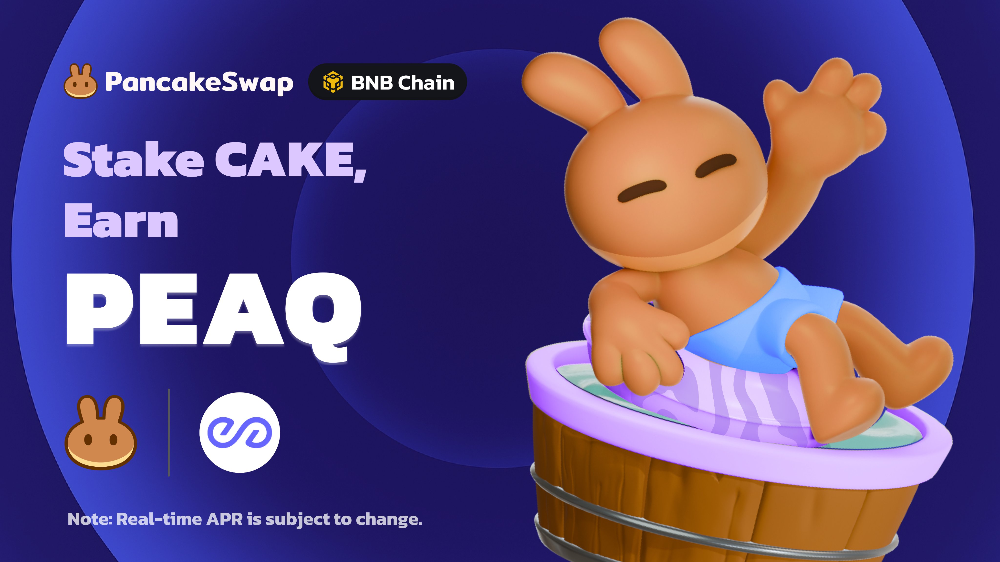

# ⛏️ Pancake Picks

<figure><figcaption></figcaption></figure>

In the fast-moving world of crypto, it can be tough to separate the noise from the trends. Pancake Picks helps by showcasing the top token pairs from trending categories like Memecoins and AI Agents on our [Liquidity Pools](https://pancakeswap.finance/liquidity/pools) page every weekday. By highlighting these tokens based on key market and community data, Pancake Picks makes it easier for users to discover the latest trends.&#x20;

### How does Pancake Picks work?

1. **Token Categories**: We use the CoinGecko API to find trending tokens in categories like [Memes](https://www.coingecko.com/en/categories/meme-token) and [AI Agents,](https://www.coingecko.com/en/categories/ai-agents) then match them with tokens on PancakeSwap across any of the 8 EVM chains we support.
2. **Selecting Top Pairs**: We analyze liquidity pools and select the top 3 token pairs from this list based on significant market and community data over the previous 24 hours.
3. **Formula**: To keep it fair and avoid gaming the system, we don’t disclose the exact formula for how we select tokens.  The Kitchen will adjust it over time to reflect market trends.
4. **Graduated Tokens**: At least one of the top 3 pairs will come from tokens that have graduated from four.meme or PancakeSwap Springboard.

### Benefits of Featured Tokens

#### Benefits from PancakeSwap:&#x20;

If your token pair is selected for Pancake Picks, you’ll enjoy:

* **Whitelisting**: If your token isn’t already on our token list, we’ll add it.
* **CAKE Emissions**: Your token will earn CAKE emissions for the duration it is featured.
* **Increased Visibility**: We’ll feature your token prominently on our Liquidity Pools page, making it easier for users to explore your token and its liquidity pair.

#### Benefits from veCAKE Managers:

Every veCAKE epoch (2 weeks each), we will select the top 3 performing pairs throughout the period. They will share the following rewards provided by veCAKE Managers:

* \~400 CKP in bribes from [Cakepie](https://www.pancake.magpiexyz.io/stake)
* 5% of [StakeDAO’s](https://www.stakedao.org/lockers/cake) veCAKE votes (amounts to \~91k veCAKE as of March 2025)
* 60k veCAKE votes from [Astherus](https://www.astherus.finance/en/earn/astoken?token=CAKE)

### Why is Pancake Picks important?

* **Data-Driven Selection**: Pancake Picks provides a transparent, merit-based approach to highlight tokens that are gaining momentum in the market, allowing users to discover relevant, trending projects.
* **Simplifying Support**: The Kitchen receives many requests for support from new projects. Pancake Picks helps streamline the process by focusing on tokens with strong market and community metrics, making it easier to evaluate which projects to prioritize.
* **Promoting PancakeSwap Liquidity**: By featuring tokens on Pancake Picks, we incentivize teams to deploy their tokens on PancakeSwap, further supporting our goal to provide liquidity for high-quality projects across multiple chains.

### FAQ

1. My token is doing great, but why wasn’t it selected?
   1. We don’t share the exact formula we use to pick tokens to prevent manipulation. If your token wasn’t chosen, key market or community metrics might be missing. Keep building, and your token could be featured in the future!
2. My token’s liquidity is on another DEX, will it be considered for Pancake Picks?
   1. No. We only consider tokens whose liquidity resides on PancakeSwap, along with their metrics from our liquidity pools. If you want your token to be considered, make sure to add liquidity to any of the 8 EVM chains we support.
3. How long will Pancake Picks last for?
   1. There’s no set end date, but if interest fades or if the feature no longer aligns with our goals, we may retire it. We’ll also adapt the token categories to keep up with new trends.
4. What token categories are currently being considered for Pancake Picks?
   1. We’re currently looking at Memecoins and AI Agents, as defined by CoinGecko, though we may expand or adjust this list in the future.
5. Why wasn’t my token selected, even though it’s in an active category?
   1. Make sure your token is listed on CoinGecko with the correct category tag. If it’s not, we won’t be able to pick it up through their API.
6. Why isn’t \<insert token category> considered by Pancake Picks? It is currently trending and picking up steam in the crypto community
   1. We’re open to suggestions! Please share your requests on [Telegram](https://t.me/pancakeswap) or [Discord](https://discord.com/invite/pancakeswap). However, to keep the filtering process efficient, we need to limit the number of categories we consider.
7. How much CAKE emissions will the selected token pairs receive?
   1. 1st place: 30 CAKE per day
   2. 2nd place: 20 CAKE per day
   3. 3rd place: 10 CAKE per day
   4. These numbers may change as the product evolves. For now, the emissions come from the [Kitchen’s discretionary budget,](https://pancakeswap.finance/voting/proposal/0x8eff088ca5d8c07a1a0be979533b6aa36dd098edb62714f948c06cf561817432) with no new emissions. If this feature becomes popular, we might tap into the Ecosystem Growth budget to increase emissions.
8. How much in bribes and veCAKE votes will the top 3 pairs receive from the veCAKE Managers every epoch (2 weeks)?
   1. 1st place: 50% of all bribes / veCAKE votes provided
   2. 2nd place: 33% of all bribes / veCAKE votes provided
   3. 3rd place: 17% of all bribes / veCAKE votes provided
9. How do I improve my tokens’ performance to be considered for Pancake Picks?
   1. While we are unable to share the exact formula we use, we encourage projects to continue organically growing their token traction and community, which should reflect positively when we do our internal evaluation.
10. How often will the Pancake Picks be updated?
    1. Pancake Picks will be updated every weekday. If your token is featured on a Friday, it will stay live for about 3 days.
11. What time will the Pancake Picks be updated?
    1. There’s no fixed time, but we aim to update the Picks every weekday around 0900 UTC.
12. When will the data of the tokens be considered?
    1. We use data from the past 24 hours, which is updated at 0000 UTC every weekday to determine the Pancake Picks.
    2. For the top 3 pairs per epoch, they will be selected based on their frequency of appearing on Pancake Picks throughout the 2 weeks. If there is a tie, we will take the higher-scoring pair over the epoch based on our internal formula.

\
**Disclaimer:** Pancake Picks is based purely on data from CoinGecko and PancakeSwap’s liquidity pools. Its sole purpose is to display trending tokens and token pairs on our Liquidity Pools page. We do not endorse or guarantee the success of any of the tokens or projects mentioned. All decisions related to investment or involvement with these tokens are the responsibility of the user.
