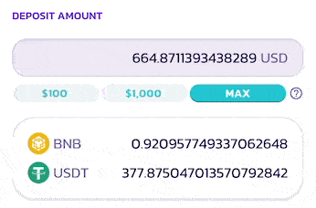
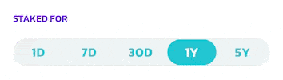
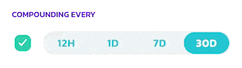
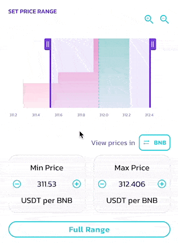
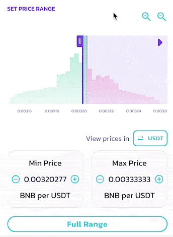
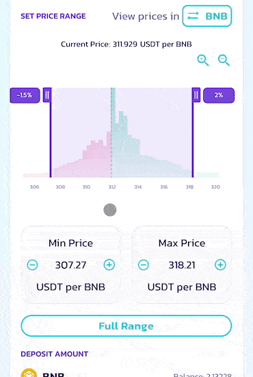

# APR/ROI/IL 计算器

在 V3 流动性和农场中，随着全新的非同质化流动性和可自定义价格区间功能的推出，每个 LP 头寸都将拥有自己的 LP 手续费和 CAKE 农场挖矿 APR。

为了让提供流动性更顺畅、更轻松，每当你提供流动性或进行农场挖矿时，都可以使用全新的自动 APR 显示以及全新的 ROI 计算器。

## 自动 APR 计算与显示 

<figure><figcaption></figcaption></figure>

当你提供流动性时，自动 APR 显示会响应你的配置更改，并根据你的设置计算 APR。

例如，在大多数情况下，如果你收紧价格区间设置，APR 会上升。

请注意 LP 手续费 APR：

* LP 手续费奖励的估算金额会根据所选的手续费等级而有所不同，手续费奖励需要手动领取和复投。
* APR 数据使用历史交易量计算，这依赖于 Subgraph，可能存在索引延迟。

关于农场挖矿 APR：

* CAKE 奖励的估算金额基于农场的实时 CAKE 排放量。它们会根据未来的排放量调整而变化。


这些数字是根据当前的费率和资金池状况计算的，并会根据各种外部变量而变化。它们仅作为估算值提供给你参考，绝不代表保证的回报。


你可以在以下位置找到此 APR 显示：

* “添加流动性”页面 - 显示 LP 手续费 APR
* 每个现有流动性头寸的详情页面 - 显示 LP 手续费 APR\
  .png>)
* 农场页面，在每个农场下的头寸中 - 显示包含 LP 手续费和 CAKE 奖励的综合 APR\
  .png>) 

## 改进的 ROI 计算器 

<figure><figcaption></figcaption></figure>

每当你看到自动 APR 显示时，都可以点击调出全新的 ROI 计算器。全新的 ROI 计算器经过重新设计，新增了多项功能，以满足 V3 集中流动性提供和农场挖矿的需求。

让我们一起逐一了解各个部分：

### 存入金额、“质押时长”和“复投频率” 

这三项是基本输入项，在之前的 ROI 计算器中也有呈现。它们用于定义：

1. 向流动性头寸提供了多少资产（以美元计）。
2. 这些资产将在头寸中质押多长时间。
3. 你将多频繁地把奖励复投回头寸。

⓵ **存入金额**

你可以手动输入以美元计的金额，或使用快捷操作按钮快速填入 $100、$1000 或根据钱包中代币余额所允许的最大金额。

⓶ **质押时长**

你可以通过选择以下时长来设定资产在流动性头寸中质押的时间：1 天、7 天、30 天、1 年和 5 年。

回报数额将根据你的质押时长计算。

⓷ **复投**

你可以选择多频繁地收获头寸产生的奖励，并将其复投回头寸。你可以在以下时间间隔中选择：12 小时、1 天、7 天和 30 天。

回报数额和 APY 将根据你的选择计算。如果你不打算复投头寸，请取消勾选左侧的复选框。


在 V3 中，LP 手续费和赚取的 CAKE 必须手动收获和复投。


### &#x20;⓸ 历史价格 

.png>)

这是一个仅供查看的部分，用于参考所选交易对的历史价格走势。

你可以参考不同时间范围内的历史价格走势，例如价格通常波动的幅度，然后据此制定合适的价格区间设置，在更高的 APR 与更低的无常损失风险之间取得平衡。

* MIN - 最低价格
* MAX - 最高价格
* AVG - 平均价格
* CURRENT - 当前价格


价格图表仅使用实际 V3 交易对的数据。因此，V3 部署之前的价格数据不可用。这四个价格指标代表当前选定的时间范围，并会根据选择而变化。


### ⓹ 价格区间 

通过此部分，你可以查看不同价格区间内已存入了多少流动性，并据此制定和设置你提供流动性的价格区间。

你可以在标题下方找到分布图表。流动性数量越大，图表越高。

你可以通过以下方式更改价格区间设置：

* 拖动图表上的两个手柄来增大或减小最低和最高价格限制。
* 使用两个手柄之间的区域来移动所选区间。
* 点击最低和最高价格字段上的 + 和 - 按钮。
* 点击价格字段中的数字并手动输入。

如果你想浏览分布图表：

1. 使用加号和减号放大镜按钮进行放大和缩小
2. 拖动 X（底部）轴以左右移动

如果你想为整个价格区间提供流动性，请点击“全区间”

### ⓺ 翻转价格方向以不同基准查看价格 

对于某些代币对，以特定基准代币查看价格更容易也更直观。例如，对于 BNB/USDT 交易对，大多数人会更喜欢以“每个 BNB 多少 USDT”来查看价格，而不是反过来。

你可以轻松翻转价格显示。只需点击“查看价格单位：”后面的按钮，即可在交易对中的两种代币之间切换基准。

### ⓻ 导入和导出（应用）你的设置 

当你在“添加流动性”窗口中打开 ROI 计算器，或通过查看现有头寸打开时，以下设置将自动导入，因此你无需再次设置：

1. 你存入的资产金额
2. 价格区间
3. 所选的手续费等级

当你在 ROI 计算器中完成配置后，可以点击“应用设置”，将计算器中的设置快速应用回“添加流动性”窗口，这样你就无需手动匹配它们。

### ⓼ 计算农场挖矿奖励和 APR 

如果你在“农场”页面下调出 ROI 计算器，农场挖矿奖励将被纳入计算中。

你可以展开详情部分以查看奖励明细。

<figure><figcaption></figcaption></figure>
