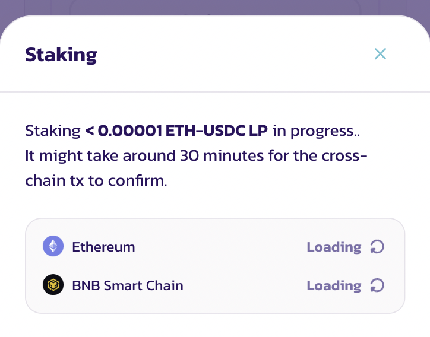

# 农场使用指南（旧版）

在农场中进行农场挖矿是在 PancakeSwap 上赚取 CAKE 奖励的好方法。

与 Syrup 资金池不同，农场要求你质押**两种代币**来提供流动性，并获得流动性头寸 NFT 或 LP 代币，然后你将其质押在农场中以赚取奖励。这让你在赚取 CAKE 的同时，仍能保留对你其他代币的头寸！


农场挖矿能带来比 Syrup 资金池更高的回报，但同时伴随着**无常损失**的风险。它并不像听起来那么可怕，但在开始之前值得先了解一下这个概念。

查看币安学院的这篇精彩的[无常损失解析文章](https://academy.binance.com/en/articles/impermanent-loss-explained)以了解更多。


## 农场 V3

### **做好准备**

.png>)

你需要一个流动性头寸才能进入农场。农场只能接受来自其自身精确交易对、且具有所选精确手续费等级的流动性头寸；例如，CAKE-BNB 0.25% 农场只接受选择了 0.25% 手续费等级的 CAKE-BNB 流动性头寸。它不会接受：

* 其他交易对，如 CAKE-BUSD
* 相同交易对但具有其他手续费等级：如手续费率为 0.05% 的 CAKE-BNB

要创建精确的 LP 头寸，你需要为该交易对在选择了正确手续费率的情况下提供流动性。因此，要获得 CAKE-BNB 0.25% LP 头寸，你首先必须为 CAKE-BNB 交易对在选择了 0.25% 手续费等级的情况下提供流动性。

这听起来可能令人生畏，但其实并不太复杂。让我们一步步来。

### **定位你的农场**

.png>)

在继续之前，你需要选择一个适合你的农场。[访问农场页面](https://pancakeswap.finance/farms)以查看可用农场列表。

你可以选择其他排序选项，例如按 APR 排序，以查看当前奖励率最高的农场。请注意，APR 是针对单个头寸全局计算的；它可能因其价格区间设置而有所不同。

当你找到想要使用的农场时，记下交易对及其手续费率，例如 BNB-CAKE 和 0.25%，以备日后需要。

### **提供流动性以创建头寸**

现在你已经找到了要质押的农场，你需要提供流动性：

1 - 如果你没有任何可用的头寸，你将看到一个“添加流动性”按钮，只需点击它即可在不离开农场页面的情况下打开“添加流动性”窗口。

.png>)

2 - 或者，你可以点击你从列表中选择的农场所在的行。它将展开以显示更多详情。或者在卡片视图中，点击“详情”以展开显示更多详情。点击详情部分中的“添加 XXX-YYY LP”链接以添加流动性。

.png>)

### **将你的头寸质押到农场**

.png>)

完成添加流动性后，你应该会看到你的头寸列在你想使用的农场下方。

如果你有多个头寸，可以点击“查看全部”在新的弹出窗口中查看它们。

.png>) .png>)

点击所列头寸上的“质押”，你的钱包将要求确认。

.png>)

稍等片刻后，窗口将关闭，你将在详情中看到你已质押的头寸。

你可以重复上述步骤，快速质押具有不同价格区间配置的多个头寸。每个头寸都将赚取 CAKE，并需要分别收获。

### **收获农场挖矿奖励**

在农场 V3 中，你可以在同一个农场上质押多个头寸。每个质押的头寸都将赚取 CAKE，并需要分别收获。

.png>)

要从质押的头寸中收获 CAKE 奖励，只需返回农场页面，找到你想要收获的农场和头寸。你可以使用“仅显示已质押”切换开关快速筛选你当前正在质押的农场。

如果你有多个质押的头寸，可以点击“查看全部”在新的弹出窗口中查看它们。

.png>)

点击头寸上的“收获”，你的钱包将要求确认。稍等片刻后，CAKE 奖励将发送到你的钱包。

### **在农场中质押的同时添加或移除流动性**

当在农场中质押时，你仍可以在不从农场取消质押的情况下添加或移除流动性。

.png>)

要执行此操作，只需返回农场页面，找到你想要调整的农场和头寸。你可以使用“仅显示已质押”切换开关快速筛选你当前正在质押的农场。

.png>)

点击带有代币对、手续费率、头寸 ID 和“>”箭头的头寸标题。你将被带到头寸详情页面。

只需使用“添加”或“移除”按钮来调整质押头寸中的流动性。

请注意，在调整头寸时，所有未领取的 CAKE 奖励都将被收获并发送到你的钱包。

### **从农场取消质押你的头寸**

你可以随时取消质押一个头寸。

要取消质押，只需返回农场页面，找到你想要取消质押的农场和头寸。你可以使用“仅显示已质押”切换开关快速筛选你当前正在质押的农场。

如果你有多个质押的头寸，可以点击“查看全部”在新的弹出窗口中查看它们。

点击头寸上的“取消质押”，你的钱包将要求确认。稍等片刻后，你的头寸 NFT 将连同所有待领取的 CAKE 奖励一起返回到你的钱包。

## 农场 V2

### 做好准备

农场挖矿需要做一些准备工作才能开始。

你需要一些“LP 代币”才能进入农场。农场只能接受其自身精确的 LP 代币；例如，CAKE-BNB 农场只接受 CAKE-BNB LP 代币。

要获得精确的 LP 代币，你需要为该交易对提供流动性。因此，要获得 CAKE-BNB LP 代币，你首先必须为 CAKE-BNB 交易对提供流动性。

这听起来可能令人生畏，但其实并不太复杂。让我们一步步来。

### 查找你的农场

在继续之前，你需要选择一个适合你的农场。[访问农场页面](https://pancakeswap.finance/farms)，你会看到可用农场列表。

.png>)

如果你愿意，可以选择其他排序选项，例如按 **APR** 排序，以查看当前奖励率最高的农场。

当你找到想要使用的农场时，记下交易对，例如 BNB-CAKE，以备日后需要。

### 提供流动性以获得 LP 代币

现在你已经找到了要质押的农场，你需要添加流动性以获得你的 LP 代币。

1. 点击你从列表中选择的农场所在的行。它将展开以显示更多详情。
2. 在左侧，你会看到一些链接。点击 **获取（你的交易对）LP** 链接。

.png>)

### 将你的 LP 代币放入农场

现在你已经有了 LP 代币，你准备好开始将它们质押在农场中并赚取奖励了！

1 - 返回[农场页面](https://pancakeswap.finance/farms)并找到你的农场。点击显示你交易对的行的任意位置。它将展开以显示更多详情。

.png>)

准备就绪后，点击 **启用** 按钮并在你的钱包中确认你的操作。

2 - 稍等片刻后，启用按钮将变为 **质押 LP**。点击它，将出现一个新窗口。

.png>)

3 - 在字段中输入你想要进行农场挖矿的 LP 代币数量，或直接点击 **最大** 以使用你所有的 LP 代币。

.png>)

4 - 当你输入金额后，**确认** 按钮将亮起。点击它。你的钱包将要求你确认操作。

5 - 稍等片刻后，窗口将关闭，你将在详情中看到你新的已质押 LP 代币余额。

.png>)


当你在 BNB Chain 以外的 EVM 区块链上进行跨链农场挖矿时，你需要等待大约 30 分钟以确认跨链交易。

要跟踪跨链农场挖矿交易的进度，点击你已质押余额旁边的圆形图标，或查看右上角的“最近交易”部分。



当你首次在 BNB Chain 以外的 EVM 区块链上进行跨链农场挖矿时，首次设置需要少量原生代币（例如，Ethereum 的 ETH）。因此第一笔交易的成本会稍高一些。


### 从农场添加或移除 LP 代币

你可能会决定日后想向农场添加更多 LP 代币，或从农场中取出一些。你可以随时非常轻松地执行此操作。

1. 返回[农场页面](https://pancakeswap.finance/farms)。在页面顶部，你会看到一个 **仅显示已质押** 切换开关。点击该切换开关。

.png>)

现在你应该只在列表中看到你拥有 LP 代币的交易对，从而更容易找到你的农场。

1. 找到你拥有 LP 代币的农场，点击该行以查看详情。你会在右侧看到一个 **-** 和 **+** 按钮。点击 **-** 移除 LP 代币，或点击 **+** 添加更多 LP 代币。

.png>)

1. 将打开一个窗口，看起来就像你之前首次质押 LP 代币时使用的那个。和上次一样，输入你想要取消质押/质押的数量，或点击 **最大** 以移除/添加所有可用的 LP 代币。

.png>)

1. 确保你的信息正确无误。准备就绪后，点击 **确认** 按钮并在你的钱包中确认操作。
2. 稍等片刻后，你的新余额将显示在你 LP 代币对的详情部分。如果你取消质押了你的 LP 代币，你拥有的任何未收获的奖励都将自动被收取。

### 收取你的农场挖矿奖励

农场挖矿会随着时间为你带来 CAKE 奖励。你可以收取这些奖励并用它们来获得更多 LP 代币、将它们质押在 Syrup 资金池中、用它们参与彩票，或做任何你想做的事情。

### 返回你的农场进行收获

你可以从主页一起收获你的农场和 Syrup 资金池奖励。如果你只想收取你的农场挖矿奖励，请继续阅读。

要收取你的奖励，你需要访问你所选的农场并收取等待你的 CAKE。

1 - 返回农场页面[此处](https://pancakeswap.finance/farms)。

2 - 找到你质押了 LP 代币的农场，点击该行以查看详情。你应该会在“已赚取 CAKE”下看到你奖励的估算值。

.png>)

3 - 点击 **收获** 按钮并在你的钱包中确认操作。稍等片刻后，CAKE 将被领取到你的钱包，供你随意使用。


当你在 BNB Chain 以外的 EVM 区块链上进行跨链农场挖矿时，你需要始终切换到 BNB Smart Chain 以收获你的农场挖矿奖励。

如果你的钱包不支持链切换，质押或取消质押 LP 代币将始终收获你的 CAKE。请注意，收获的 CAKE 将在 BNB Smart Chain 上分发。



## 我应该多频繁地收获我的奖励？

你多频繁地收获奖励取决于你自己，但请记住，收获时会涉及一笔小额费用。

你可以在点击**收获**后确认时在钱包中看到此费用。

.png>)

这显示了收获费用在 MetaMask 钱包中的样子。不同的钱包会以略有不同的方式显示信息。可以考虑让你的奖励积累一段时间，这样你支付费用的频率就会降低。

就这么简单！你可能还想了解[如何使用 PancakeSwap Syrup 资金池](https://docs.pancakeswap.finance/get-started/syrup-pool-guide)来赚取奖励。

农场挖矿愉快！
