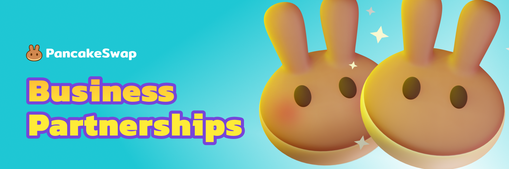

# Parcerias de Negócios

## Farms e Pools de Syrup

Os farms incentivam os usuários a fornecer liquidez para seu par de negociação distribuindo CAKE para os detentores de LP Token do seu par.

As Pools de Syrup são uma maneira de distribuir seus tokens para usuários da BNBChain que fazem stake de CAKE na pool.&#x20;

Esses dois produtos andam de mãos dadas na PancakeSwap: quando um projeto fornece seus tokens para uma Pool de Syrup, também criamos um Farm. Se você deseja distribuir tokens e incentivar a liquidez, entre em contato.&#x20;

[Candidate-se para administrar uma Farm ou Pool de Syrup ](https://docs.google.com/forms/d/e/1FAIpQLSfQNsAfh98SAfcqJKR3is2hdvMRdnvfd2F3Hql96vXHgIi3Bw/viewform)

* Por favor, não nos envie um e-mail para se candidatar - nós apenas respondemos a candidaturas através do formulário de candidatura.&#x20;
* Por favor, não nos persiga por uma resposta em sua inscrição. Temos um backlog constante de projetos de qualidade chegando até nós.

### Quanto tempo vai levar para ter uma resposta?

Nosso objetivo é responder às inscrições em uma semana, mas devido a um grande número de solicitações, não podemos responder a todos os candidatos. Se você não receber uma resposta nossa dentro de duas semanas após a inscrição, tente entrar em contato com @PancakeSwapBD no Telegram, com o **nome do seu projeto, seu código do token e a data em que você se inscreveu.**

### Qual é a diferença entre Farm do Core e Farm do Leilão

Um Farm do Core geralmente é oferecido a projetos que mostraram excelentes volumes de negociação na PancakeSwap e atenderam aos padrões de nosso processo de revisão interna, enquanto qualquer projeto pode participar de um Leilão de Farm e ganhar um slot de Farm.

### Qual são os critérios de qualificação do Comunitária VS Core?

Os critérios de qualificação para Farms Comunitárias e Farms/Conjuntos do Core são baseados em nosso processo de revisão interna. Não os publicamos externamente. Se você não for elegível para uma Farm do Core, podemos convidá-lo a se inscrever para uma Farm Comunitária.

### Posso obter um multiplicador de Farm maior? Ou posso estender minha Pool de Syrup e Farm?

Se você já possui uma Pool e Farm em andamento, poderá estender a linha do tempo por meio de um Boost Pool. Se você deseja aumentar o multiplicador, a equipe considerará se o volume de 30 dias for aumentado. Entre em contato conosco através de seus canais de comunicação da PancakeSwap existentes para consultas.

## IFOs (Venda de Token)

"IFO" (Initial Farm Offering) é um novo modelo de venda de tokens iniciado pela PancakeSwap. Veja como funciona, resumindo:&#x20;

* Os usuários compram seu token com tokens CAKE.&#x20;
* Após a venda, distribuímos o CAKE para você.

Saiba mais sobre [como IFO funciona](https://medium.com/pancakeswap/oferta-inicial-de-farm-ifo-3-0-ifo-com-pool-de-cake-db0024f4a0bc)[.](https://medium.com/pancakeswap/initial-farm-offering-ifo-3-0-ifo-staking-pool-622d8bd356f1)

[Candidate-se para ter um IFO](https://docs.google.com/forms/d/e/1FAIpQLSf0Vmy3k0KyXtXwqxr8QLjD8Xd6KBAmkYxcBRRVTUYJVX17fA/viewform)

* Por favor, não nos envie um e-mail para se candidatar - nós apenas respondemos a candidaturas através do formulário.
* Por favor, não nos persiga por uma resposta em sua inscrição. Temos um backlog constante de projetos de qualidade chegando até nós.

### Quanto tempo leva para obter uma resposta?

Nosso objetivo é responder às inscrições em uma semana, mas devido a um grande número de solicitações, não podemos responder a todos os candidatos. Se você não receber uma resposta nossa dentro de duas semanas após a inscrição, tente entrar em contato com @PancakeSwapBD no Telegram, com **o nome do seu projeto, seu código de token e a data em que você se inscreveu.**

## Mercado de NFT 

[Inscreva-se para listar](../../contact-us/nft-market-applications.md#apply-for-nft-market-listing)

## Listagem na Exchange 

### Como eu posso listar meu token na exchange?

Qualquer um pode "listar" qualquer token de rede BEP-20 na PancakeSwap. Você não precisa entrar em contato conosco ou pedir permissão. Você só precisa [adicionar liquidez a um pool de liquidez ](https://docs.pancakeswap.finance/v/portuguese-brazilian/produtos/pancakeswap-exchange/pancakeswap-pools)- é isso. Os traders podem então negociar seu token inserindo o endereço de contrato do seu token.

### Como posso adicionar meu token na lista padrão?

A lista dos 100 melhores é gerada de acordo com o volume mais alto para um período de tempo específico. Quanto à lista estendida: projetos que hospedam Farms geralmente serão adicionados, e outros tokens escolhidos pela equipe principal da PancakeSwap também podem ser adicionados.&#x20;

Nós não temos inscrições para essas listas. Os usuários ainda podem adicionar seu token manualmente inserindo o endereço do contrato.

### Como posso adicionar logo/ícone do meu token?

Adicione seu ícone ao repositório de ativos da Trust Wallet, que a PancakeSwap usa como referência: [https://github.com/trustwallet/assets](https://github.com/trustwallet/assets)

### Alguem fez uma cópia fake do meu token! Você pode bloquear isso?

Devido à natureza da PancakeSwap como uma DEX baseada em AMM, não podemos impedir a negociação de nenhum token BEP-20. Recomendamos garantir que seu contrato de token seja claramente visível e verificável em seu site e instruir seus usuários sobre como negociar seu token com segurança.

### As pessoas recebem um erro ao negociar meu token. O que posso fazer?

Consulte nossa [página de solução de problemas](https://docs.pancakeswap.finance/v/portuguese-brazilian/help/troubleshooting) para obter uma lista de erros comuns na exchange e como resolvê-los.

## Alguma coisa mais

Você pode nos enviar um e-mail para info@pancakeswap.com se o dito acima não cobrirem suas dúvidas.

Por favor, não tente entrar em contato conosco através deste e-mail para [suporte ao cliente](https://docs.pancakeswap.finance/v/portuguese-brazilian/contact-us/customer-support), não é para isso e não vamos responder: sua melhor opção para obter ajuda com um produto é através do [Telegram ou comunidade do Reddit](../../contact-us/telegram.md).
