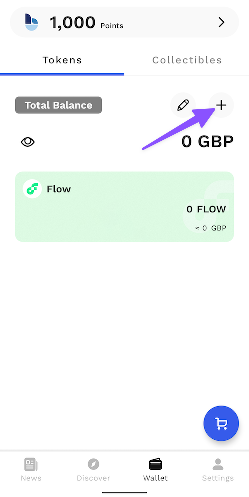
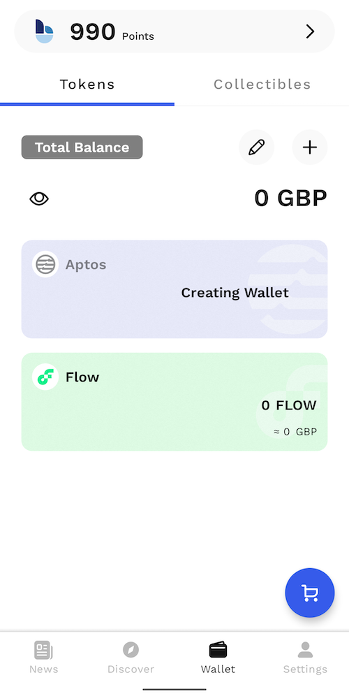
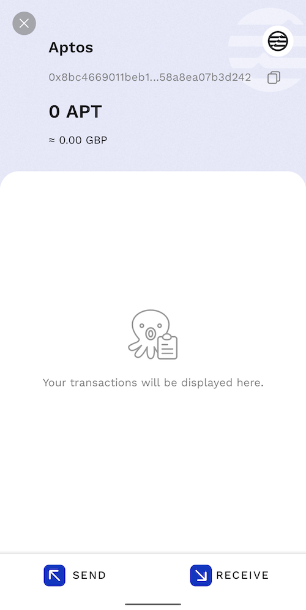

# Create a Wallet

To get started on your PancakeSwap journey on Aptos, the first thing you'll need is to set up a wallet that supports Aptos Chain. Wallets are available both on desktop computers and on smartphone devices. You'll need to choose the wallet that fits your needs best.


**When you're setting up a wallet, be sure to:**

* ✅ **Download and install only the latest version from an official source.**
* ✅ **Follow the setup guide carefully.**
* ✅ **Safely back up your recovery phrases.**
* ❌ **NEVER share your recovery phrases with anyone, under any circumstances.**
* ❌ **NEVER input your recovery phrase to a website or app, other than your wallet app.**


## Smartphone/Mobile or Desktop wallet?


At the time of writing, there are a limited number of mobile wallets with Aptos support. Chefs will include more wallets in the tutorial when they are available.

**We recommend using** [**desktop wallets**](wallet-guide.md#desktop-web-browser-wallets) **until more mobile wallets are ready.**


Mobile device wallets and desktop-based wallets have different strengths and weaknesses. Consider which fits your needs better to help decide which type of wallet to use.

|                                   | Mobile | Desktop |
| --------------------------------- | ------ | ------- |
| Use anywhere                      | ✅      | ➖       |
| Easy to use                       | ✅      | ➖       |
| More secure                       | ➖      | ✅       |
| Accessibility friendly            | ➖      | ✅       |
| Damage/loss/theft resistant       | ➖      | ✅       |
| Power/connection outage resistant | ✅      | ➖       |

## **Smartphone/Mobile wallets**

Smartphone/Mobile wallets allow you to access your crypto almost anywhere. Wallets are available on both Android and iOS devices.

### Which mobile wallet should I choose?

This comparison table gives an overview of the most popular mobile wallets used with PancakeSwap.

|                            | SafePal                        | Trust Wallet | Blocto |
| -------------------------- | ------------------------------ | ------------ | ------ |
| Aptos Chain support        | ✅                              | ✅            | ✅      |
| Built-in DApp browser      | ✅                              | ✅ (iOS only) | ✅      |
| Hardware wallet compatible | 
✅ 

(Only SafePal)
 | ➖            | ➖      |
| Open source (auditability) | ➖                              | ✅            | ➖      |

You can find more in-depth information about each wallet below, as well as download links and installation guides.



<figure><figcaption>
SafePal is available as both a software and hardware wallet. The wallet is easy to install and create, and comes ready to support Aptos, BEP2 (BNB Beacon Chain)<strong>,</strong> BEP20 (BNB Smart Chain) right away.
</figcaption></figure>

​**Pros:**

* Easily switch between several crypto networks
* Has the option for Google Authenticator built in
* Supports a large number of languages
* Setup process is very simple
* Is available as both a software and hardware wallet (work together)

**Cons:**

* Isn't fully open source
* Does not give user notifications
* Does not enforce strong security during initial setup and wallet creation

​[**Download SafePal**](https://safepal.io/download) (Automatically detects device) \
[**SafePal Setup Guide for Aptos**](https://safepalsupport.zendesk.com/hc/en-us/articles/10061372532891-How-to-add-send-Aptos-mainnet-coin-APT-with-SafePal-Software-Wallet)****



​

<figure><figcaption></figcaption></figure>

Trust Wallet is a popular wallet for smart devices. It supports DApps, NFT collectibles (with Opensea.io support), and in-wallet staking.

**Pros:**

* Open source for auditability
* Backed by the Binance cryptocurrency exchange
* Easily switch between several crypto networks
* Includes Aptos networks by default

**Cons:**

* Currently only iOS version supports Aptos
* Language tied to phone settings
* Limited DApps
* Transaction notifications can be delayed

[**Download Trust Wallet**](https://trustwallet.com) (Automatically detects device)\
[**Trust Wallet Setup Guide for Aptos**](https://community.trustwallet.com/t/trust-wallet-adds-native-support-for-aptos-apt/575701)****



****.png>)****

Blocto offers a user-friendly solution and an all-in-one package for using Dapps and managing your assets.

**Highlights:**

* Supports both BNB Chain and Aptos Chain and other major crypto networks out-of-the-box.&#x20;
* Easy to set up.
* Supports both iOS and Android.
* Email login.
* Smart contract wallet eliminates the need for managing your own private key and also provides advanced features like account recovery
* The initial setup gas fee for the smart contract wallet is covered

**Note:**

* **Requires Email address to get started**
* Custodial model
* A bit complicated if you want to export your private key and manage it or use it in other wallets. [Tutorial](https://portto.zendesk.com/hc/en-us/articles/4411564072217-Can-I-export-my-private-key-from-Blocto-and-use-it-in-Metamask-Phantom-Trust-Wallet-).

****[**Download Blocto Wallet**](https://portto.com/download)

### **Blocto Wallet Setup Guide**

1 - Set up by entering your Email address. Then enter the one-time password received by Email.

************

2 - Click the plus button, then choose "APT - Aptos"

.png>)

3 - Done! You can now deposit APT into the Aptos wallet and start using PancakeSwap on Aptos by going to the "Discover" page!




## **Desktop/Web Browser wallets**

Desktop wallets are available on your home computer or laptop computer. Wallets on your computer can run as standalone applications, or as web browser plugins for popular browsers like Chrome and Firefox.

### Which desktop wallet should I choose?

This comparison table gives an overview of the most popular desktop wallets used with PancakeSwap on Aptos

|                            | Petra | Martian | Pontem | Fewcha | Blocto |
| -------------------------- | ----- | ------- | ------ | ------ | ------ |
| Aptos Chain support        | ✅     | ✅       | ✅      | ✅      | ✅      |
| Hardware wallet compatible | ➖     | ➖       | ➖      | ➖      | ➖      |
| Open source (auditability) | ✅     | ❓       | ✅      | ❓      | ❓      |

_❓ - as of writing, we are unsure about the status of this information_

You can find more in-depth information about each wallet below, as well as download links and installation guides.



<figure><figcaption></figcaption></figure>

Petra wallet is an extension that lets you explore Aptos in your browser.

**Highlights:**

* Built by Aptos Labs
* Easy to use
* Supports multiple accounts
* Built-in NFT support
* Supports Aptos testnet and one-click testnet APT faucet

**Note:**

* Desktop only
* Only supports Aptos chains

****[**Download Petra Wallet**](https://petra.app/)****

****[**Petra Wallet Setup Guide**](https://petra.app/docs/use)****



<figure><figcaption></figcaption></figure>

Martian is an Aptos Chain wallet that allows you to store, send, receive tokens and manage & mint NFTs. Its mobile version is coming soon.

**Highlights:**

* Mobile version coming soon
* Easy to use
* Supports multiple accounts
* Built-in NFT support
* Supports Aptos testnet

****[**Download Martian Wallet**](https://martianwallet.xyz/)****



<figure><figcaption></figcaption></figure>

Pontem Wallet is an Aptos Chain wallet that allows you to store, send, receive tokens, and connect to dApps on the Aptos ecosystem.

**Highlights:**

* Mobile version coming soon
* Easy to use
* Supports multiple accounts
* Built-in NFT support
* Supports Aptos testnet

****[**Download Pontem Wallet**](https://pontem.network/pontem-wallet)****



<figure><figcaption></figcaption></figure>

Fewcha is a trusted crypto wallet optimized for Aptos and SUI ecosystem that unlocks a universe of applications in the web3.

**Highlights:**

* Support Aptos and Sui Blockchain
* First wallet to support pure blockchain using Move language
* Friendly UX/UI
* Simple, elegant and easy to use
* In-app Swapper
* In-app Stake
* Multiple languages
* EBCI Protocol - a protocol that prevents multiple pop-ups when interacting with dApp, it’ll help users manage what dApp they are signing for a transaction.
* Support Hardware Wallet Connection (Keystone Wallet)

****

****[**Download FewCha Wallet**](https://fewcha.app/)****

****

### **Fewcha wallet setup guide**

****

1\. **** Once Fewcha Wallet extension finishes downloading, a welcome tab will appear. Here you can select “Create a new wallet” (or “Use an existing wallet” if you’ve already had one.)

<figure><figcaption></figcaption></figure>

2\. **** Select your default blockchain. Create a password that’s hard to predict yet easy to remember. Make sure you have read and agreed to the Terms of Service and Privacy Policy. Then click “Continue”.

3\. For the Recovery Phrase, please write it down or copy to save it somewhere that you can remember.

<figure><figcaption></figcaption></figure>

> * Safely backup your recovery phrases. If you lose your recovery phrase, you may lose access to your wallet and the crypto within it forever.&#x20;
> * **NEVER** share your recovery phrases with anyone, under any circumstances.
> * **NEVER** input your recovery phrase to a website or app, other than your wallet app**.**

<figure><figcaption></figcaption></figure>

4\. Click Finish to complete this setup process. And done! Once your wallet is created, you can access it at any time by clicking on the Fewcha Wallet icon on the extension bar.&#x20;

<figure><figcaption></figcaption></figure>

To start using PancakeSwap on Aptos, you will also need to have some $APT tokens to pay gas fees. You can learn how to get some here.



****.png>)****

Blocto offers a user-friendly solution and an all-in-one package for using Dapps and managing your assets.

**Highlights:**

* Supports both BNB Chain and Aptos Chain and other major crypto networks out-of-the-box.&#x20;
* No app or extension is required for using on desktop.
* Supports both desktop and mobile.
* Email login.
* Smart contract wallet eliminates the need for managing your own private key and also provides advanced features like account recovery
* The initial setup gas fee for the smart contract wallet is covered

**Note:**

* **Requires Email address to get started**
* Custodial model
* A bit complicated if you want to export your private key and manage it or use it in other wallets. [Tutorial](https://portto.zendesk.com/hc/en-us/articles/4411564072217-Can-I-export-my-private-key-from-Blocto-and-use-it-in-Metamask-Phantom-Trust-Wallet-).

### **Blocto wallet setup guide**

1 - After selecting "Blocto" in the wallet connection window, you should be presented with a sign-in window. Type in your Email address and click "Register". If you have previously setup a Blocto account, please type in the Email address and click "sign in".

2 - Then enter the one-time password received by Email.

3 - Click "Create Aptos wallet". Then click "Confirm" to connect.

4 - Done! Please note that you will need to fund your Aptos address with APT to start using PancakeSwap on Aptos. If you want to access the same account on other devices, simply sign in using the same Email address.




NEVER, in any situation, should you ever give someone your private key or recovery phrase ("seed phrase"). This will give someone complete access to your crypto!

The genuine PancakeSwap site and staff will never ask you to input your seed phrase.

