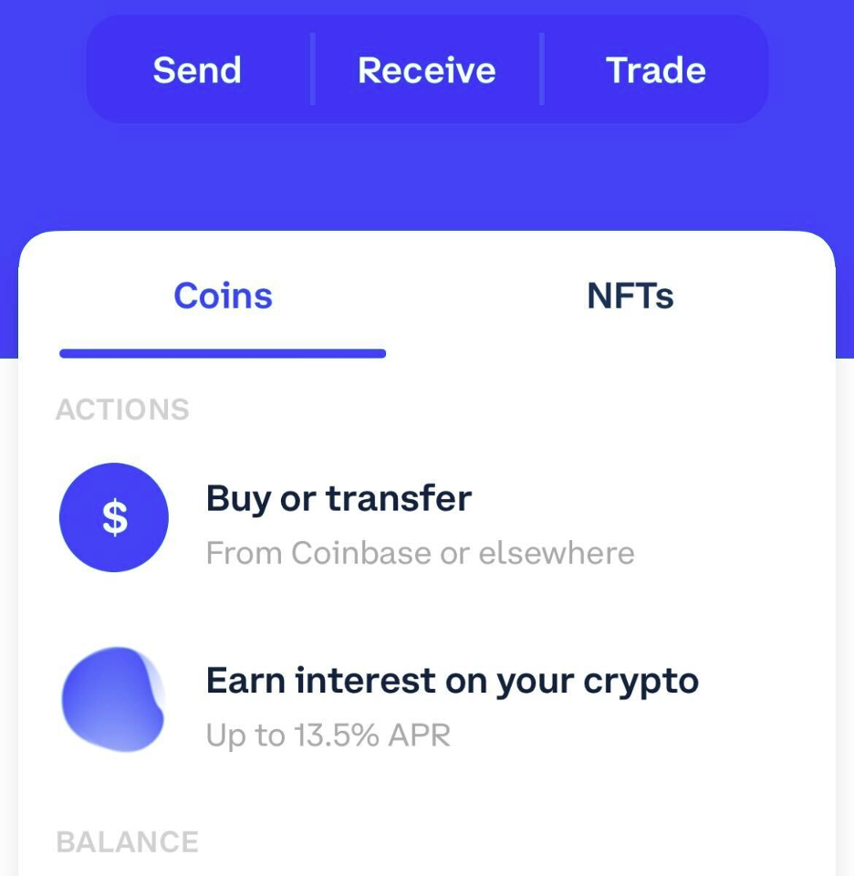
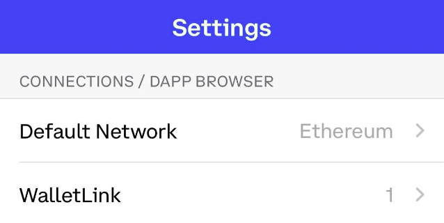
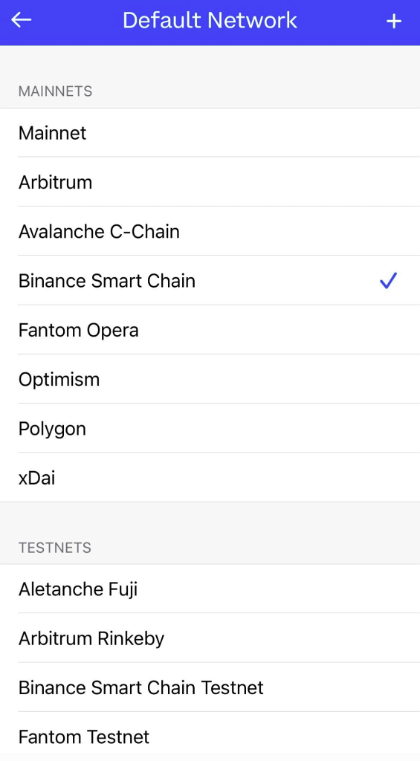
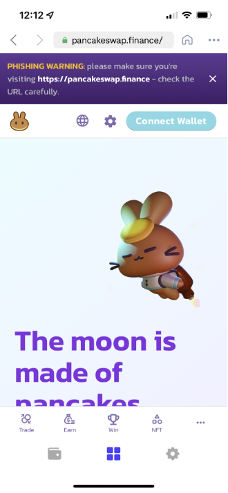
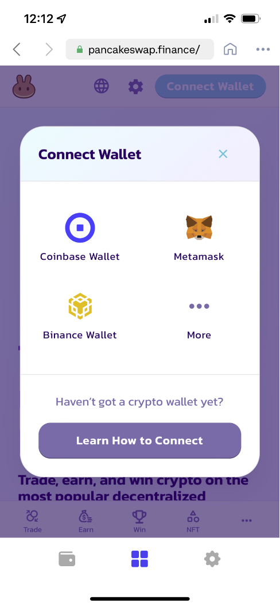
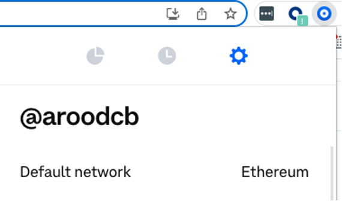
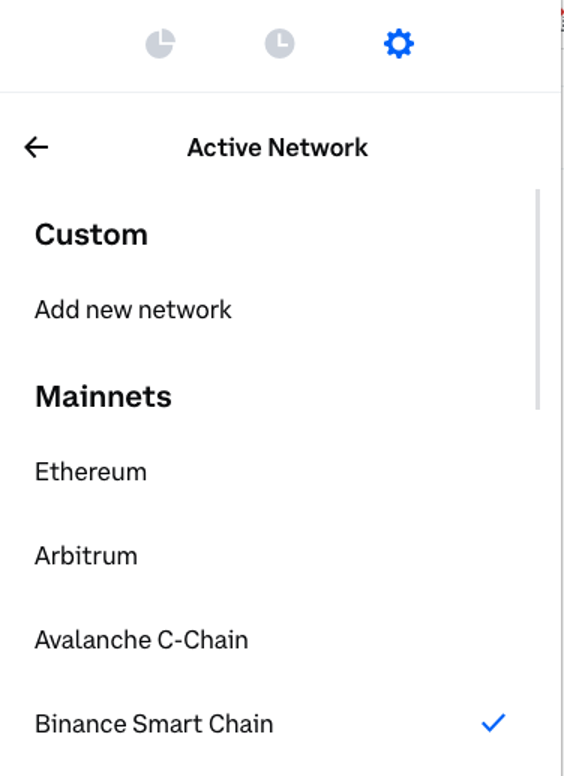
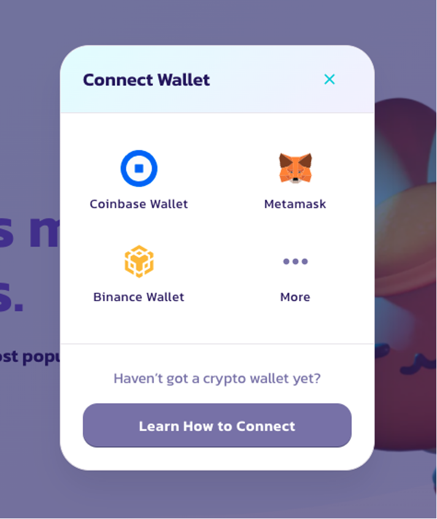

# Conecte sua Carteira na PancakeSwap

Você fez uma carteira e obteve seus tokens BEP20, agora você só precisa conectar sua carteira na PancakeSwap e pronto!&#x20;

Confira as etapas abaixo sobre como conectar cada uma das carteiras recomendadas na PancakeSwap.

## Smartphone/Celular



 (1).png>)

Para conectar a Trust Wallet, siga as etapas abaixo. Observe que os dispositivos Android e iOS não usam as mesmas etapas!

#### Android

1. Abra a Trust Wallet e clique no botão **DApps** na parte inferior da tela.

.png>)

1. Role para baixo até "Popular" e cliqye em "PancakeSwap". Você também pode encontrá-lo em "Exchanges".

 (1).png>)

1. Uma nova página será aberta com o logotipo da PancakeSwap e algumas informações. Clique no botão **Conectar**.

.png>)

1. A PancakeSwap será aberta. Se você vir um botão **Conectar** no canto superior direito, toque nele e clique em **Trust Wallet** na lista.


Se você achar que não consegue se conectar na etapa 4, volte ao menu DApps e encontre "PancakeSwap" novamente. Usar "PancakeSwap" da seção "Histórico" pode resultar no mesmo problema.


#### iOS

Para se conectar ao PancakeSwap através do iOS, a Trust Wallet preparou um guia detalhado sobre como usar o WallteConnect.

Leia o[ guia para cconectar na PancakeSwap usando a Trust Wallet via WalletConnect](https://community.trustwallet.com/t/using-walletconnect-to-access-pancakeswap/212307).

#### **Recursos**

[**Download Trust Wallet**](https://trustwallet.com) (Detecta o dispostivio automaticamente)\
[**TGuia de instalação da Trust Wallet**](https://www.binance.com/en/blog/421499824684901157/how-to-set-up-and-use-trust-wallet-for-binance-smart-chain)



 (3) (4) (5) (1) (1) (1) (1) (1) (1) (1).png>)

Para conectar a MetaMask na PancakeSwap siga os passos abaixo.

#### Android e iOS

1. Abra a MetaMask e clique no ícone no canto superior esquerdo.

.png>)

1. Clique em **Settings/Configurações** no menu.

.png>)

1. No menu dos Settings, clique em **Network/Rede**.

.png>)

1. Clique no botão **Add Network** embaixo.

.png>)

1. Na página que abrir, digite os seguintes detalhes:

**Network Name:** BNB Smart Chain\
**RPC Url:** [https://bsc-dataseed.binance.org](https://bsc-dataseed.binance.org)\
**Chain ID:** 56\
**Symbol:** BNB\
**Block Explorer URL:** [http://bscscan.com](http://bscscan.com)

1. Uma vez qye vicê tenha confirmado a entrada da nova rede, volte para o menu e clique em  **Browser**.

.png>)

1. Digite "PancakeSwap" no campo de busca e comece a busca. O resultado do topo será a exchange PancakeSwap. Clique para entrar.
2. Sua carteira vai perguntar se quer conectar. Clique **Connect** para conectar na PancakeSwap.

.png>)

#### Recursos

[**Download MetaMask**](https://metamask.io/download.html) (Dispositivo detectado automaticamente)\
[**Guia de Instalação da MetaMask**](https://academy.binance.com/en/articles/connecting-metamask-to-binance-smart-chain\))



 (1) (1) (1) (1).png>)

1. Abra a Coinbase Wallet e cliqu no **ícone de configurações** no canto inferior direito.\
   \
   
2. No menu de configurações, clique em **Default Network**.\
   \*\*\*\*
3. Escolha **Binance Smart Chain** da lista de opções de rede.\
   
4. Depois que você seleciono**u a Binance Smart Chain**, clique no Ícone do **Browser** no meio no menu embaixo do seu app.\
   \
   
5. Digite "PancakeSwap.finance" no campo de busca e faça a busca.\
   
6. Cllique **Connect** **Wallet** para conectar a Carteira da Coinbase.\
   

#### **Recursos**

[**Download Coinbase Wallet**](https://coinbase-wallet.onelink.me/q5Sx/fdb9b250) **(Dispositivo detectado automaticamente)**

[**Guia de instalação da Carteira da Coinbase**](https://www.coinbase.com/wallet/getting-started-mobile)



 (3) (4) (1) (1) (1) (1) (1) (1).png>)

Token Pocket é um app de gerenciamento de criptoativos que suporta nativamente muitas redes de criptomoedas. É também disponível em um aplicativo desktop.

#### **Android e iOS**

1. Clique no botão **Discover** embaixo na tela principal.

.png>)

1. Você verá abrir uma página de navegador de DApp. No "Recommended", encontre e clique no símbolo da **PancakeSwap.** Se você não pode ver PancakeSwap, você também pode pesquisar isso em "BSC".

.png>)

1. Uma janela vai abrir dizendo que você vai abrir um DApp de terceiros. Clique em **I got it** e você será levado ao site da PancakeSwap conectado na sua carteira.

.png>)

**Recursos**\
[**Download Token Pocket App**](https://www.tokenpocket.pro/en/download/app) (Dispositivo detectado automaticamente)\
**Guia de instalação da carteira Token Pocket Mobile**



 (1) (1).png>)

SafePal está disponível tanto como carteira de software quanto em hardware. A carteira é facil de instalar e criar e vem pronta para suportar BEP2 (Binance Chain) e BEP20 (BNB Smart Chain) imediatamente.

#### **Android e iOS**

1. Clique no ícone dos **4 quadrados** embaixo da tela no menu principal.

.png>)

1. Você vai ver a página do navegador de DApp abrir. Em "DeFi", encontre e clique na imagem da **PancakeSwap**. Se você não puder ver PancakeSwap em DeFi, você também pode entrar isso em "BSC".

 (1).png>)

1. Uma janela vai abrir dizendo que você está abrindo um DApp de terceiros. Clique **Confirm** e você será levado para a página da PancakeSwap conectado na sua carteira.

.png>)

**Recursos**\
​[**Download SafePal**](https://safepal.io/download) (Dispostivio detectado automaticamente)\
[**Guia de instalação da SafePal**](https://blog.safepal.io/binance-smart-chain-x-safepal/)



## **Carteiras de Desktop/Web Browser**



 (3) (4) (5) (1) (1) (1) (1) (1) (1).png>)

#### Chrome e Firefox

1. Abra a MetaMask e clique no menu de **rede** no topo. Por padrão vai mostrar "Ethereum Mainnet". Role pra baixo e clique em **Custom RPC**.

.png>)

1. Uma janela vai abrir. Digite estes detalhes abaixo.

**Network Name:** BNB Smart Chain\
**New RPC URL:** [https://bsc-dataseed.binance.org](https://bsc-dataseed.binance.org)\
**Chain ID:** 56\
**Currency Symbol (optional):** BNB\
**Block Explorer URL (optional):** [http://bscscan.com](http://bscscan.com)

.png>)

1. Verifique se você digitou tudo corretamente e clique em **Salve**. BNB Smart Chain vai ser agora uma opção de rede.

.png>)

1. Visite o site da [PancakeSwap](https://pancakeswap.finance). No canto superior direito, você vai ver o botão **Conectar**. Clique.

 (3) (3) (1) (1) (1) (1) (1) (1) (1).png>)

1. Uma janela vai aparecer perguntado para você escolher qual carteira conectar. Clique **MetaMask** (é uma das primeiras opções).

.png>)

#### Recursos

[**Download MetaMask**](https://metamask.io/download.html) (Navegador detectado automaticamente)\
[**Guia de Instalação da MetaMask**](https://academy.binance.com/en/articles/connecting-metamask-to-binance-smart-chain)



.png>)

#### Chrome e Firefox

1. Abra a Carteira da Binance Chain e clique no menu de redes no topo. A rede padrão será Binance Chain. Escolha **BNB Smart Chain** da lista.

 (1).png>)

1. Visite o site da PancakeSwap. No canto superior direito, clique **Conecte**.

 (3) (3) (1) (1) (1) (1) (1) (1).png>)

1. Uma janela vai aparecer perguntando qual carteira você quer escolher para conectar. Clique **Binance Chain Wallet** (um pouco pra baixo na lista).

.png>)

#### Recursos

[**Download Binance Wallet**](https://www.binance.org/en) (Navegador automaticamente detectado)\
**Guia de instalação da Binance Wallet**



 (1) (1) (1) (1) (2).png>)

1. Abra a Carteira da Coinbase e clique no ícone **Settings** no canto superior direito. Por padrão vai mostrar "Ethereum Mainnet" como a rede padrão.\
   
2. Clique em **Default Network** e escolha **Binance Smart Chain**\
   
3. Binance Smart Chain agora será sua rede padrão.
4. Visite o site[pancakeswap.finance](https://pancakeswap.finance). No canto superior direito, você vai ver o botão **Conecte**. Clique.\
   
5. Uma janela vai aparecer perguntando qual carteira você quer escolher para conectar. Clique **Coinbase Wallet** (é logo uma das primeiras).\
   

#### **Recursos**

[**Download Coinbase Wallet**](https://chrome.google.com/webstore/detail/coinbase-wallet-extension/hnfanknocfeofbddgcijnmhnfnkdnaad?hl=en\&authuser=0)(Somente Chrome)

[**Guia da instalação da Coinbase Wallet**](https://www.coinbase.com/wallet/getting-started-extension)



 (3) (4) (1) (1) (1) (1) (1) (1) (1).png>)

#### Aplicativo de Desktop

1. Quando você abrir o aplicativo, a página dos DApps deve ser a página padrão (se não, clique na página dos DApps).
2. Rolea página um pouco pra baixo para você ver a lista de redes para escolher. Clique **BSC/BNBChain**.

.png>)

1. Na lista de DApps da BSC, você vai encontra o link da PancakeSwap. Clique no link da **PancakeSwap**.

.png>)


Certifique-se de não escolher a opção "PancakeSwap Data analysis". Se você fizer isso, você não será capaz de se conectar.


1. Seu navegador vai abrir um aba da PancakeSwap tab e tentará se conectar na Token Pocket.


Você não poderá usar MetaMask e TokenPocket conectando-se através do mesmo navegador. Certifique-se de usar um navegador da Web sem o plug-in MetaMask instalado se estiver usando o TokenPocket em seu computador desktop.


#### Recursos

[**Download Token Pocket Desktop Wallet**](https://www.tokenpocket.pro/en/download/pc) (MacOS ou Win64)\
**Token Pocket Desktop Setup Guide**




**Lembre-se - NUNCA, em situação alguma, você deve dar par aalguem sua chave priva ou frase de recuperação.**

