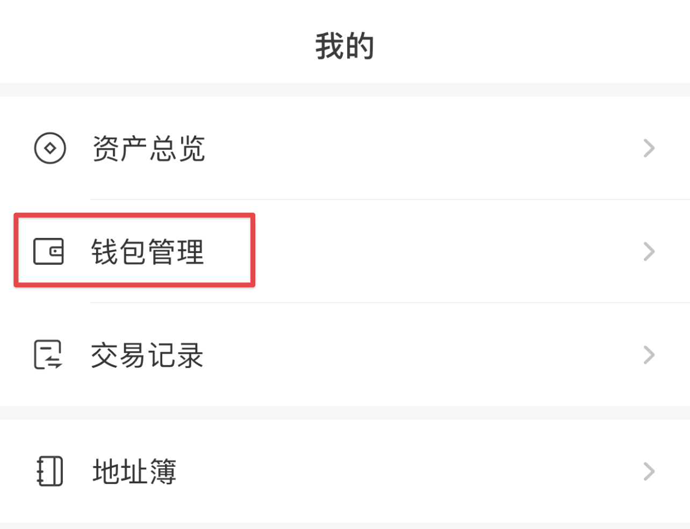

# 创建钱包

.png?alt=media\&token=a86affdf-4276-4963-8f05-661aec80064a)

开始使用 PancakeSwap 前，您首先需要创建一个支持币安智能链（BSC）的钱包。钱包在电脑和手机上都可以使用。请选择最适合您的钱包应用。

**在设置钱包时，请务必注意**：

* ✅ **从可信的官方渠道下载并安装最新版本的钱包应用。**
* ✅ **仔细阅读并遵循设置指南进行操作。**
* ✅ **妥善备份用于恢复钱包的助记词或私钥**
* ❌ **在任何情况下都不要：向任何人透露您的恢复助记词或私钥！**
* ❌ **在任何情况下都不要：在任何网站上输入您的恢复助记词或私钥！**

## 我应该使用手机端钱包还是电脑端钱包？

您在手机与电脑上均可通过钱包软件使用 PancakeSwap，它们有各自的优势与缺点。请考虑自己的具体需求，按以下表格决定使用哪种类型的钱包应用：

|                | 手机端 | 电脑端 |
| -------------- | --- | --- |
| 随时随地使用         | ✅   | ➖   |
| 简单易用           | ✅   | ➖   |
| 更加安全           | ➖   | ✅   |
| 对无障碍使用者更友好     | ➖   | ✅   |
| 不易损坏/丢失/遭窃     | ➖   | ✅   |
| 不易受网络连接/电力供应影响 | ✅   | ➖   |

## **手机/移动设备 钱包**

手机/移动设备钱包应用允许您随时随地操作您的加密货币。钱包应用在安卓和 iOS 设备上均可使用。

### 我应该选择哪个手机钱包？ 

This comparison table gives an overview of the most popular mobile wallets used with PancakeSwap.

以下表格列出时下热门的钱包应用以及他们的概况：

| ​                                     | Trust Wallet             | MetaMask | Token Pocket | SafePal |
| ------------------------------------- | ------------------------ | -------- | ------------ | ------- |
| 币安智能链支持                               | ✅                        | ⚠️       | ✅            | ✅       |
| 内置 DApp 浏览器                           | 
✅ 安卓

⚠️ iOS
 | ➖        | ✅            | ✅       |
| 兼容硬件钱包                                | ➖                        | ✅        | ➖            | 🔶      |
| 开源（可审计性）                              | ✅                        | ✅        | ✅            | ➖       |
| 
可在 BscScan 上使用

(适用于高级用户)
 | ➖                        | ✅        | ➖            | ➖       |

⚠️ 需要额外设置 \
🔶 仅支持 SafePal 硬件钱包

您可以在下方找到关于每个钱包的详细信息、下载链接和安装指南：



.png>)

Trust Wallet 在移动设备上颇受欢迎的钱包应用。它支持 DApps，NFT 收藏品（支持 Opensea.io），以及钱包内直接质押，

**优点：**

* 开源代码可审计
* 得到币安加密货币交易所的支持
* 在几个加密货币网络之间轻松切换
* 默认包含币安智能链网络  
* 含有钱包内质押选项
* 拥有额外的功能，如：NFT 收藏品浏览、BNB 质押和钱包内的 DApp 访问。

**缺点：**

* 语言与手机设置语言绑定，无法更改
* 有限的 DApps 支持
* 交易通知可能会延迟

[**下载 Trust Wallet**](https://trustwallet.com) **（自动检测您的设备）**

****[**Trust Wallet 设置指南**](https://www.binance.com/cn/blog/421499824684901157/How-to-Set-Up-and-Use-Trust-Wallet-for-Binance-Smart-Chain)****



 (3) (4) (5) (1).png>)

MetaMask 是一个基于浏览器的热门钱包插件，支持 ERC20（以太坊网络）、BEP2 和 BEP20（币安链与币安智能链）。

​**优点：**

* 开源代码可审计
* 适用于 BscScan 上的 web3 操作  
* 优秀的安全性和可靠性记录
* 网上有大量的资料与操作指南 
* 非常多小工具及自定义设置  
* 提供使用 Transak 购买 ETH 
* 丰富的语言支持
* 同时提供电脑浏览器插件

**缺点：**

* 设置需时较长
* 搭配币安智能链和 PancakeSwap 使用前需要一些额外设置
* 额外的信息与设置可能会让新手感觉眼花缭乱

[**下载 MetaMask**](https://metamask.io/download.html) **（自动检测您的设备）**

****[**MetaMask 设置教程**](https://academy.binance.com/cn/articles/connecting-metamask-to-binance-smart-chain)****

****\
****



 (3) (4) (2).png>)

Token Pocket 是一个原生支持多个网络（加密货币链）的虚拟货币钱包。它同时也提供电脑端程序。

​**优点：**

* 开源代码可审计
* 在几个加密货币网络之间轻松切换
* 默认支持多个主流加密货币网络
* 与浏览器插件钱包相比，界面不拥挤，使用体验较为友好
* 同时提供电脑端程序

**缺点：**

* 只提供英文与中文
* 部分英文翻译有问题
* 与其他更成熟的钱包相比，在线资源较少

****[**下载 Token Pocket**](https://www.tokenpocket.pro) **（自动检测您的设备）**

### **Token Pocket 手机端设置指南**

1.  访问 Token Pocket 网站并点击 **手机下载 **开始下载

    
2. 页面将自动检测您的设备，点击 **Google Play** 或 **App Store** 前往相应的商店下载。苹果用户建议使用 TestFlight 下载 TokenPocket Pro ，请遵循页面指示。
3.  安装 Token Pocket 后打开，您将会看到一个询问您是否已有钱包的选项。若您想导入现有的钱包，请选择「我有钱包」。点击「我没有钱包」创建一个新的钱包：

    .png>)
4.  在下一个页面，在列表内选择「**币安智能链**」。

    .png>)
5.  接下来，选择顶部的「**创建钱包**」继续。

    
6. 您需要设置一个保护您账号的密码。为了您的安全，请确保密码强度为「安全」。同时您可以添加一个密码提示，但请确保任何人无法用提示轻易地猜出密码。设置完后，点击「**创建钱包**」继续。
7. 接着，钱包会提醒您备份助记词。请注意！助记词就是您的「银行卡卡号 + 密码」，任何人掌握了助记词，就可以操作您在区块链上该钱包内的**一切资产**！请务必使用多种方法妥善保管，不要透露给任何人。PancakeSwap 的社区管理员不会向您询问任何私钥或助记词。

备份好助记词并验证后，创建钱包的操作就完成了。

想要通过 TokenPocket 连接币安智能链并使用 PancakeSwap，您可参考「如何连接钱包」教程中的 TokenPocket 部分：\
[https://docs.pancakeswap.finance/get-started/connection-guide](https://docs.pancakeswap.finance/get-started/connection-guide).

### 导出私钥并在另一台手机或电脑上使用

Token Pocket 允许您使用电脑端或其他设备同时管理一个钱包，这部分教程讲引导您如何导出私钥，并在其他设备上同时使用。


在操作私钥时请务必小心，任何人只要获得您的私钥，即可操作您在区块链上该钱包内的所有资产！Token Pocket 是一个公开透明的开源项目，它将使用您的私钥来导入钱包，仅此而已。所以，请务必仔细验证任何您要导入私钥的程序是否为正规，且不含恶意代码。


1.  在底部点击「**我的**」，并选择「**钱包管理**」。

    
2.  在下一页的左侧点击「**币安智能链**」，并找到您想导出私钥的钱包，点击向右箭头。

    
3. 当菜单出现时，选择「**导出私钥**」，输入密码即可获得并复制您的钱包私钥。


**任何情况下都绝对不要给任何人提供您的私钥或助记词。如果有人向您索取私钥或助记词，请立即将其举报并封禁。**

管理员**绝对不会**主动跟您私聊。如果有人假扮成客服直接与您联系，请立即点击封禁并将其举报为垃圾信息。




.png>)

SafePal 有软件和硬件钱包两种形式。该钱包 App 安装便捷，设置步骤简单，并原生支持币安链 (BEP2) 和币安智能链 (BEP20)。

**优点：**

* 在几个加密货币网络之间轻松切换
* 使用 BNB 支付时有机会获得 25% 手续费折扣（需要登录）
* 内置谷歌认证器
* 丰富的语言支持
* 设置步骤简单快捷
* 同时提用软件和硬件钱包（协同使用）
* 支持币安智能链和以太坊上的 NFT 收藏品展示及管理

**缺点：**

* 代码非完全开源 
* 某些功能尚未完善（如 DeFi）
* 不支持通知消息提醒
* 初始设置及钱包创建时，并不强制用户使用强安全凭证
* 与其他更成熟的钱包相比，在线资源较少

​[**下载 SafePal**](https://safepal.io/download) **（自动检测您的设备）**\
[**SafePal 设置教程（英文）**](https://blog.safepal.io/binance-smart-chain-x-safepal/)****\
****[**SafePal 设置教程（中文）**](https://docs.safepal.io/safepal-app/how-to-create-a-safepal-software-wallet/ru-he-chuang-jian-safepal-ruan-jian-qian-bao)****



## ****

