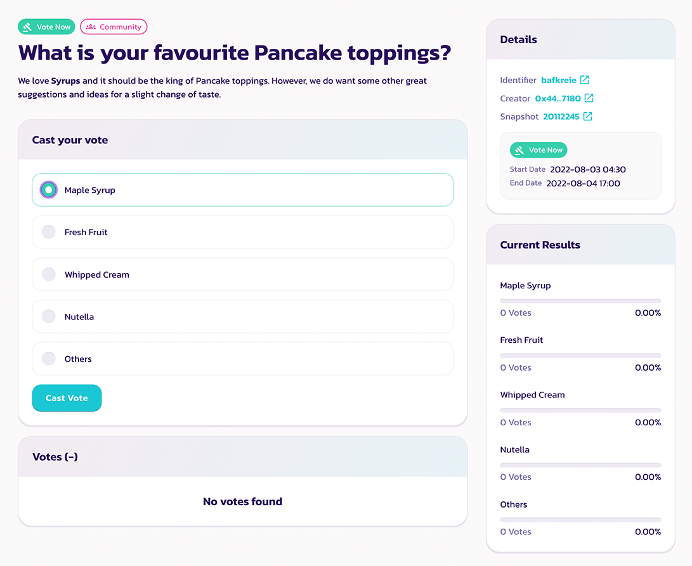
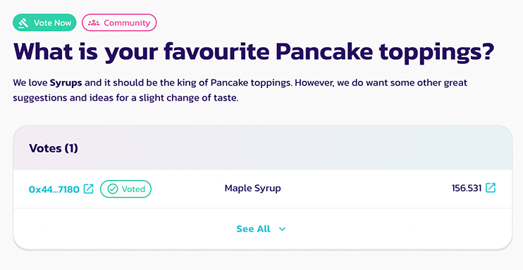

# Como votar

<figure><figcaption></figcaption></figure>

Participar da votação de governança é fácil e totalmente **GRATUITO**. Você nem precisa pagar taxas de gás! Saiba mais sobre como votar, veja a próxima proposta e vote.

## Como votar 

### Navegando até a proposta de votação

Sempre que publicamos uma nova proposta, sempre anexamos o link para a página de votação. Portanto, certifique-se de seguir nossas [redes sociais ](../../../contact-us/telegram.md)para as notícias e atualizações.&#x20;

Como alternativa, você pode visitar o [portal de votação nativo da PancakeSwap](https://voting.pancakeswap.finance/?\_gl=1\*pc8o0h\*\_ga\*MTUzNDEzNDQxMy4xNjAwNzkzNDM4\*\_ga\_334KNG3DMQ\*MTYwNDMwMTk4Ni42MC4xLjE2MDQzMDM3MDIuMA..#/) para navegar pelas propostas em uma lista. Caso não veja a proposta, ela pode estar na aba "em breve".&#x20;

### Leia e escolha a opção para votar.

<figure><figcaption>
a página da proposta
</figcaption></figure>

Na página da proposta. Você encontrará:&#x20;

* O conteúdo da proposta&#x20;
* As opções para votar&#x20;
* O detalhe da proposta, como snapshot e janela de votação&#x20;
* O último resultado da votação&#x20;
* A lista de votos&#x20;

Leia a proposta com atenção e clique na opção que deseja votar.

#### .png>) 

### Confirme e vote

<figure><figcaption></figcaption></figure>

Confirme todos os dados e clique em "Confirmar Voto", depois confirme em sua carteira para assinar a mensagem.&#x20;

Pronto, você acabou de votar com sucesso.

### Como verificar os detalhes



Antes de votar, você verá uma janela "Confirmar Voto".

 (1).png>)

Nesta janela, você pode verificar novamente os seguintes itens:&#x20;

* A escolha que você escolheu&#x20;
* Seu poder de voto&#x20;

Se você não tem certeza sobre como o poder de voto é calculado, clique em ">" para abrir o detalhamento.

 (1).png>)

Observe que apenas o CAKE nos seguintes locais contribuirá para o número total de poder de voto:&#x20;

1. Na carteira&#x20;
2. Em stake flexível de CAKE (tanto na pool de CAKE quanto na side pool)&#x20;
3. No Stake de CAKE de prazo fixo (impulsionado pelo vCAKE!)&#x20;
4. Outras pools de syrup (fornecidos por outros projetos)&#x20;
5. CAKE/BNB LP&#x20;

O CAKE em outros locais não contribui para o seu poder de voto.



### Verificando o snapshot do bloco

.png>)

O poder de votação é calculado com base em um snapshot obtido em algum bloco. Portanto, comprar ou depositar mais CAKE após a publicação da proposta não aumentará o poder de voto para aquela proposta em particular.&#x20;

Se você quiser saber a hora exata do bloco do snapshot. Basta clicar no número do bloco e procurar o carimbo de data/hora na página BscScan.

.png>)


