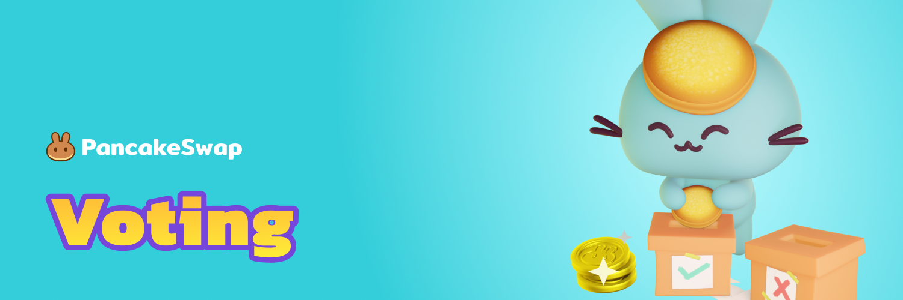

# Voting (old)


We are transitioning from vCAKE to veCAKE for our governance system. Once the migration is done, not all information on this page will be accurate.


Voting gives a voice to the PancakeSwap community, letting the community have a say in how PancakeSwap develops into the future.

Check out [PancakeSwap's native voting portal](https://pancakeswap.finance/voting) on the PancakeSwap website.

**Core** - proposals posted by the PancakeSwap team. The results will be actioned.

**Community** - proposals posted by the PancakeSwap community. These are used to propose ideas and show the communities point of view. The PancakeSwap team reviews every community vote and will often cherry-pick any great ideas and designs with strong community support up to the coming product releases and/or core voting proposal level.
