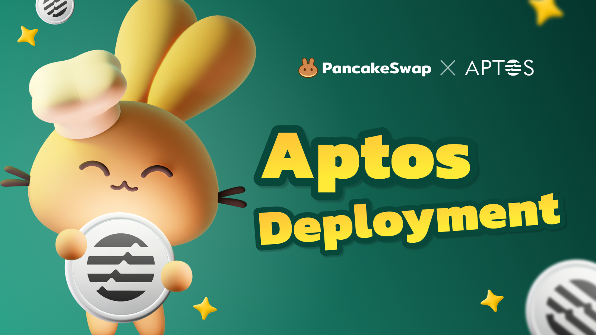
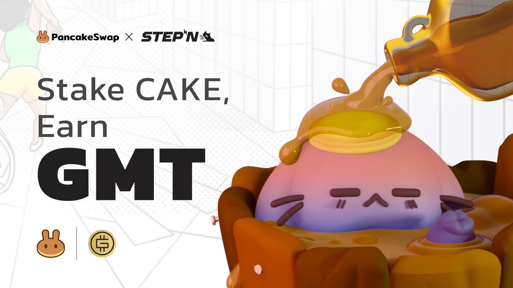

# Implantação na Aptos

<figure><figcaption></figcaption></figure>

Estamos implantando na Aptos e gostaríamos de começar a conversar com as equipes dos Projeto Aptos, potencialmente apresentando a você um dos maiores, mais engajados e ativos DApps de criptomoedas (com mais de 3 milhões de usuários ativos mensais)!&#x20;

Desde o nosso início, a PancakeSwap (PCS) prosperou no cenário de varejo do DeFi, estabelecendo-se como a DEX líder, com vários produtos líderes do setor – pools de liquidez; plataformas de lançamento; mercado de previsão e produtos perpétuos; Mercados NFT – e claro, a melhor comunidade 😉.&#x20;

Esta página serve como um FAQ rápido para as equipes de projeto descobrirem um pouco mais sobre nós - mas se você tiver alguma dúvida, entre em contato com Chef Icy, Lder BD, no Twitter (https://twitter.com/PancakeIcy) ou TG.

### A escolha do povo para todas as coisas DeFi

O simples é sexy, e a segurança também!&#x20;

Com quase US$ 3 bilhões em TVL, gostamos de agir rapidamente e com responsabilidade. Com dois anos de experiência nos mercados de criptomoedas, do touro ao urso, do DeFi Summer (ao Aptos Autumn?), entregamos o DeFi à nossa comunidade.&#x20;

Nossas parcerias com projetos também vão além de apenas programas de mineração de liquidez (“Pools de Syrup e Farms”) e reconhecem genuinamente o impacto da comunidade em cripts – nossa equipe dedicada de CMs e administradores nativos de criptomoedas nos ajuda a acompanhar as diversos comunidades que atendemos e organizamos regularmente eventos com alto envolvimento e fluxo de usuários para projetos: AMAs, Prize Challenges e muito mais!

### Ok, fui mordido - como podemos entrar em contato?

Estamos lançando na Aptos em fases escalonadas.

1. Para nossa primeira fase, estaremos hospedando programas de mineração de liquidez (“Pools de Syrup e Farms”) – isso será lançado em breve, portanto, projetos interessados devem se inscrever [aqui](https://docs.google.com/forms/d/e/1FAIpQLSceljMty-AKliByIMX6d1Kqtn88hMnzXnp\_DRBEQ7XptwiOGw/viewform).
2. Para nossa segunda fase, apresentaremos plataformas de lançamento (“Oferta Inicial de Farm, ou IFO”). Isso está programado para ser lançado em meados do final de novembro de 2022, e atualmente estamos reunindo uma lista de espera aqui [aqui](https://docs.google.com/forms/d/e/1FAIpQLSf9gWv9L8U0PGYgl-ymeX1qgXncBSlJ1HV5gB6ZeW7e4ekV\_w/viewform).

Para obter mais informações sobre nossos programas de mineração de liquidez (“Pools de Syrup e Farms”), consulte este PDF:



Para obter mais informações sobre nossas plataformas de lançamento (“Oferta inicial de Farm, ou IFO”), consulte este PDF:



### Um exemplo do processo da Pool de Syrup/Farm

1. Divulgação inicial
   * Temos um bate-papo adorável (onde podemos compartilhar dados, estatísticas de usuários e memes) e sua equipe decide iniciar o processo de inscrição – vamos lá!
   * Inscreva-se neste formulrio [**aqui**](https://docs.google.com/forms/d/e/1FAIpQLSceljMty-AKliByIMX6d1Kqtn88hMnzXnp\_DRBEQ7XptwiOGw/viewform)**.**
2. Diligência prévia
   * Usando as informações do formulário, esclarecemos alguns pontos (não se preocupe, não são perguntas sem sentido, mas levamos a segurança do usuário a sério na PancakeSwap e também gostaríamos de apresentar apenas projetos interessantes à nossa comunidade).
   * Equipe passa por diligncia prvia - parabéns!
3. Preparação de marketing
   * Pedimos alguns recursos de design, algumas informações do projeto e criamos um lindo banner (exemplo STEPN abaixo) e uma [postagem no medium](https://pancakeswap.finance/voting/proposal/QmTPyGYpg7Y4dEc9jLB9kwBrLe5kmnDSLfmk3GcFqPpdqs) (vinculamos um link de proposta, mas como não lançaremos nosso mecanismo de votação na implantação inicial do Aptos, vamos usar o Medium).
   * **Observe que, antes do lançamento, a PancakeSwap ou as equipes de projeto não devem comunicar as notícias da colaboração.**
4. Lançamento
   * Lançamos as pools/farms e, por meio de nossa equipe de administradores da comunidade, monitoraremos, reuniremos e comunicaremos qualquer feedback levantado pela comunidade.
   * Também publicaremos algumas publicaçes nas redes sociais em nosso [Twitter](https://twitter.com/pancakeswap/status/1501537445401481217) e Telegram
5. Ps-Lançamento
   * Continuaríamos a manter contato e trabalhar juntos sempre que possível!

<figure><figcaption></figcaption></figure>

### Um exemplo do processo IFO

1. Divulgação inicial
   * Temos um bate-papo adorável (onde podemos compartilhar dados, estatísticas do usuário e macro, como o resto do CT) e sua equipe decide iniciar o processo – vamos lá!
   * Inscreva-se neste formulrio [**aqui**](https://docs.google.com/forms/d/e/1FAIpQLSceljMty-AKliByIMX6d1Kqtn88hMnzXnp\_DRBEQ7XptwiOGw/viewform)**.**
2. Diligência prévia
   * Usando as informações do formulário, esclarecemos alguns pontos (não se preocupe, não são perguntas sem sentido, mas levamos a segurança do usuário a sério na PancakeSwap e também gostaríamos de apresentar apenas projetos interessantes à nossa comunidade).
   * Para nossos IFOs, em comparação com nossas pools/farms de syrup, há um pouco mais de idas e vindas: estamos felizes em compartilhar nosso conhecimento das melhores práticas em relação a tokenomics, produto, estratégia Go-To-Market (GTM), etc.
   * Equipe passa por diligcia prvia - parabéns!
3. Preparação de marketing
   * Pedimos alguns recursos de design, algumas informações do projeto e criamos um lindo banner (exemplo STEPN abaixo) e uma [postagem no medium](https://pancakeswap.finance/voting/proposal/QmTPyGYpg7Y4dEc9jLB9kwBrLe5kmnDSLfmk3GcFqPpdqs) (vinculamos um link de proposta, mas como não lançaremos nosso mecanismo de votação na implantação inicial do Aptos, vamos usar o Medium).
   * Também começaremos a reunir perguntas para a AMA
   * **Observe que, antes do lançamento, a PancakeSwap ou as equipes de projeto não devem comunicar as notícias da colaboração.**
4. ​[AMA](https://twitter.com/PancakeSwap/status/1562648945721212929) (geralmente 1 dia antes do IFO)
   * Uma sessão interativa com nossa comunidade para esclarecer dúvidas e estabelecer ✨vibes✨
5. Lançamento do IFO
   * Lançamos as pools/farms e, por meio de nossa equipe de administradores da comunidade, monitoraremos, reuniremos e comunicaremos qualquer feedback levantado pela comunidade.
   * Também publicaremos algumas publicaçes nas redes sociais em nosso [Twitter](https://twitter.com/pancakeswap/status/1501537445401481217) e Telegram
6. Ps-Lançamento
   * Continuaríamos a manter contato e trabalhar juntos sempre que possível! Por exemplo. Sobre a parceria pós-IFO do Wombat usando a bridge da PancakeSwap [aqui](https://twitter.com/PancakeSwap/status/1566694245213556737)​

Em cada etapa do processo, a equipe está aqui para ajudar – entendemos que para os fundadores e suas equipes, o lançamento do IFO ou TGE é extremamente crítico e não deixamos nada ao acaso.

<figure><figcaption></figcaption></figure>
