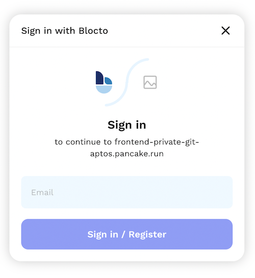
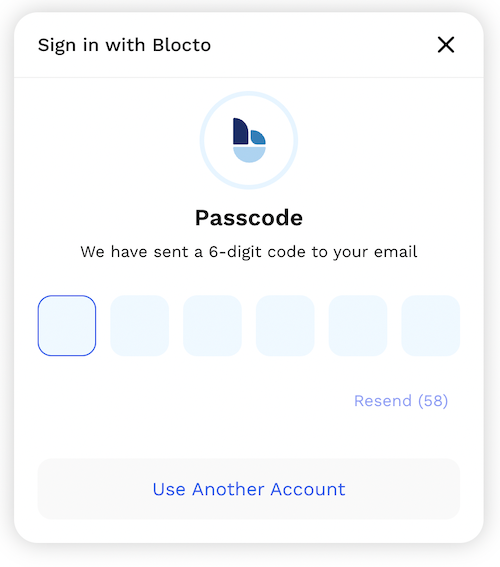
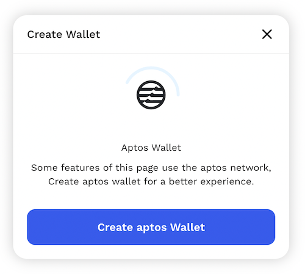
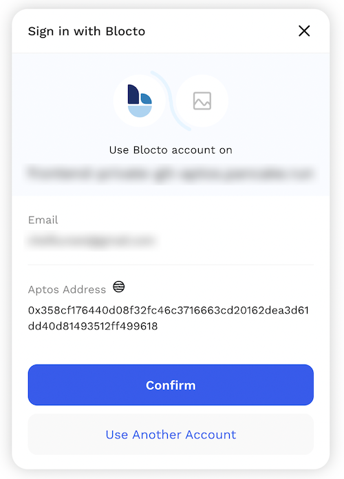

# Crie uma Carteira

<figure><figcaption></figcaption></figure>

Para começar sua jornada com a PancakeSwap na Aptos, a primeira coisa que você precisa é configurar uma carteira que suporte a Aptos Chain. As carteiras estão disponíveis em computadores desktop e em dispositivos de smartphone. Você precisará escolher a carteira que melhor se adapta às suas necessidades.


**Ao configurar uma carteira, certifique-se de:**&#x20;

* **✅ Baixe e instale apenas a versão mais recente de uma fonte oficial.**
* **✅ Siga atentamente o guia de configuração.**&#x20;
* **✅ Faça backup com segurança de suas frases de recuperação.**&#x20;
* **❌ NUNCA compartilhe suas frases de recuperação com ninguém, em hipótese alguma.**&#x20;
* **❌ NUNCA insira sua frase de recuperação em um site ou aplicativo que não seja seu aplicativo de carteira.**


### Carteira para smartphone/celular ou desktop?


No momento da redação deste artigo, há um número limitado de carteiras de celular com suporte para Aptos. Os chefs incluirão mais carteiras no tutorial quando estiverem disponíveis.

**Recomendamos o uso de** [**carteiras de desktop**](crie-uma-carteira.md#carteiras-de-desktop-navegador-web) **até que mais carteiras de celular estejam disponveis**


As carteiras de dispositivos móveis e as carteiras baseadas em desktop têm diferentes pontos fortes e fracos. Considere qual se adapta melhor às suas necessidades para ajudar a decidir qual tipo de carteira usar.

<table data-header-hidden><thead><tr><th width="210"></th><th></th><th></th></tr></thead><tbody><tr><td>Text</td><td>Celular</td><td>Desktop</td></tr><tr><td>Use em qualquer lugar</td><td>✅</td><td>➖</td></tr><tr><td>Fcil de Usar</td><td>✅</td><td>➖</td></tr><tr><td>Mais segura</td><td>➖</td><td>✅</td></tr><tr><td>Accessibilidade amigvel </td><td>➖</td><td>✅</td></tr><tr><td>Resistente  Dano/perda/roubo</td><td>➖</td><td>✅</td></tr><tr><td>Resistente   interrupço de energia e conexão</td><td>✅</td><td>➖</td></tr></tbody></table>

### Carteiras para smartphones/celulares

As carteiras para smartphones/móveis permitem que você acesse suas criptomoedas em praticamente qualquer lugar. As carteiras estão disponíveis em dispositivos Android e iOS.

#### Qual carteira móvel devo escolher?

Esta tabela de comparação fornece uma visão geral das carteiras para dispositivos mveis mais populares usadas com a PancakeSwap.

|                                |                          |              |        |
| ------------------------------ | ------------------------ | ------------ | ------ |
| Text                           | SafePal                  | Trust Wallet | Blocto |
| Suporta Aptos Chain            | ✅                        | ✅            | ✅      |
| Navegador DApp integrado       | ✅                        | ✅            | ✅      |
| Compatível com Hardware wallet | 
✅ (Só SafePal)
 | ➖            | ➖      |
| Open source (auditvel)         | ➖                        | ✅            | ➖      |

Você pode encontrar informações mais detalhadas sobre cada carteira abaixo, bem como links de download e guias de instalação.



<figure><figcaption>
O SafePal está disponível como uma carteira de software e hardware. A carteira é fácil de instalar e criar e vem pronta para suportar Aptos, BEP2 (BNB Beacon Chain), BEP20 (BNB Smart Chain) imediatamente.
</figcaption></figure>

**Prós:**

* Alterne facilmente entre várias redes cripto&#x20;
* Tem opção para o Google Authenticator integrado&#x20;
* Suporta um grande número de idiomas&#x20;
* O processo de configuração é muito simples&#x20;
* Está disponível como carteira de software e hardware (trabalha em conjunto)&#x20;

**Contras:**

* Não é totalmente de código aberto&#x20;
* Não dá notificações ao usuário&#x20;
* Não impõe uma segurança forte durante a configuração inicial e a criação da carteira

​[**Download SafePal**](https://safepal.io/download) (Dispositivo Detectado Automaticamente)\
[**Guia de Instalação da SafePal para Atpos**](https://safepalsupport.zendesk.com/hc/en-us/articles/10061372532891-How-to-add-send-Aptos-mainnet-coin-APT-with-SafePal-Software-Wallet)



<figure><figcaption></figcaption></figure>

Trust Wallet é uma carteira popular para smartphone. Ele suporta DApps, NFTs colecionáveis (com suporte Opensea.io) e stake na carteira.

**Pros:**

* Código aberto para auditabilidade
* Apoiado pela exchange de criptomoedas Binance
* Alterne facilmente entre várias redes cripto
* Inclui rede Aptos por padrão

**Contras:**

* DApps limitados
* As notificações de transações podem ser atrasadas

[**Download Trust Wallet**](https://trustwallet.com) (Dispositivo detectado Automaticamente)\
[**Guia de Instalação da Trust Wallet para Aptos**](https://community.trustwallet.com/t/trust-wallet-adds-native-support-for-aptos-apt/575701)



<figure><figcaption></figcaption></figure>

Blocto oferece uma solução amigável e um pacote completo para usar Dapps e gerenciar seus ativos.&#x20;

**Destaques:**&#x20;

* Suporta BNB Chain e Aptos Chain e outras grandes redes de cripto prontas para uso.&#x20;
* Fcil de configurar
* Suporta IOS e Android.&#x20;
* Login de E-mail.&#x20;
* A carteira de contrato inteligente que elimina a necessidade de gerenciar sua própria chave privada e também fornece recursos avançados, como recuperação de conta&#x20;
* A taxa de gás de configuração inicial para a carteira de contrato inteligente é coberta&#x20;

**Observação:**&#x20;

* **Requer endereço de e-mail para começar**&#x20;
* Modelo custodial
* Um pouco complicado se você quiser exportar sua chave privada e gerenciá-la ou usá-la em outras carteiras. [Tutorial](https://portto.zendesk.com/hc/en-us/articles/4411564072217-Can-I-export-my-private-key-from-Blocto-and-use-it-in-Metamask-Phantom-Trust-Wallet-).

[**Download Blocto Wallet**](https://portto.com/download)

### Guia de configuração da carteira Blocto&#x20;

1 - Configure inserindo seu endereço de e-mail. Em seguida, digite a senha de uso único recebida por e-mail.

 (4) (2).png>)

.png>)

2 - Clique no botão de adição e escolha "APT - Aptos"

 (4).png>)

 (1).png>)

3 - Pronto! Agora você pode depositar o APT na carteira Aptos e começar a usar **a** PancakeSwap na Aptos acessando a página "Descobrir"!

 (4) (1).png>)

 (1) (2).png>)



### Carteiras de desktop/navegador Web

As carteiras de desktop estão disponíveis em seu computador doméstico ou laptop. As carteiras em seu computador podem ser executadas como aplicativos independentes ou como plug-ins de navegador da Web para navegadores populares como Chrome e Firefox.

### Qual carteira de desktop devo escolher?&#x20;

Esta tabela de comparação fornece uma visão geral das carteiras de desktop mais populares que podem ser usadas com a PancakeSwap na Aptos.

| Text                             | Petra | Martian | Pontem | Fewcha | Blocto |
| -------------------------------- | ----- | ------- | ------ | ------ | ------ |
| Suporta Aptos Chain              | ✅     | ✅       | ✅      | ✅      | ✅      |
| Compatíveis com Hardware wallet  | ➖     | ➖       | ➖      | ➖      | ➖      |
| Open source (auditáveis)         | ✅     | ❓       | ✅      | ❓      | ❓      |

_❓ -_ no momento da escrita, não temos certeza sobre o status dessas informações&#x20;

Você pode encontrar informações mais detalhadas sobre cada carteira abaixo, bem como links de download e guias de instalação.



<figure><figcaption></figcaption></figure>

A carteira Petra é uma extensão que permite explorar a Aptos no seu navegador.&#x20;

**Destaques:**&#x20;

* Construída pelo Aptos Labs&#x20;
* Fácil de usar&#x20;
* Suporta várias contas&#x20;
* Suporta NFT integrado
* &#x20;Suporta testnet Aptos e faucet de APT no testnet de um clique

**Observação:**&#x20;

* Somente Desktop&#x20;
* Suporta apenas Aptos Chain

[**Download Petra Wallet**](https://petra.app/)

[**Petra Wallet Setup Guide**](https://petra.app/docs/use)



<figure><figcaption></figcaption></figure>

Martian é uma carteira na Aptos Chain que permite armazenar, enviar, receber tokens e gerenciar e mintar NFTs. Sua versão móvel está chegando em breve.

**Destaques:**&#x20;

* Versão para celular chegando em breve
* Fácil de usar&#x20;
* Suporta várias contas&#x20;
* Suporta NFT integrado
* &#x20;Suporta testnet Aptos

[**Download Martian Wallet**](https://martianwallet.xyz/)



<figure><figcaption></figcaption></figure>

A Pontem Wallet é uma carteira na Aptos Chain que permite armazenar, enviar, receber tokens e conectar-se a dApps no ecossistema Aptos.

**Destaques:**&#x20;

* Versão para celular chegando em breve
* Fácil de usar&#x20;
* Suporta várias contas&#x20;
* Suporta NFT integrado
* &#x20;Suporta testnet Aptos

[**Download Pontem Wallet**](https://pontem.network/pontem-wallet)



<figure><figcaption></figcaption></figure>


Atualmente, a carteira Fewcha tem um problema com a importação de chaves privadas. Recomendo experimentar outras carteiras por enquanto.


A Fewcha Wallet é uma carteira na Aptos Chain que permite armazenar, enviar, receber tokens e conectar-se a dApps no ecossistema Aptos.

**Destaques:**&#x20;

* Versão para celular chegando em breve
* Fácil de usar&#x20;
* Suporta várias contas&#x20;
* Suporta NFT integrado
* &#x20;Suporta testnet Aptos

[**Download FewCha Wallet**](https://fewcha.app/)



<figure><figcaption></figcaption></figure>

Blocto oferece uma solução amigável e um pacote completo para usar Dapps e gerenciar seus ativos.&#x20;

**Destaques:**&#x20;

* Suporta BNB Chain e Aptos Chain e outras grandes redes de cripto prontas para uso.&#x20;
* Nenhum aplicativo ou extensão é necessário para uso na área de trabalho.&#x20;
* Suporta desktop e celular.&#x20;
* Login de E-mail.&#x20;
* A carteira de contrato inteligente que elimina a necessidade de gerenciar sua própria chave privada e também fornece recursos avançados, como recuperação de conta&#x20;
* A taxa de gás de configuração inicial para a carteira de contrato inteligente é coberta&#x20;

**Observação:**&#x20;

* **Requer endereço de e-mail para começar**&#x20;
* Modelo custodial
* Um pouco complicado se você quiser exportar sua chave privada e gerenciá-la ou usá-la em outras carteiras. [Tutorial](https://portto.zendesk.com/hc/en-us/articles/4411564072217-Can-I-export-my-private-key-from-Blocto-and-use-it-in-Metamask-Phantom-Trust-Wallet-).

### Guia de configuração da carteira Blocto&#x20;

1 - Após selecionar "Blocto" na janela de conexão da carteira, você deverá ser apresentado a uma janela de login. Digite seu endereço de e-mail e clique em "Registrar". Se você já configurou uma conta Blocto, digite o endereço de e-mail e clique em "entrar".

<figure><figcaption></figcaption></figure>

2 - Em seguida, digite a senha de uso único recebida por e-mail.

<figure><figcaption></figcaption></figure>

3 - Clique em "Criar carteira Aptos". Em seguida, clique em "Confirmar" para se conectar.

<figure><figcaption></figcaption></figure>

<figure><figcaption></figcaption></figure>

4 - Pronto! Observe que você precisará de fundos no seu endereço Aptos com o APT para começar a usar a PancakeSwap na Aptos. Se você quiser acessar a mesma conta em outros dispositivos, basta fazer login usando o mesmo endereço de e-mail.




NUNCA, em qualquer situação, você deve dar a alguém sua chave privada ou frase de recuperação ("frase inicial"). Isso dará a alguém acesso completo às suas criptomoedas!&#x20;

O site e a equipe genuínos da PancakeSwap nunca pedirão que você insira sua frase inicial.

