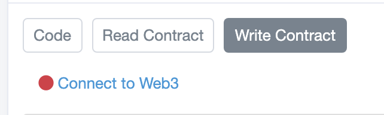

# JUV Emergency Withdrawal

1. Go here [https://www.bscscan.com/address/0x27bd41e77cab966a57232915292410acfd2761ac](https://www.bscscan.com/address/0x27bd41e77cab966a57232915292410acfd2761ac)

2. Click Contract 

3. Click "Write Contract" and then connect your wallet by clicking "Connect to Web3"

4. Click "Emergency Withdraw" and confirm the tx. This will return your CAKE tokens to your wallet.

