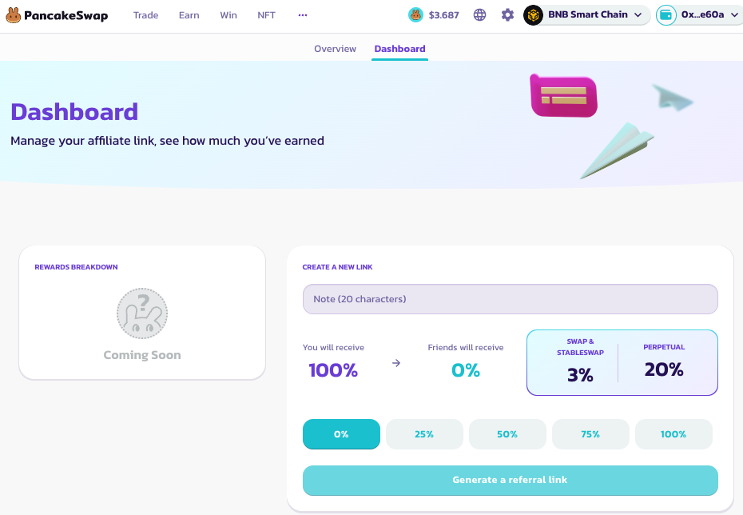

# 联盟计划

PancakeSwap 的联盟计划旨在奖励那些为社区的发展壮大以及对我们产品宣传做出贡献的人。该计划一开始将针对给特定的能在 PancakeSwap 的宣传方面做出贡献的群体，后续厨房计划将其推广到更多的用户。作为联盟会员，您将成为我们志趣相投的群体中的一部分，共同致力于建立一个更强大的 DeFi 社区。

### 成为联盟会员

成为联盟成员非常容易。您只需要访问我们的[联盟计划页面](https://pancakeswap.finance/affiliates-program)，在那您可以找到用于开始申请需要的所有信息。此外，您也可以填写[谷歌表单](https://docs.google.com/forms/d/e/1FAIpQLSfP43IciQ5cH0JhTf1fDgUpwapBx-yD3ybv24pBdiVW7Th5jQ/viewform)。

厨房将审查您提交的申请，并确定您是否适合这个项目。此过程可能需要一些时间，所以请耐心等待！如果您通过审查，我们将通过您的电子邮件或电报与您联系。&#x20;

通过审查后，您将获得进入联盟仪表板的权限，您可以通过连接您在项目申请中提交的钱包以进入联盟仪表盘。

<figure><figcaption></figcaption></figure>

这个仪表板将为你提供一系列的工具和资源，您可以通过创建分享链接来分享本协议的产品或服务，还可以跟踪您的佣金情况。

&#x20;一旦您经过审查获得进入仪表板的权限，您就可以创建联盟返佣链接以分享到您的社区。当**新用户**点击您的联盟返佣链接并进行特定交易时，您将获得佣金。请确保您始终使用您的联盟链接的来分享您对 PancakeSwap 的喜爱。
