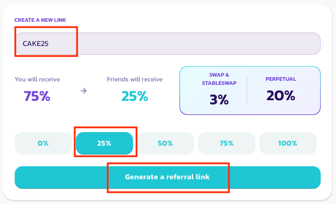
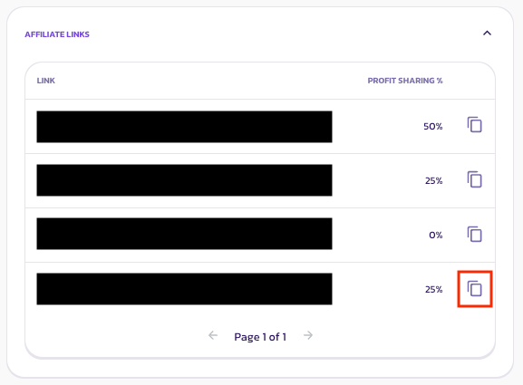

# 联盟仪表板&返佣链接

<figure><figcaption></figcaption></figure>

联盟仪表板是联盟计划的总部。在这里你将能够创建和分享返佣链接，同时也能追踪和提取返佣奖励。&#x20;

以下是访问联盟仪表板和生成返佣链接的步骤：&#x20;

**1.访问联盟仪表板**&#x20;

1. 前往[联盟计划页面](https://pancakeswap.finance/affiliates-program)&#x20;
2. 用提交申请时使用的钱包地址登录&#x20;
3. 点击 "仪表板 "标签&#x20;
4. 你可能会被提示需要登录，选择合适你的加密货币钱包登录

**2.生成返佣链接**&#x20;

1. 在联盟仪表板页面，移动到生成返佣链接的部分
2. 为你的返佣链接设置好独一无二的名称（代码）和佣金分享比率。关于这部分的更详细的信息可以点击[这里](yong-jin-jie-gou-ji-zhi-fu-xiang-qing.md)了解

<figure><figcaption></figcaption></figure>

3. 点击 "Generate a referral link 生成返佣链接 "并批准签名。之后的有一个弹出窗口，通知你已经生成了一个返佣链接
4. 移动到底部的链接部分，复制你创建的链接

<figure><figcaption></figcaption></figure>

以上步骤完成后，您就可以将您的返佣链接与您的社区分享，当您的邀请的新用户在 PancakeSwap 上进行交易时，您就可以获得返佣。想要了解关于我们如何鉴定一个新用户的讯息，请访问[条款及细则](tiao-kuan-ji-xi-ze.md)页面。
