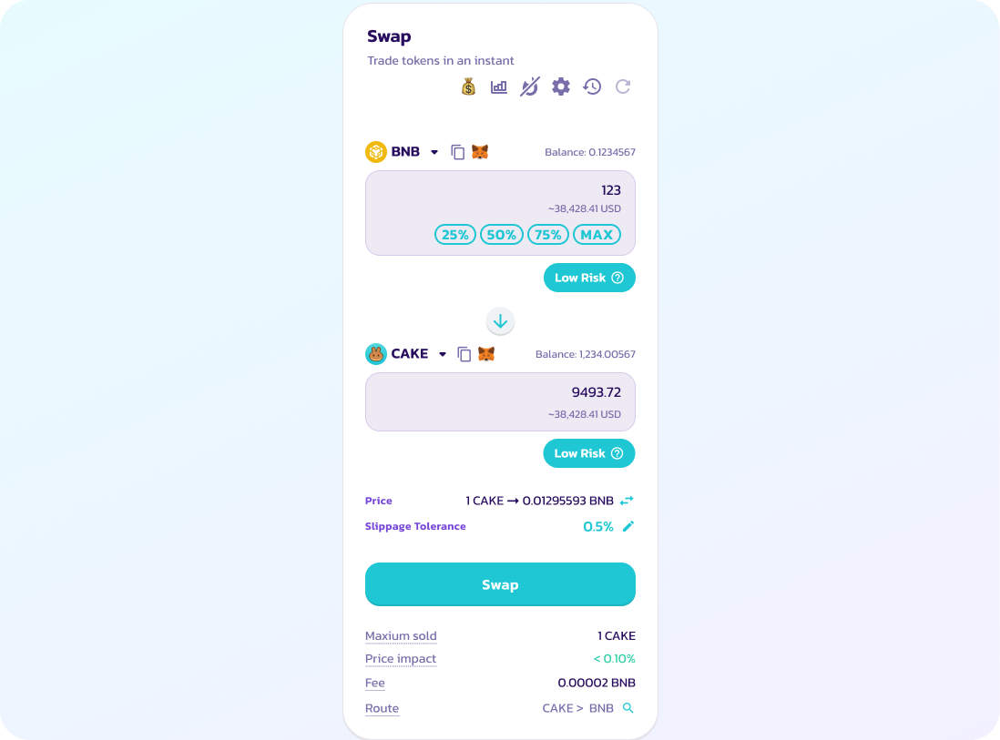
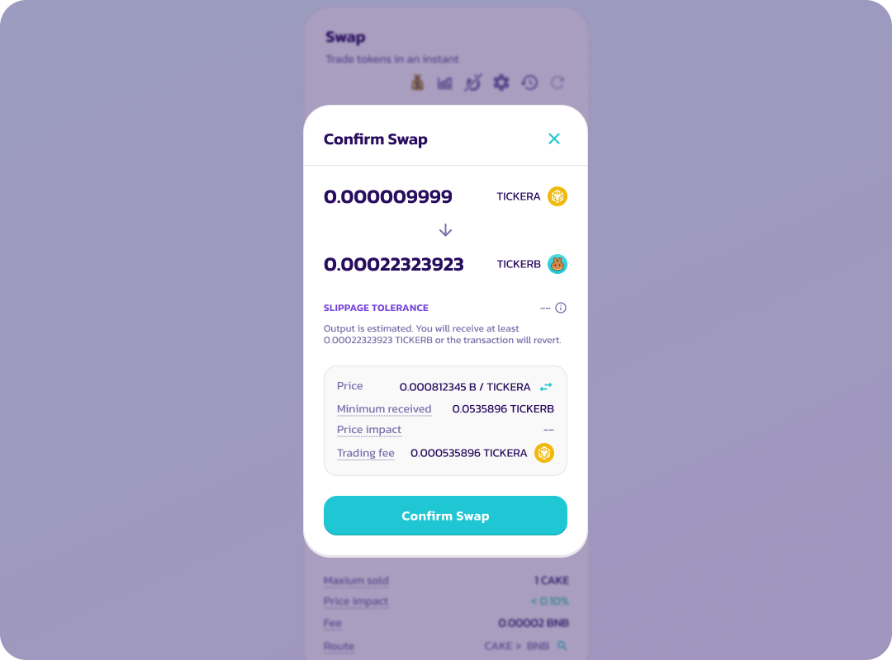
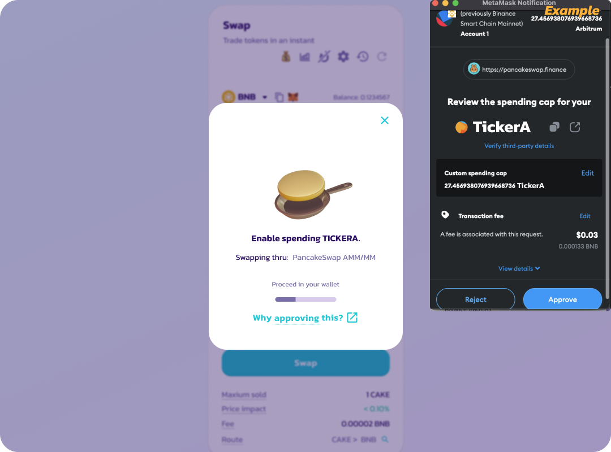
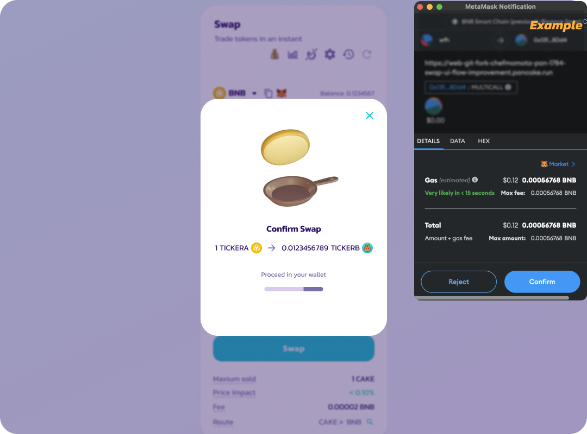
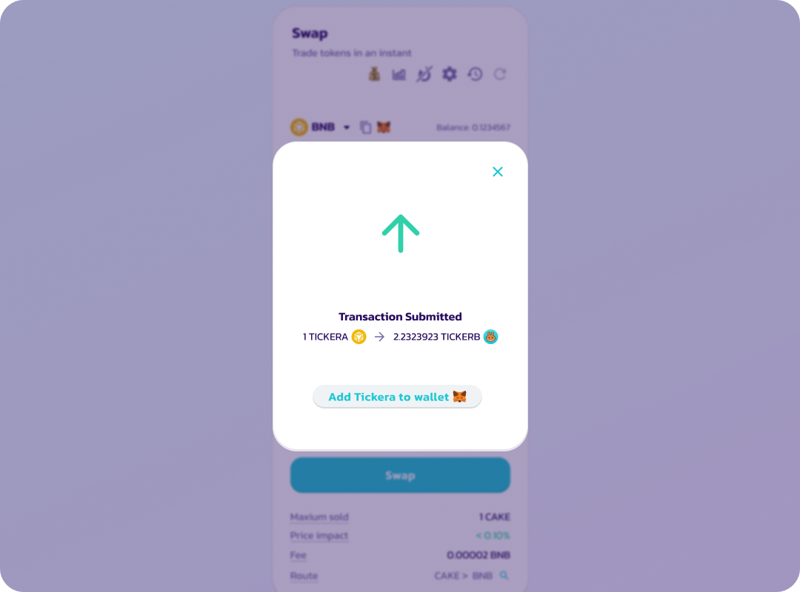
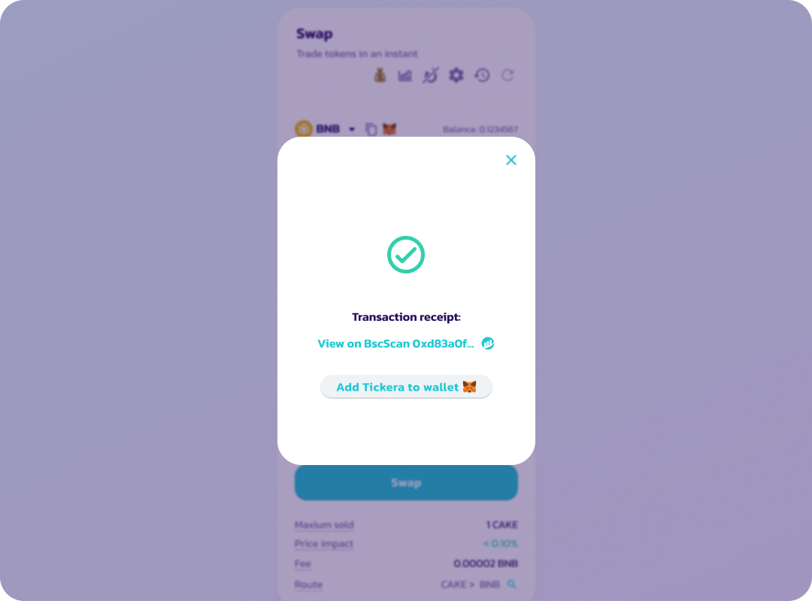

# 什么是授权操作（Approval Transaction）

**第一次进行兑换或添加流动性时，您必须要先对支出代币进行授权（approve）操作。通过此步骤， 您授权给了 PancakeSwap 的智能合约让合约能从您的钱包中使用该代币进行兑换操作。**

授权操作（approval transaction），即您授权给 PancakeSwap 来使用您钱包中某一特定代币用于兑换操作。您钱包中的每一种代币，若要使用 PancakeSwap 进行兑换，都必须先进行授权。

下面是如何完成授权操作的指南：

1\. 输入好您的兑换内容。

<figure><figcaption></figcaption></figure>

2\. 核对完兑换内容后，选择 "确认兑换（Confirm swap）"。

<figure><figcaption></figcaption></figure>

3\. 在钱包应用程序或钱包扩展程序中，授权您在此次兑换中将花费的代币。

让钱包中的代币能于兑换中使用。

_您的钱包可能会要求您输入欲授权代币的数量。请输入一个大于或等于您要支出的代币数量的数额。_

<figure><figcaption></figcaption></figure>

4.授权完成后，钱包会弹出另一个上链确认，要求您确认兑换（confirm swap）。

<figure><figcaption></figcaption></figure>

5\. 一旦兑换得到确认，交易就会提交到区块链（未确认）。&#x20;

<figure><figcaption></figcaption></figure>

6\. 当交易成功完成时，您将看到屏幕上显示 "成功（Success）" 和一个绿色的勾号。

<figure><figcaption></figcaption></figure>

代币的授权有效期会持续一段时间，之后必须通过签名请求再次授权代币。授权签名无需支付矿工费。
