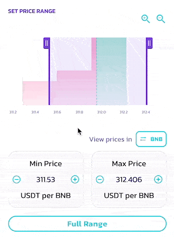

# APR/ROI/Calculadora IL

En Liquidez y Farm V3, con la nueva función de rango de precios personalizable para los LP no fungibles, cada posición tiene su propio fee de LP y APR de CAKE del farming.

Para hacerlo más fácil y menos desafiante a la hora de aportar liquidez, el nuevo APR automático se presenta con una flamante calculadora de ROI disponible al momento de aportar liquidez o depositar en el Farm.

## Indicador y cálculo automático de APR 

<figure><figcaption></figcaption></figure>

Cuando aportas liquidez, el indicador automático de APR responde a tus cambios en la configuración y calcula el APR basado en la misma.

Por ejemplo, en la mayoría de los casos, si achicas tu rango de precios, el APR subirá.

Tenga en cuenta para los APRs de los fee de LP:

* La cantidad estimada de recompensas de fee de LP varía basada en el tier de fee seleccionado, el reclamo y reinversión de las recompensas de fee deben hacerse manualmente.
* Las cifras de APR son calculadas usando el volumen de trading histórico, el cual depende de Subgraph y puede verse afectado por demoras en la actualización.

Para los APRs de farming:

* La cantidad estimada de recompensas en CAKE se basa en las emisiones actuales de CAKE para los farms. Están sujetas a cambios, basados en futuros ajustes en las emisiones.


Todos los valores son calculados según las tasas y condiciones del pool actuales y están sujetas a cambios debidos a varias variables externas. Son estimaciones brindadas solamente como ayuda, y de ninguna manera garantizan retornos específicos.


Puedes encontrar este indicador de APR en las siguientes secciones:

* La página de “Add Liquidity” - mostrando el APR de fee de LP
* Página de detalles de cada posición de liquidez existente - mostrando el APR de fee de LP\
   (1) (1).png>)
* Página de Farm, dentro de la posición debajo de cada farm - mostrando el APR combinado de los fee de LP y las recompensas en CAKE\
   (4).png>)\

## Calculadora de ROI mejorada 

<figure><figcaption></figcaption></figure>

Siempre que vea las pantallas de APR automática, puede hacer clic y abrir la nueva calculadora de ROI. La nueva calculadora de ROI ha sido rediseñada con funciones adicionales de servicio para satisfacer las necesidades de aporte de liquidez concentrada y farming V3.&#x20;

Repasemos juntos cada una de las secciones:

### Monto de depósito, “Staked For” y “Compounding Every” 

Estos son los tres datos principales a ingresar, los cuales también fueron presentados en la calculadora anterior. Sirven para definir:

1. Cuánto es lo que está aportado en la posición, en USD.
2. Por cuánto tiempo estará  depositado en la posición.
3. Con qué frecuencia harás la reinversión de las recompensas.

⓵ **Monto de depósito**

<figure><figcaption></figcaption></figure>

Puedes ingresar la cantidad en USD manualmente, o usar los botones para autocompletar directamente $100, $1000 o la cantidad máxima permitida, según la cantidad disponible en tu wallet.

⓶ **Duración del depósito**

<figure><figcaption></figcaption></figure>

Puedes elegir por cuánto tiempo tus activos estarán depositados en la posición, eligiendo entre: 1 dia, 7 dias, 30 dias, 1 año, and 5 años.

La cantidad de retorno se calculará en base a esa duración.

⓷ **Compounding (Reinversión)**

<figure><figcaption></figcaption></figure>

Puedes seleccionar con qué frecuencia estarás recogiendo las recompensas generadas por la posición, y reinvirtiéndolas en ella. puedes elegir entre: 12 horas, 1 dia, 7 dias, and 30 dias.

La cantidad de retorno y el APY serán calculados en base a tu elección. Si no tienes pensado reinvertir tus recompensas, desmarca la casilla de la izquierda.


En V3, los fees ganados por el LP y los CAKE de recompensa, deben ser recogidos y reinvertidos manualmente.


### &#x20;⓸ Histórico del Precio 

<figure><figcaption></figcaption></figure>

Esta es sólo una sección informativa para ver los movimientos históricos del precio del par seleccionado.

Puedes ver el histórico en diferentes escalas de tiempo, como, por ejemplo, cuánto suele fluctuar el precio y luego establecer una configuración de rango de precios adecuada para equilibrar entre una APR más alta y un menor riesgo de impermanent loss.

* MIN - precio mínimo
* MAX - precio máximo
* AVG - precio promedio
* CURRENT - precio actual


El gráfico de precios usa datos solamente del par real en V3. Por lo tanto, los datos de precio anteriores al lanzamiento en V3 no están disponibles. Las cuatro variables del precio son respecto a la escala de tiempo seleccionada, y varían según dicha selección.


### ⓹ Rangos de precio 

<figure><figcaption></figcaption></figure>

Usando esta sección, podrás chequear cuánta liquidez ha sido depositada en los diferentes rangos de precio, y así decidir y crear y establecer el rango de precios al que estás proporcionando liquidez.

Puedes encontrar el gráfico de distribución debajo del título. Cuanto más grande sea la cantidad de liquidez, más alto será el gráfico.

Puedes cambiar tu selección de rango de precio de diferentes maneras:

* Arrastrando las dos barras del gráfico para aumentar o disminuir los límites máximo y mínimo del precio.
* Usando el espacio entre las barras para desplazar el rango seleccionado.
* Haciendo clic en los botones de + y - en los campos de min y max del precio.
* Haciendo clic en los números en los campos de precio e ingresándolos manualmente.

Si quieres navegar por el gráfico de distribución:

1. Usa los botones de + y - de la lupa para hacer zoom.
2. Arrastra el eje X (inferior) para desplazarte hacia la derecha o izquierda.

Si quieres aportar liquidez al rango de precios completo, haz clic en “Full Range”.

### ⓺ Invierte la dirección del precio para verlo con base en diferente activo 

<figure><figcaption></figcaption></figure>

Para algunos pares, es más fácil e intuitivo ver los precios con determinado token como base. Por ejemplo, para el par BNB/USDT, la mayoría preferirá ver los precios de la manera "cuántos USDT por BNB" en lugar de verlo a la inversa.

Puedes invertir el precio base fácilmente. Simplemente haz clic en el botón a continuación de "Ver precio en:" para cambiar la base entre los dos tokens del par.

### ⓻ Importar y exportar (aplicar) tus preferencias 

<figure><figcaption></figcaption></figure>

Cuando abres la calculadora de ROI en la ventana de "Agregar liquidez", o chequeando una posición existente, las siguientes preferencias serán importadas automáticamente, así que no hace falta que las setees otra vez:

1. La cantidad de activos que estás depositando
2. El rango de precios
3. El fee tier elegido

Cuando terminas de configurar la calculadora de ROI, puedes hacer clic en "Aplicar Preferencias" para aplicar directamente las preferencias seteadas en la calculadora a la ventana de "Agregar liquidez" así no tienes que hacerlo manualmente luego.

### ⓼ Calculate farming rewards and APR 

Las recompensas de Farming serán incluidas en los cálculos si abres la calculadora de ROI desde la página de "Farm".

Puedes abrir la sección de detalles para ver la composición desagregada de las recompensas
