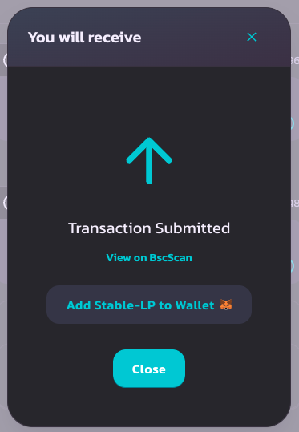
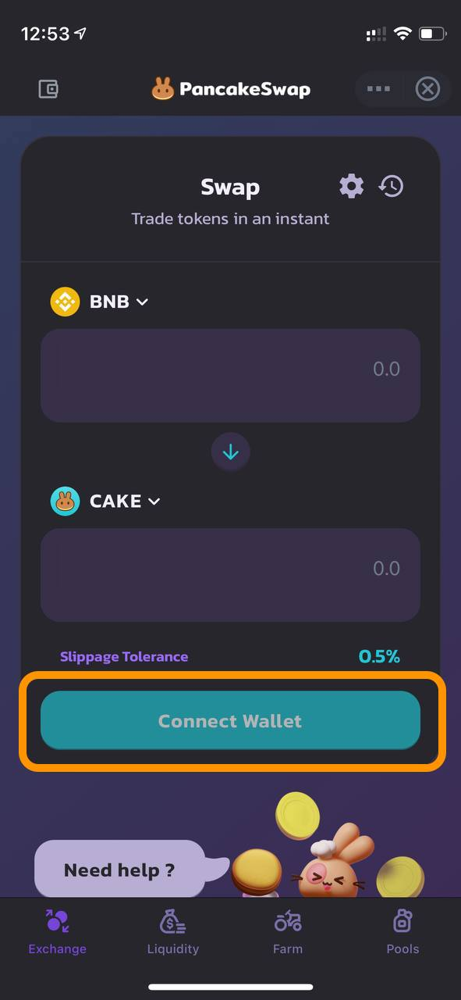
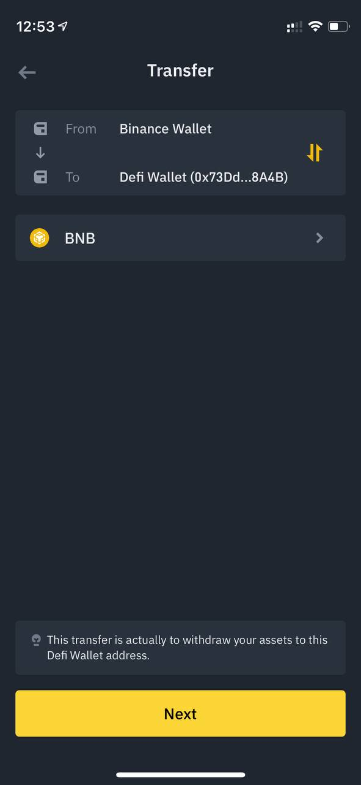
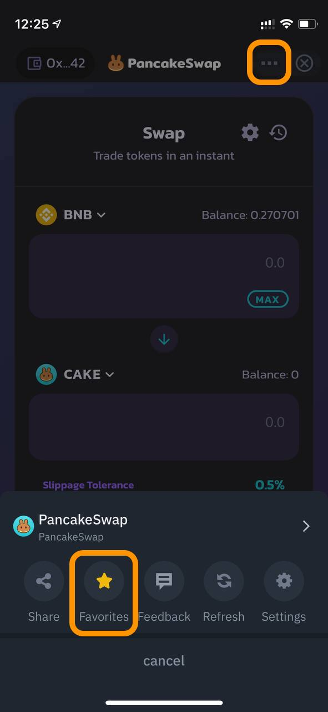
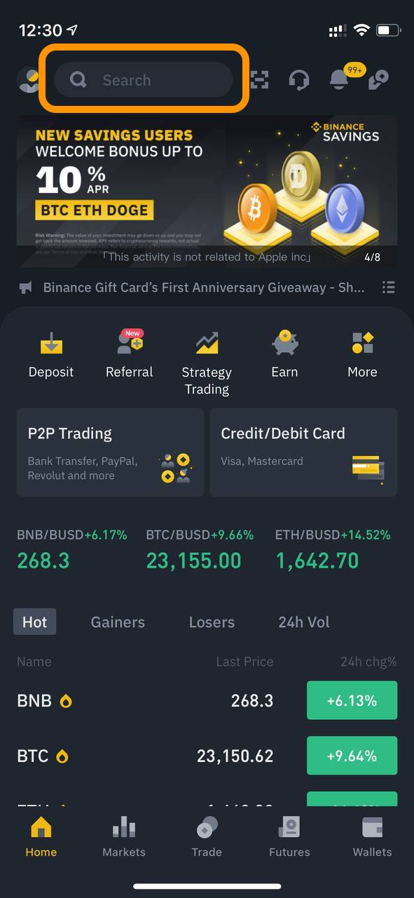
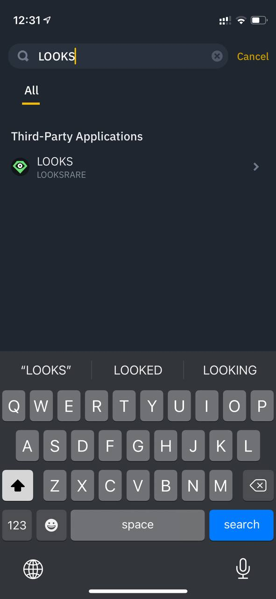
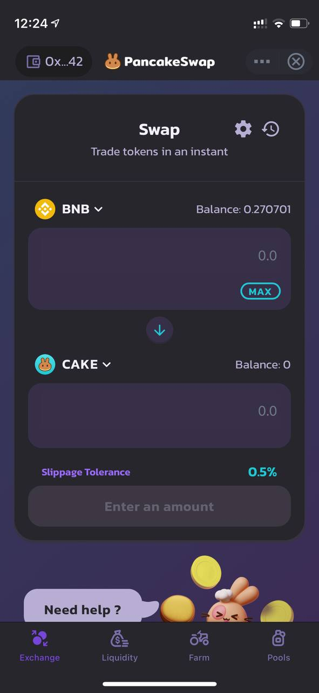
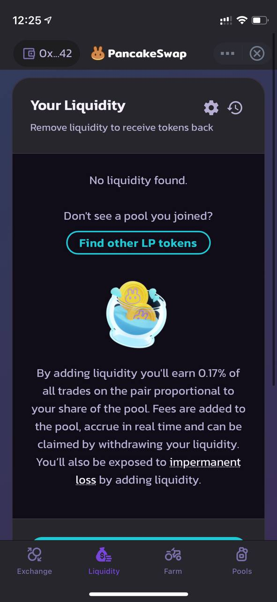
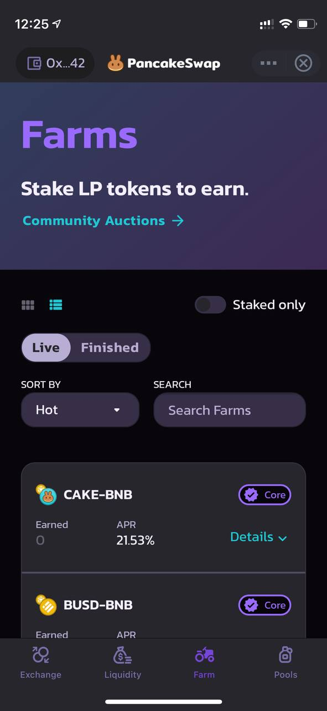
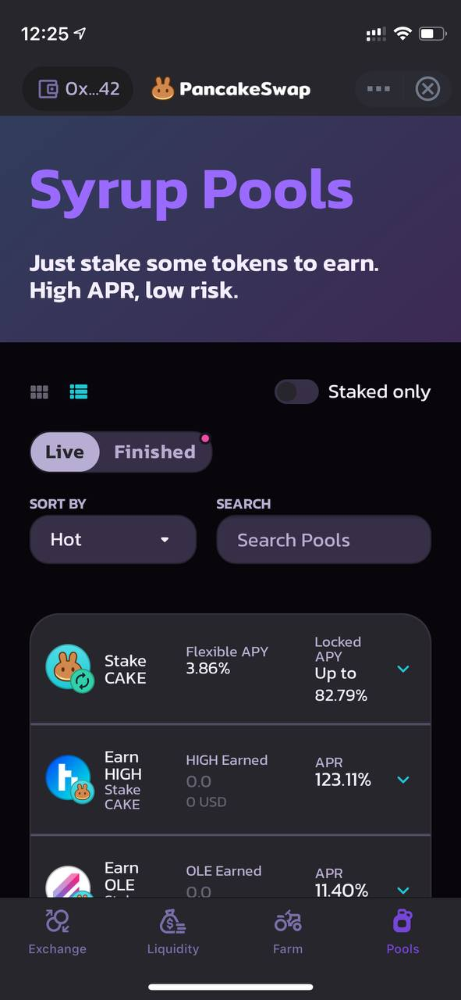

# ¿Cómo usar el Mini-Programa de PancakeSwap?

### Encontrar el Mini-Programa de PancakeSwap 

Para encontrar el Mini-Programa de PancakeSwap, simplemente puede ir a su aplicación de Binance y deslizar hacia abajo 👆⬇️ desde la parte superior en la página de inicio para encontrar el Marketplace de Mini-Programas:

Una vez que esté en el Marketplace, puede encontrar fácilmente el Mini-programa de PancakeSwap dentro de la lista Popular o alternativamente, también puede buscarlo.

 (1).png>)

### Configuración del Mini-Programa de PancakeSwap 

Antes de ingresar al Mini-Programa de PancakeSwap, hay un descargo de responsabilidad de Binance, así como un acuerdo de servicio de usuario que debe leer y aceptar antes de poder acceder a las funciones.

Después de leerlos, asegúrese de desplazarse hasta la parte inferior para hacer clic en "I understand" para comenzar.

### Configuración de la wallet DeFi de Binance 

Si es la primera vez que usa el Mini-Programa de PancakeSwap, y probablemente cualquier Mini-Programa en la aplicación de Binance, es probable que primero tenga que configurar su Wallet DeFi de Binance.

La wallet DeFi de Binance es una billetera Web3 descentralizada sin custodia dentro de la aplicación Binance. Actualmente, la billetera limita las transferencias solo hacia y desde la billetera spot Binance CEX (elimina la necesidad de copiar, pegar y verificar la dirección de la billetera para retirar de la billetera spot Binance CEX y depositar nuevamente en ella). ¡Al menos por ahora, no más dobles, triples, cuádruples verificaciones de direcciones, manos sudorosas y ansiedad de los nuevos usuarios que sumergen un dedo del pie en aguas DeFi!

Para configurarlo, puede hacer clic en “Connect Wallet” en la página de inicio de PancakeSwap, alternativamente, puede ir a la pestaña “Wallet” en la aplicación y hacer clic en “DeFi Wallet” para configurarlo.

El proceso de configuración está diseñado y simplificado para usuarios de CEX. Los usuarios pueden crear una nueva billetera DeFi con un botón o importar su billetera existente con sus frases semilla. Una vez que se crea una nueva billetera, puede encontrar la opción de hacer una copia de seguridad de sus frases de recuperación, ¡asegúrese de hacerlo!

Luego, puede hacer clic en el botón de transferencia en la billetera DeFi para transferir fondos desde su billetera spot de Binance. Tenga en cuenta que una transferencia desde la billetera spot se cuenta como un retiro en el extremo de Binance, por lo que puede haber tarifas de retiro, pero no tarifas de gas.

### ¡Importante! Asegúrese de que haya algo de BNB en la billetera DeFi 

### Es muy importante tener en cuenta que los activos que se han transferido de la billetera spot a la billetera DeFi ahora están fuera del sistema de custodia centralizado de Binance, por lo tanto, todas las transacciones como transferencias, intercambios, staking requerirían BNB para las tarifas de gas para completar las transacciones en la BNB Smart Chain. Sin BNB en su billetera DeFi, ninguna de las funciones de los mini-programas funcionará, ¡así que asegúrese de tener algo de BNB en su billetera DeFi! 

Una vez tenga configurada su wallet con sus activos, lo más importante es que tenga ya BNB, estarás listo para probar el Mini-Programa de PancakeSwap.

### Otras opciones para acceder al Mini-Programa 

¡También hay otras opciones de entrada a nuestro Mini-Programa y estamos trabajando con el equipo de Binance para agregar más!

1. **Favorito del Marketplace** – haga clic en los tres puntos en la esquina superior derecha del Mini-Programa y márquelo como favorito, ¡luego la próxima vez en el Marketplace estará en la parte superior!

**2. DeFi Wallet** – PancakeSwap está en la página de inicio de la DeFi Wallet, por lo que al acceder a la DeFi Wallet desde la pestaña de la billetera, también puede ingresar desde allí.

**3. Barra de búsqueda** – barra de búsqueda en la parte superior, puede buscar ciertos tokens que aún no están listados por Binance pero que están incluidos en la lista PancakeSwap, ¡desde allí lo dirigirá al Mini-Programa de PancakeSwap para operar! En este ejemplo, buscamos LOOKS:

### Características disponibles en el Mini-Programa 

Actualmente, se han implementado cuatro características principales en el Mini-Programa:

1. **AMM Swap**: permite a los usuarios operar sin la necesidad de pasar por un intercambio centralizado, las operaciones se enrutan directamente a través de su propia billetera. Se pueden crear pools de liquidez para todos los activos en BNB Smart Chain, una variedad mucho más amplia de tokens para operar.

**2. Provisión de liquidez**: proveer liquidez le dará tokens LP, que le harán ganar recompensas en forma de tarifas por trading para asegurarse de que siempre haya liquidez para que el DEX la use.

**3. Yield Farming:** permite a los usuarios que proveen liquidez ganar recompensas en CAKE, bloqueando sus tokens LP en un contrato inteligente. Esto es para equilibrar el riesgo de impermanent loss que viene junto con el bloqueo de su liquidez.

**4. Syrup Pool** – Los Syrup Pools son la forma más sencilla de ganar tokens gratis en PancakeSwap. Deja tus CAKE en stake y gana tokens gratis. Es realmente así de fácil.

### &#x20;
