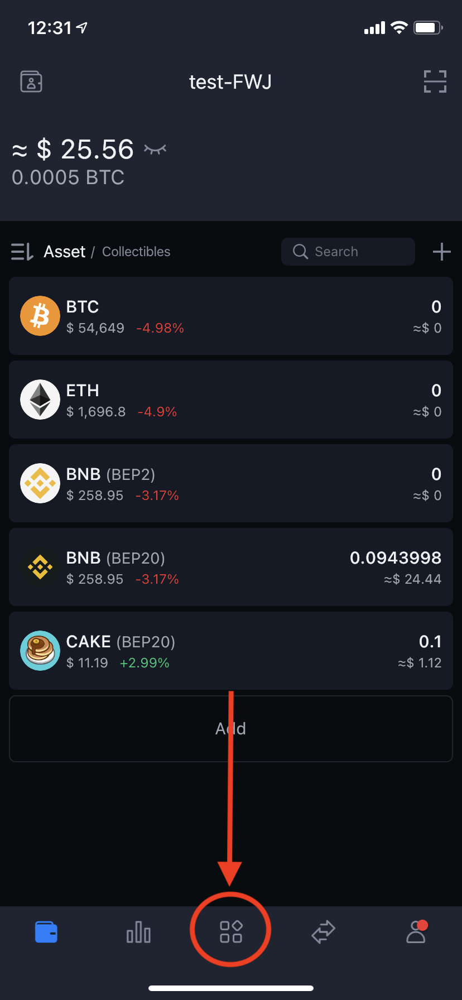
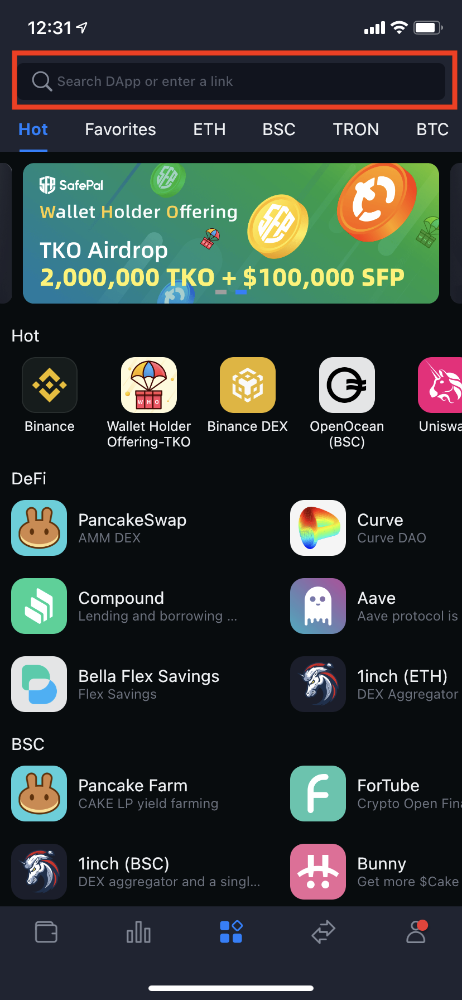
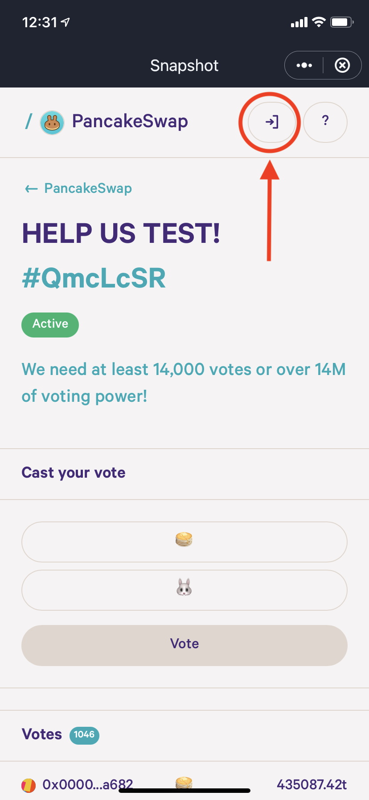
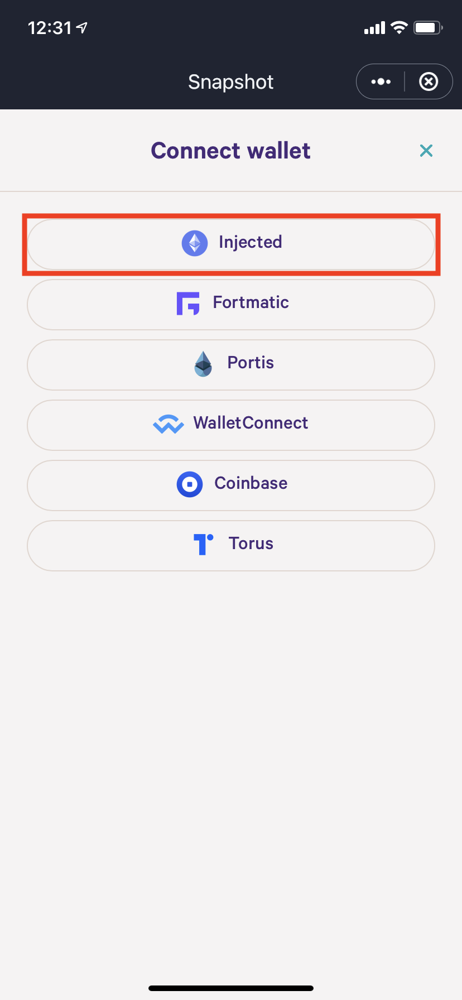

# How to vote with SafePal wallet

First, open your SafePal wallet and select the dApp browser icon in the menu down the bottom.

Second, enter the URL of the voting page in the address bar. If you don't know the direct URL to the vote you want to vote on, you can go to [voting.pancakeswap.finance](https://voting.pancakeswap.finance) and find the vote from there.

Third, click on the connect wallet button at the top of your screen.&#x20;

Last, click on "Injected" as the wallet. Your wallet will now be connected and you can now vote on PancakeSwap proposals

