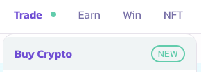
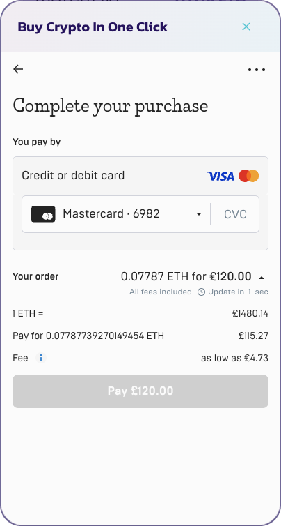

# 💳 Buy Crypto

PancakeSwap introduces the ability to purchase your favourite tokens using a credit card, debit card or bank transfer. Integrating on-ramp services into our platform aims to provide users with a seamless and convenient way to purchase cryptocurrencies using fiat currencies. Using our on-ramp quote interface, users can choose between different providers and get the best rates in Web3.

### Benefits for Users

The on-ramp integration and quote system offers several key benefits for our users:

1. Easy Purchase of Cryptocurrencies: Users can now conveniently purchase cryptocurrencies directly from our platform using their preferred fiat currency, eliminating the need for multiple transactions across different platforms.
2. Wide Range of Supported Currencies and Regions: Our esteemed partners, including Mercuryo, support various fiat currencies, ensuring users from various regions can actively participate in the ever-expanding crypto market.
3. Multiple Payment Methods: We support various payment methods, such as credit/debit cards and bank transfers, providing users with great flexibility and convenience to complete transactions in a way that suits their preferences.
4. Secure and Compliant: Our trusted partners adhere to stringent security standards and comply with all applicable regulations, prioritizing protecting user data and ensuring that transactions are carried out in a secure environment.
5. Transparent Fee Structure: We maintain a transparent fee structure with no hidden charges. Users will have complete visibility of the exact amount they will be charged before finalizing their purchases, ensuring a fair and informed transaction process.

#### Structure and Fees

On-ramp services will be available on BNB and Ethereum chains. Major cryptocurrencies and stablecoins will be available and outlined in the table below:\

<table><thead><tr><th width="137">Provider</th><th width="203">Fees*</th><th>Fiat Currencies Supported</th><th>Tokens Supported**</th></tr></thead><tbody><tr><td>Mercuryo</td><td>3.95% for Debit/Credit 3.95% for Bank Transfers/SEPA (EU)</td><td>USD, EUR, GBP, HKD, CAD, AUD, BRL, JPY, KRW, VND</td><td>
ERC-20: ETH, USDT, USDC, DAI

BEP-20: BNB, BUSD
</td></tr><tr><td>MoonPay</td><td>
3.25% for Debit/Credit

1.25% for SEPA (EU) , FPS (UK)

2.95% for PIX (Brazil) 1.50% for Yellowcard (Nigeria)
</td><td>USD, EUR, GBP, HKD, CAD, AUD, BRL, JPY, KRW, VND</td><td>
ERC-20: ETH, USDT, USDC,  DAI 

BEP-20: BNB, BUSD
</td></tr></tbody></table>

\*Fees are subject to minimum spend and maximum- most likely above 30 USD and below 10,000 USD, depending on the token.

\*\*Please note that the availability of particular cryptocurrencies may vary based on the user's region.

Please note that the quote system will provide full transparency of the exchange rate, including fees, to recommend the best option.

### How do I buy crypto?

1. Click on the "Buy Crypto" button on the PancakeSwap platform.

<figure><figcaption></figcaption></figure>

2. Select your desired fiat currency and token pair from the pop-up menu.

<figure><figcaption></figcaption></figure>

3. Click on "Get Quote"

<figure><figcaption></figcaption></figure>

4. Select recommended quote.&#x20;

<figure><figcaption></figcaption></figure>

 

<figure><figcaption></figcaption></figure>

5. Proceed to follow the on-screen steps with the on-ramp provider.

<figure><figcaption></figcaption></figure>

 

<figure><figcaption></figcaption></figure>

6. Your cryptocurrency should arrive in your wallet within minutes.

### Do I need proof of identity?

To purchase crypto through our providers, different levels of evidence are required to prove identity to our on-ramp partners. These levels will depend on the payment mode and payment amount required. Users will have to comply with provider requirements to use the buy crypto product. To learn more about this, please visit our partner documentation. **PancakeSwap does not collect and store any financial or personal data.**

### Is buy crypto available where I'm located?

Buy crypto is available for select regions based on provider availability. Please visit our partner documentation for more information.

### Where can I find out more?

You can visit our partner documentation here:

* [Mercuryo](https://help.mercuryo.io/en/articles/6122838-on-and-off-ramps)
* [MoonPay](https://support.moonpay.com/hc/en-gb/sections/360003486437-Buying-Cryptocurrency-)

### **What's next?**

The kitchen believes the onboarding experience is important to adoption in the DeFI space. We will continue improving the buy crypto experience by integrating with more partners while exploring off-ramp solutions for our users.&#x20;
