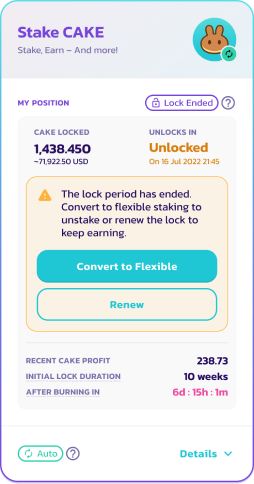
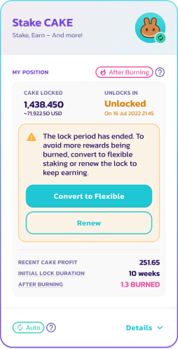

# New CAKE Syrup Pool

## Stake CAKE, earn CAKE!

PancakeSwap now offers one CAKE Syrup Pool with two staking options: flexible staking or fixed-term staking. Note that the Auto CAKE, IFO CAKE, and Manual CAKE pools will be retired upon launch of the new CAKE Syrup Pool with flexible and fixed-term staking. Keep reading on to learn more!

_Note that actual APY values will vary_

## What’s the difference between “Flexible” and “Fixed-Term” staking?

With both, you can simply stake your CAKE tokens to earn more CAKE tokens with no deposit fees. Both staking options auto-compound CAKE rewards for you. Flexible staking allows users to stake CAKE and earn rewards with the ability to unstake whenever they please. Fixed-term staking offers users the opportunity to maximize their yield and earn even more CAKE by locking their staked CAKE for a period of time they choose, earning a linearly boosted APY compared to flexible staking.

Flexible staking and fixed-term staking are both part of the same pool to allow users easy migration between the two staking options. **Because of this, you can only choose one staking option at a time.** More details about the differences below.

### Flexible Staking

Stake your CAKE and forget about it! The CAKE you stake in this Syrup Pool will be automatically compounded (reinvested) for you, minus a small fee (same as old Auto CAKE Syrup Pool).

**Unstaking fee**

* **0.1%
 if you unstake (withdraw) within 72 hours.**
* Only applies within 3 days of manually staking.
* After 3 days, you can unstake with **no fee**.
* The 3-day timer resets every time you manually stake more CAKE in the pool.
* This fee only applies to manual unstaking: it does not apply to automatic compounding.

**Performance fee**

* **2%, subtracted automatically from each yield harvest**.
* For example, if the harvest was 1 CAKE, then 0.02 CAKE would be subtracted as the performance fee.

The CAKE collected via the unstaking fee and performance fee is **burned every week** as part of the regular CAKE token burns.

This is a good thing for CAKE holders because it reduces the overall amount of CAKE tokens in existence, which helps reduce inflation.

### Fixed-Term Staking

Stake your CAKE for a fixed amount of time to maximize yields and receive additional benefits! The staked CAKE will be automatically compounded during the entire lock duration.

* No performance fees
* The longer you lock, the higher the boost applied on the yield!
* CAKE rewards are auto-compounded and will unlock, along with your staked CAKE, when your lock duration expires
* Once staked in fixed-term staking, you cannot withdraw until the end of your lock duration
* IFO CAKE credit (the maximum amount of CAKE they can commit during an IFO) will be determined from fixed-term staking pool

Chefs are cooking up additional benefits in the kitchen for Q2!

## FAQ

### What lock duration can we choose?

You can choose from 1-52 weeks. What do you prefer?

### Can I harvest the rewards during the locked period?

No. You can harvest the rewards only when the locked duration is ended. This is based on the yield/return we are providing as well as the technical implementations.

### Can I use both Flexible Staking CAKE pool and Fixed-Term Staking CAKE pool at the same time?

No. As it is mentioned above in the "What’s the difference" section, both options are part of the same, single pool. Below is what you can and can't do when CAKE is staked in one of the two staking options (can **never** have CAKE in both fixed-term and flexbile staking):

**CAKE locked in fixed-term staking**

* ✅ Add more CAKE to lock
* ✅ Extend lock period
* ❌ Add CAKE to flexible staking
* ❌ Harvest rewards
* ❌ Withdraw before locked term ends

**CAKE staked in flexible staking**

* ✅ Add more CAKE to flexible staking
* ✅ Harvest rewards any time
* ✅ Withdraw any time (fees apply for first 72 hr)
* ✅ Convert all staked CAKE in flexible to fixed-term staking
* ❌ Add CAKE to fixed-term staking if you have any CAKE in flexible staking

We have multiple solutions coming in the future, but for now you can choose only one of them.

### What happens at the end of the lock duration? What is "After Burning"?

When your fixed-term staking period ends and your CAKE unlocks, you have 7 days to complete one of two options:

* Lock your CAKE to begin a new fixed-term staking period\
  or
* Convert your staked CAKE to flexible staking (no 72 hour withdraw fee).

During this 7 day period, you will still earn CAKE at the same APY as your lock period.

After 7 days if you have not done one of the two options, your staked CAKE will enter what is called "After Burning". In "After Burning" you will still earn CAKE but a portion of your rewards will be sent to burn at a linearly decreasing APR over 90 days, where your APR will be 0% after 90 days.

The “After Burning” state will last for 90 days until all the CAKE rewards are burnt. So, to avoid missing out on CAKE rewards, at the end of your lock staking period, we recommend starting a new fixed-term staking period or converting your CAKE to flexible staking.

