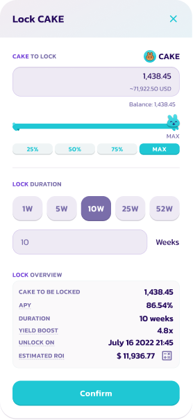
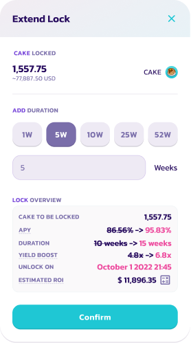
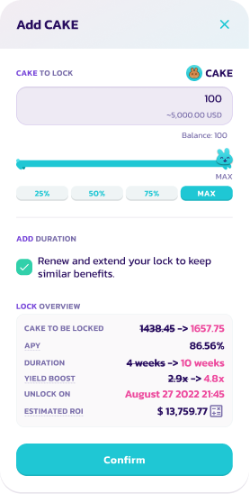

# How to use the Fixed-Term Staking option

1\. Go to the Pools page [here](https://pancakeswap.finance/pools).

2\. Connect to your BNB Smart Chain-compatible wallet by clicking the **Connect** button (top right-hand side).

 (1) (1) (2).png>)

3\. Choose your wallet and connect.

 (1) (2).png>)

4\. Choose the CAKE Syrup Pool and click the **Enable** button. Your wallet will ask you to confirm the action.

5\. The **Enable** button should now be replaced with **Flexible** and **Locked**. Click the button to bring up the staking menu.

6\. For Fixed-Term Staking simply press **Locked**, which will present you with a new window, enter the amount of CAKE you wish to stake and for how long you want to lock your CAKE for.

Below that, you will find a summary of your position, including APY, lock duration, and unlock date and time. Double-check to make sure you are okay with the lock duration and amount staked, click **Confirm** and confirm the transaction in your wallet.

Please note that we are still refining our UI including more precise unlock durations and a possible countdown.

## Extending your lock staking duration

Changed your mind during the lock staking duration? No problem. You can always extend the time of your locked CAKE by simply clicking "Extend" and choose how much time you want to add on top of the **initial lock duration**. Remember, the longer you lock, the higher your yield will be boosted. The maximum locking duration is 52 weeks.

A user's new extended lock duration = initial lock duration + added duration\
\
**Example:**\

A user staked 1,438.45 CAKE in fixed-term staking with an initial lock duration of 10 weeks on 7th May 2022.

On 18th June 2022 (6 weeks later, 4 weeks until the user's CAKE unlocks), the user decides they want to add 5 weeks to their lock duration.

1\. Navigate to the CAKE Syrup Pool and click **Extend**.&#x20;

.png>)

2\. Select the duration you would like to add (5 weeks in this example).\
\
Note that your new lock duration will equal your initial lock duration of 10 weeks plus the added 5 weeks for a new lock duration of 15 weeks.

3\. Double-check to make sure you are okay with the new extended lock duration and click **Confirm**.

Please note that you can not shorten the locking period nor withdraw your CAKE prematurely.

## Adding more CAKE to your lock

You can easily do that by renewing your fixed-term staking position. Simply click "Add CAKE" and choose how much CAKE you want to deposit.

Please note that adding more CAKE to an existing lock resets your staking term based on the remaining lock duration, essentially “renewing” your fixed-term staking position. This results in a lower yield boost because your locked duration is renewed to 4 weeks.\
\
Users can check the box next to "Renew and extend your lock to keep similar benefits." to maintain a similar yield boost setting the lock duration equal to the initial lock duration (in this example, 10 weeks).

