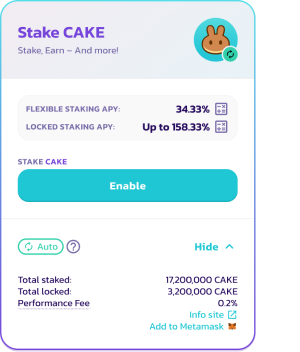
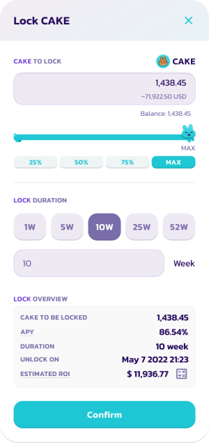
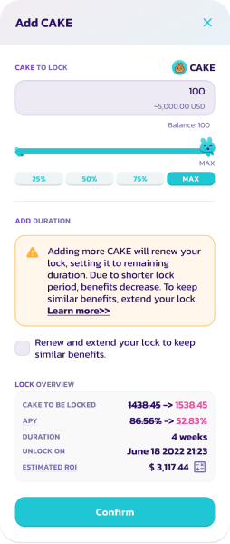
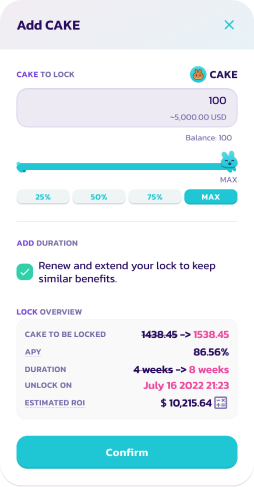

# How to use Fixed Term Staking option

1\. Go to the Pools page [here](https://pancakeswap.finance/pools).

2\. Connect to your BNB Smart Chain-compatible wallet by clicking the **Connect** button (top right-hand side).

 (1) (3).png>)

3\. Choose your wallet and connect.

.png>)

4\. Choose the CAKE Syrup Pool and click the **Enable** button. Your wallet will ask you to confirm the action.

5\. The **Enable** button should now be replaced with **Flexible** and **Locked**. Click the button to bring up the staking menu.

6\. For Fixed-Term Staking simply press **Locked**, which will present you with a new window, enter the amount of CAKE you wish to stake and for how long you want to lock your CAKE for. Below that, you will find a summary of your position, including APY, lock duration, and unlock time. Double check to make sure you are okay with the lock duration and amount staked, click **Confirm** and confirm the transaction in your wallet.

_We are still refining our UI_ _including more precise unlock_ _durations and a possible countdown_

## Extending your lock staking duration

Changed your mind during the lock staking duration? No problem. You can always extend the time of your locked CAKE by simply clicking "Extend" and choose how much time you want to add on top of the current lock . Remember, the longer you lock, the higher your yield will be boosted. The maximum locking duration is 52 weeks.

Please note that you can not shorten the locking period nor withdraw your CAKE prematurely.

## Adding more CAKE to your lock

You can easily do that by renewing your fixed-term staking position. Simply click "Add CAKE", and choose how much CAKE you want to deposit.

 

Please note that adding more CAKE to an existing lock resets your staking term based off the remaining lock duration, essentially “renewing” your fixed-term staking position. This results in lower APY because your compounding over a shorter period of time.
