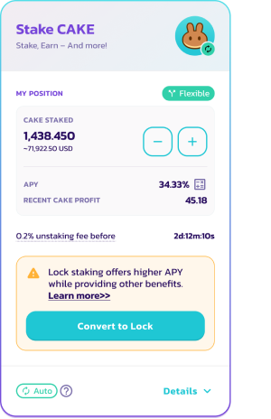
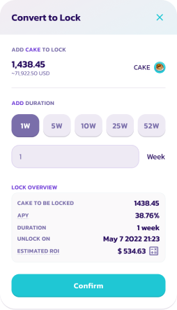

# How to use the Flexible Staking option

1\. Go to the Pools page [here](https://pancakeswap.finance/pools).

2\. Connect to your BNB Smart Chain-compatible wallet by clicking the **Connect** button (top right-hand side).

 (1) (1) (1) (1) (4).png>)

3\. Choose your wallet and connect.

 (1) (2).png>)

4\. Choose the CAKE Syrup Pool and click the **Enable** button. Your wallet will ask you to confirm the action.

_Note that actual APY values will vary_

5\. The **Enable** button should now be replaced with **Flexible** and Locked. Click the button to bring up the staking menu.

_Note that actual APY values will vary_

6\. For Flexible Staking simply press **Flexible**, which will present a new window, enter the amount of CAKE you wish to stake, click **Confirm** and confirm the transaction in your wallet.

_Note that actual APY values will vary_

Want to convert your flexible staking to fixed-term staking to earn more CAKE? Simply click **Convert to Lock** and choose how long you want to lock your CAKE.

 

_Note that actual APY values will vary_
