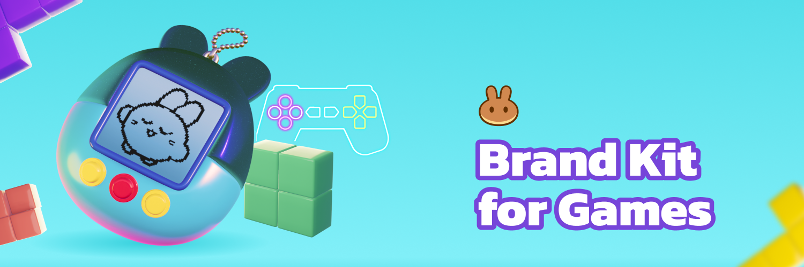

# 📒 Brand Kit

<figure><figcaption></figcaption></figure>

##

## Brand Kit for Games

<figure><figcaption></figcaption></figure>

:point\_right: [Click to view the guideline and access to resources download on figma](https://www.figma.com/file/658oTHPzqnygmNXi9XANkC/Brand-Kit---Game-\(Public\)?type=design\&node-id=60%3A222\&mode=design\&t=lV1WGVgmR6LxDkcS-1)

## Table of contents

I Read Me - T\&C&#x20;

II Brand Kit - Game Partner

* 01\. Landing page spec&#x20;
* 02\. 2D resources&#x20;
* 03\. 3D resources&#x20;
* 04\. PancakeSwap colour palette

By duplicating the file above, you confirm that you will only use it to the extent permitted by the Terms detailed in the above’s figma - Read Me - T\&C Page.
