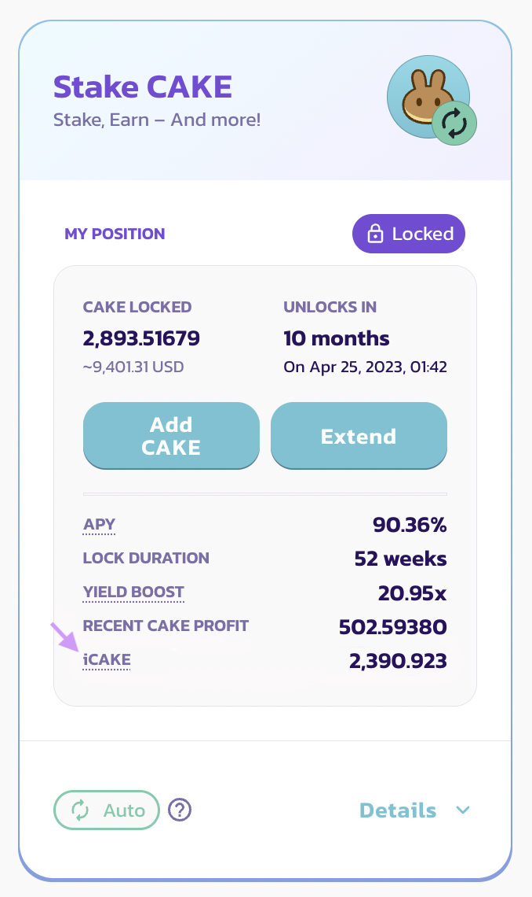

# iCAKE

### **What is iCAKE?**

iCAKE is similar to “IFO credits” from the previous IFO CAKE staking pool, which was retired during the MasterChef v2 migration. After this update, iCAKE will determine the maximum CAKE commit limit in the PancakeSwap IFO public sales. For example, if you have 200 iCAKE, you will be able to commit 200 CAKE in any upcoming IFO public sales.

**iCAKE is NOT a new token, it is a numerical metric being used by the PancakeSwap IFO system.**

### How is iCAKE calculated?

The number of iCAKE you have is based on the number of CAKE staked in the fixed-term CAKE staking pool and the total staking duration of your current fixed-term staking position.

iCAKE works based on a staking duration threshold for all iCAKE users.

If your staking duration is above the threshold, the number of iCAKE you have is equal to the number of the CAKE in your staking position.

If your staking duration is below the threshold, the number of iCAKE you have will be linear decreased and adjusted.

If your staking position is ended, the number of iCAKE you have is 0.

For example, if the threshold is 20 weeks:&#x20;

* Your current fixed-term staking position has a duration of 25 weeks and 200 staked CAKE. Then the number of iCAKE you have is 200.&#x20;
* Your current fixed-term staking position has a duration of 10 weeks and 200 staked CAKE. Then the number of iCAKE you have equals 200 × (10 ÷ 20) = 100.&#x20;
* Your current fixed-term staking position has a duration of 2 weeks and 200 staked CAKE. Then the number of iCAKE you have equals 200 × (2 ÷ 20) = 20.&#x20;
* Your current fixed-term staking position has a duration of 2 weeks and 200 staked CAKE. But the position is ended. Then the number of iCAKE you have is 0.

|                  | Your staking duration is equal to or longer than the threshold | Your staking duration is shorter than the threshold                  |
| ---------------- | -------------------------------------------------------------- | -------------------------------------------------------------------- |
| **iCAKE Amount** | Equals your Locked CAKE Amount                                 | Equals your Locked CAKE Amount x (Your Staking Duration / Threshold) |

### How to check the number of iCAKE I have?

You can check the number of iCAKE you have in the IFO page [here](https://pancakeswap.finance/ifo).

### **How to increase the number of iCAKE I have?**

You can increase the number of iCAKE you have by:

* Adding more CAKE to your fixed-term staking position in the CAKE syrup pool.
* Extend your fixed-term staking durations if your current durations is shorter than the threshold.

********

You can preview the number of iCAKE generated from your staking position when adjusting or initializing the fixed-staking.

### What is the threshold for iCAKE calculations?

Between each IFOs, the kitchen will optimize the threshold based on the average staking duration of the fixed-term staking CAKE pool. The adjustment will be published on all social channels.

.png>)

You can check the current threshold for iCAKE calculations by hovering or tapping the underlined iCAKE text in the CAKE syrup pool window.
