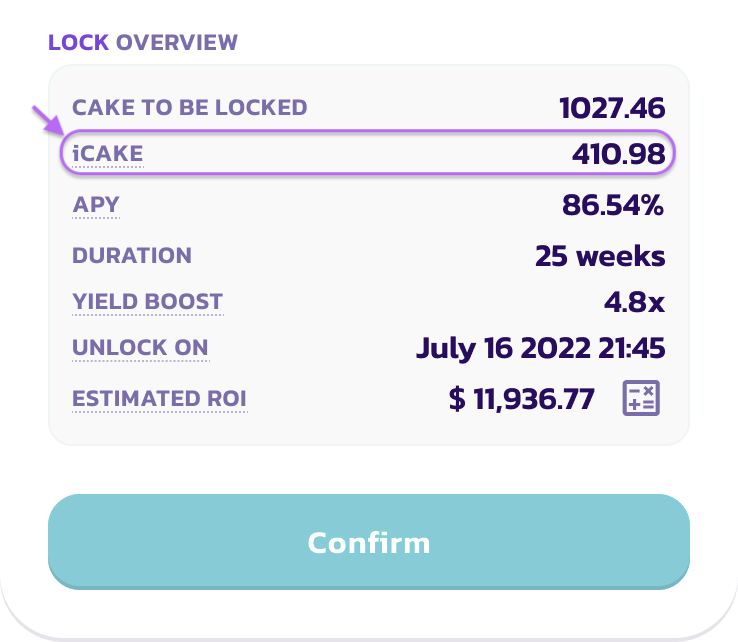

# iCAKE

### 什么是 iCAKE？

iCAKE 类似于之前 IFO CAKE质押池中的"IFO 积分“，该池在 主厨合约v2 迁移期间中停用。此次更新后，iCAKE 决定了PancakSwap IFO公开发售中每个地址能提交的 CAKE 数量上限。

举个例子，如果您的 iCAKE 数值为 200，您可以在即将到来的 IFO 公开销售中提交最高 200 个 CAKE 代币。

**iCAKE 不是一个新的代币，他是PancakeSwap IFO系统中使用的一个数值度量。**

### iCAKE 怎么计算？

您拥有的 iCAKE 数量，根据您在 CAKE 定期质押池中质押的 CAKE 数量，和您当前定期质押仓位的总质押时长来确定的。

&#x20;iCAKE 的计算方式中，锁仓质押周数的**阈值**是一个很重要的分界。阈值由厨房基于所有 iCAKE 用户的锁仓质押持续时间计算分析后定出。每一期的 IFO 阈值周数不一定相同。

如果您的质押时长超过阈值，则您的 iCAKE 数值等于您质押的 CAKE 数量。&#x20;

如果您的质押时长低于阈值，您的 iCAKE 数值将线性减少和调整。&#x20;

如果您的质押期结束，那么您的 iCAKE 数值将为0。

举例说明，如果阈值为20周：

* 您当前的定期质押锁定时间为 25 周并且质押 200 个CAKE。 那么您的 iCAKE 数值是 200。&#x20;
* 您当前的定期质押锁定时间为 10 周并且质押 200 个 CAKE。 那么您的 iCAKE 数值等于 200 × (10 ÷ 20) = 100。&#x20;
* 您当前的定期质押锁定时间为 2 周并且质押 200 个 CAKE。 那么您的 iCAKE 数值等于 200 × (2 ÷ 20) = 20。&#x20;
* 您定期质押锁定时间为 2 周并且质押 200 个CAKE。 但是您的质押已经结束到期， 那么您的 iCAKE 数值为 0。

| 情况分类     | 您的锁仓时长 ≥ 阈值   | 您的锁仓时长 < 阈值                  |
| -------- | ------------- | ---------------------------- |
| iCAKE 数值 | 等于您锁仓 CAKE 数量 | 等于您锁仓 CAKE 数量 x（您的锁仓持续时长/阈值） |

### 如何查看我拥有多少个 iCAKE ?

<figure><figcaption></figcaption></figure>

您可以在 [IFO界面](https://pancakeswap.finance/ifo) 看到您的 iCAKE 数值。

### 如何增加我拥有的 iCAKE 数量?

您可以增加 iCAKE 数量的途径有：

* 在 CAKE 定期锁仓糖浆池中，增加您质押的 CAKE 数量
* 延长您的锁仓时间（如果您目前的总锁仓时间短于当前的阈值）

<figure><figcaption></figcaption></figure>

在您调整或初始投入锁仓质押时，锁仓界面将显示您当下的 iCAKE 数值以供预览。

### 本期用以计算 iCAKE 的阈值周数？

两个 IFO 销售活动之间的时间段中，厨房会根据**锁仓质押 CAKE 糖浆池**的**平均质押时长**来优化**阈值**。优化结果将在**所有社交媒体渠道**上公布。

<figure><figcaption>
图片仅供参考，实际「阈值」周数可于当期IFO界面查看。
</figcaption></figure>

您可以通过悬停、或点击 CAKE 糖浆池窗口中带下划线的 iCAKE 文本，来查看当前的**阈值**。
