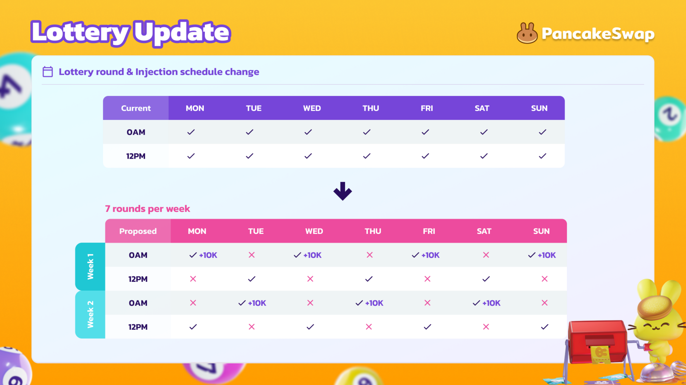

# Lottery FAQ

## What if there are no winners?

If CAKE in the prize pools isn't won it doesn't go to waste! Unclaimed CAKE rolls over to the next Lottery round.

## My ticket matches several numbers but I can't claim a prize

Tickets are only eligible for prizes if matching numbers from left to right. See the [Lottery v2 documentation](./) for a thorough explanation.

## How is Lottery v2 different from Lottery v1?

Lottery v2 distributes prizes more widely than Lottery v1. It gives each ticket a 1 in 10 chance to match the first number, which means more tickets will at least win a small prize. It also has 6 (up from 4) numbers that need to be matched sequentially to win the biggest prize.

Overall this means more tickets can win a prize, but the largest prize jackpot will be won less frequently, making for huge top prize pools!

**Lottery v2 introduces:**

* cheaper ticket prices (\~$5 USD in CAKE per ticket) that don't swing wildly with the price of CAKE
* bulk ticket discounts
* 6-tiered prize pool brackets with increasing prize pools as more numbers are matched
* manual number selection (optional), so users can use their lucky numbers
* [Chainlink’s implementation of VRF](https://docs.chain.link/docs/chainlink-vrf/) for true, secure randomness
* lower overall fees (see [lower down this page](lottery-faq.md#what-transaction-fee-will-i-pay-for-buying-tickets) for more information)

[Learn more about Lottery v2 features, gameplay, and prizes](./)

## How are prizes broken down between brackets?

Each bracket's prize pool is a portion of the total CAKE in each Lottery round.&#x20;

* | Bracket (numbers matched in order) | CAKE Allocation |
  | ---------------------------------- | --------------- |
  | First 1 number                     | 2%              |
  | First 2 numbers                    | 3%              |
  | First 3 numbers                    | 5%              |
  | First 4 numbers                    | 10%             |
  | First 5 numbers                    | 20%             |
  | First 6 numbers                    | 40%             |
  | Burn                               | 20%             |

## Can I swap my tickets back to CAKE?

No, once purchased you will not be able to convert your ticket back to CAKE.

## If I win, do I need to manually claim the prize?

Yes, you will need to click the **Check Now** button under "Are you a winner?" on the Lottery page.

.png>)

## How often is the lottery?

A new Lottery round starts every 12 hours.

## What transaction fee will I pay for buying tickets?

Every ticket purchase you make will be one transaction. Purchasing a single ticket in a Lottery purchase will cost the normal amount of fees for a transaction.

However, buying more tickets in that purchase will increase the fee. Buying 100 tickets rather than 1 will not multiply the fee by 100, but may increase the fee amount by 5-6 times (though this varies).

## How does the bulk discount work?

The bulk discount rewards buying larger amounts of tickets with a scaling discount. If you're only buying 2 tickets, the discount is negligible, but will add up quickly as you increase the number of tickets to buy in the one transaction.

The discount only applies to each transaction up to 100 tickets. The discount does not carry over to the next transaction or next round.

## Why can I only buy 100 tickets?

You can only buy a maximum of 100 tickets in one purchase, but you can make multiple purchases. There's nothing to stop you buying more tickets after your first 100.

## If I manually create two or more tickets with the same numbers and they win, am I eligible for prizes for each ticket?

Yes, each ticket is treated as a separate entry to the Lottery. Keep in mind that the prizes will not be 1:1 though, as each winning ticket you have dilutes each share of the bracket's total prizes.

## Injection schedule: When is CAKE added to the lottery?&#x20;

When people buy tickets, the CAKE they spend is added to the lottery pot. In addition, 10,000 CAKE is also added (injected) to the lottery pot every other round on a regular schedule over the course of seven rounds per week.

This injection schedule started with round 440:

