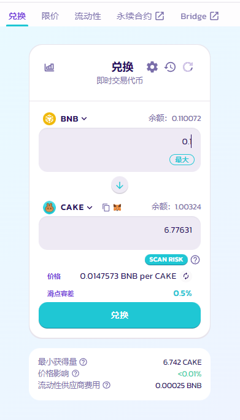

# 代币兑换

PancakeSwap 的[代币兑换](https://pancakeswap.finance/swap#/swap)，是一种简单且去中心化的代币兑换方法。通过使用流动性资金池，将一个 BEP-20 代币换成另一个代币。

<figure><figcaption></figcaption></figure>

当您在PancakeSwap交易所进行代币兑换（交易）时，您将支付 0.25% 的交易费，具体分配如下：&#x20;

0.17% - 返回给流动性提供者。以交易费用奖励形式注入到流动性资金池，实际体现在拆开流动性时。&#x20;

0.0225% - 到 PancakeSwap 团队金库。&#x20;

0.0575% - 用于 CAKE 的回购和销毁。

更新于2022/10/26
