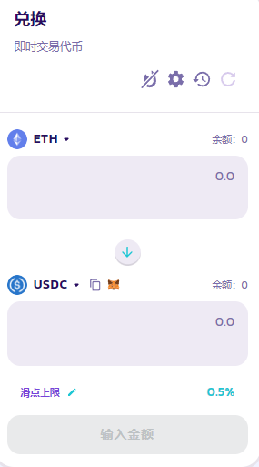
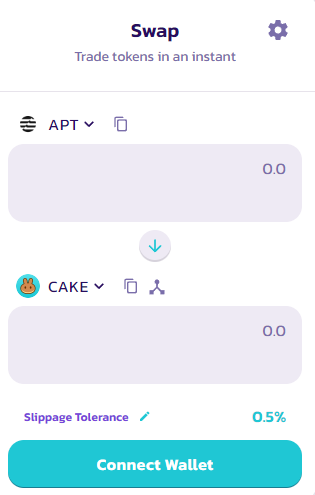

# 代币兑换

PancakeSwap 上的 [代币兑换](https://pancakeswap.finance/swap) 为一种简单的代币交易方式：可以透过自动化流动性池进行兑换，目前支援 BNB 智能链、以太链和 Aptos 链；以及与做市商（Market Maker）进行兑换，目前支援 BNB 智能链和以太链。

<figure><figcaption></figcaption></figure>

当您在 [BNB 智能链](https://pancakeswap.finance/swap?chain=bsc) 或 [以太链](https://pancakeswap.finance/swap?chain=eth) 上的PancakeSwap 进行代币兑换（交易）时，您将根据您的交易经过的流动性池类型支付交易费用。您可以通过点击 "路由" 那栏的放大镜图标来检查交易路径的详细信息。&#x20;

对于 V3 交易系统的流动性池，目前有四个不同的收费等级：0.01%、0.05%、0.25% 和 1%。&#x20;

对于 StableSwap 流动性池，费率取决于各个池子的配置。请查看 “[费用](wen-ding-bi-dui-huan/#wen-ding-bi-jiao-yi-fei-yong)” 部分以了解更多细节。

对于 V2 交易系统的流动性池，您将支付固定的 0.25% 的交易费用，具体分配如下：&#x20;

* **0.17%** - 返回给流动性提供者。以交易费用奖励形式注入到流动性资金池，实际体现在拆开流动性时。
* **0.0225%** - 到 PancakeSwap 团队金库。&#x20;
* **0.0575%** - 用于 CAKE 的回购和销毁。

<figure><figcaption></figcaption></figure>

请注意，在 [Aptos 链](https://aptos.pancakeswap.finance/swap)上，目前只部署了 PancakeSwap  V2 交易系统，因此 Aptos 链上的所有代币兑换都会有固定的 0.25% 的交易费用，具体费用细分与上面提到的一样。
