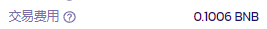
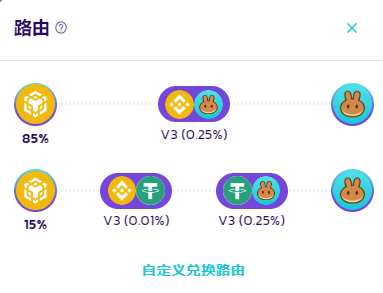

# 交易费用和路由设置

<figure><figcaption></figcaption></figure>

在 V3 交易系统中，默认情况下 PancakeSwap 的智能路由将从 V3、V2、稳定币兑换（BNB 链）、AMM 和做市商（BNB 链和以太链）智能地调用流动性来执行对应的交易，并为交易者找到最佳价格。

但是，通过自主选择路由应调用哪些流动性来源，用户也可以对自己的交易进行定制，并自由选择启用或禁用多跳和拆分路由。

### 查看目前适用的交易费率和费用金额

<figure><figcaption></figcaption></figure>

要检查您当前的交易将被收取多少费用，请查看交易细节部分的 "交易费用 "部分。

<figure><figcaption></figcaption></figure>

要检查您的交易目前是通过哪种类型的资金池和费用等级，请查看 "路由 "部分。

<figure><figcaption></figcaption></figure>

要了解更多细节，请点击放大镜图标，显示完整的交易路径。

### 自定义流动性来源

<figure><figcaption></figcaption></figure>

在 "自定义路由 "界面的上方，您可以选择路由交易时调用的流动性来源。您可以通过以下途径调出设置界面：

* 点击交易路径显示底部的 "自定义路由"。&#x20;
* 点击兑换界面的齿轮图标，然后点击底部的 "自定义路由"。&#x20;

默认情况下，所有的流动性来源都已启用，智能路由将充分利用 PancakeSwap 内所有的可用流动性。&#x20;

请注意，路由不会打通自动做市商 (AMM) 流动性池和做市商 (MM) 的流动性池。当您的交易由 MM 执行时，它将不会经过任何 AMM 流动性池。

<figure><figcaption></figcaption></figure>

你可以点击路由设置界面右上角的 "重置 "按钮，将路由配置重置为默认。

### 自定义路由偏好

<figure><figcaption></figcaption></figure>

在 "自定义路由 "界面的下方，你可以通过启用或禁用多跳和拆分路由，来定制你的兑换路径。&#x20;

多跳可以让代币兑换时，兑换路径纳入多个流动性池，以获得最佳的交易价格。关闭它将会把交易限制为直接兑换，这可能导致更高的滑点甚至资金损失。

拆分路由能够将代币兑换分解成多条路径，以获得最佳的交易价格。关闭它将会把交易限制以单一路径执行，这可能会导致低效率（价格不佳）或高滑点。


当您的交易，由于自定义路由的设置而无法执行时，会出现一个警告，您可以点击 "检查您的设置" 来快速调出 "自定义路由" 界面。或者选择 "重置为默认" 来快速将您的路由配置重置为默认设置。

