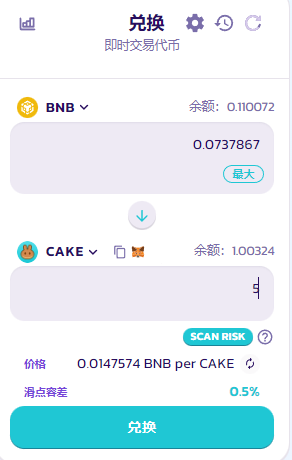
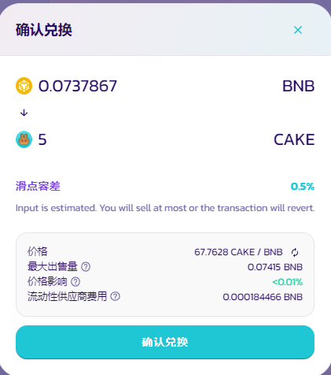

# 如何进行交易

与其他大多数交易平台相比，在PancakeSwap 上交易十分方便。网页设计时已经考量到您做交易时需要的全部计算，并且自动帮您算好了。您不需要看一堆的图标以及行话才能进行交易。

### 交易前准备

在进行交易前，您需要准备一个兼容BNB智能链的钱包。您可以[点击这里](../../get-started/wallet-guide.md)学习如何取得。您还需要准备一些BEP20代币来进行交易。您可以[点击这里](../../get-started/bep20-guide.md)学习如何开始。

### 如何在PancakeSwap交易所交易

1. 跳转到[交易页面](https://pancakeswap.finance/swap#/swap)
2. 通过点击**解锁钱包**解锁您的BNB智能链兼容钱包（可以透过右上角的**连接**）。如果您还没有将您的钱包连接到PancakeSwap, 您可以查看[这里的指南](../../get-started/connection-guide.md)

<figure><figcaption></figcaption></figure>

&#x20;3\. 点击代币右边的小箭头下拉菜单中选择您需要交易的代币。默认设置为BNB。

<figure><figcaption></figcaption></figure>

无论您选择哪种代币，都需要确保您手中有一些代币可用于交易。您钱包中该代币的余额数量显示在代币下拉菜单的右边。

4\. 在下图的代币下拉菜单中选择您想购入的代币，接下来，通过在输入框中单击来输入您想购入的数量。

<figure><figcaption></figcaption></figure>

系统将自动计算您可换得/需支付的代币数量。

5\. 检查无误后，点击 "兑换" 按钮。

<figure><figcaption></figcaption></figure>

6\. 点击"兑换"后，会显示以下带详细信息的界面，请检查信息内容是否正确。

<figure><figcaption></figcaption></figure>

确认无误后，点击 “确认兑换” 按钮。您的钱包会弹出支付gas 的界面，您确认支付后，兑换操作将被传送上链。

7\. 完成了！你可以点击 “View on BscScan” 在浏览器上查看这笔交易的细节。

<figure><figcaption></figcaption></figure>

## 为什么我的链上操作不成功？

PancakeSwap 是一个 DeFi 应用程序，它与钱包交互以完成包括交易、创建 LP、在农场和糖浆池中质押等链上操作。&#x20;

### Gas 费&#x20;

首先要确保你有**足够的 BNB 来支付链上操作的 Gas 费**。通常 Gas 费用会根据链上正排队中的待处理事务（transactions) 数量而波动，如果队列中有很多笔交易排队中，可能需要花费更高的 Gas 费用才能成功上链。在 BNB 智能链上，Gas 费通常按 BNB 计费从几美分到 1 美元不等。在此处了解有关 [Gas费的更多信息](https://academy.binance.com/en/glossary/gas)。

### 交易费用（Transaction Fees）&#x20;

如果您的交易未成功并且显示错误，您可以修改滑点 - 您可能需要检查尝试交易的代币是否有任何**交易费用**（俗称抽税）**和交易限制**。&#x20;

BNB 智能链上的代币在其合约中包含**交易费用**的情况并不少见，通常这些费用会被用于销毁、资助公平启动项目的金库——例如， [APX 代币对每笔交易都发送 1% 到销毁地址](https://apollox-finance.gitbook.io/apollox-finance/welcome/apx-token-and-contract/tax)，频繁的交易意味着更多的销毁，为 APX 代币持有者增加价值。

由于交易费用的存在，无论是包含（部分交易金额发送到您的地址以外的其他地方，因此输出数量低于估计输入的预期）还是不包含（需要从您的钱包地址进行额外转账以发送额外的代币，因此输入超过估计输出的预期），它都会影响您同意签署的交易的输入和输出金额。在很多情况下，交易因为抽税机制而无法满足输入和输出金额要求。&#x20;

### 带着交易费用进行交易

在您交换任何代币之前，请确保您已访问过他们的网站以了解他们是否有交易费用机制（或着许多项目所说的抽税）。如果有，请确保您设置的滑点足以容纳交易费用——例如如果交易费为 5%，则您的滑点必须设置为至少 5% 加上正常交易滑点，具体取决于您的交易金额和代币的流动性，例如 5.5%-6%。&#x20;

在一些极端情况下，包括一些骗局，一些代币甚至限制链上大部分或者全部的转账，或者只允许某些特定地址出售，在这种情况下，您将无法成功兑换代币。请务必了解您尝试兑换的代币，并注意任何可能的费用和限制条件！
